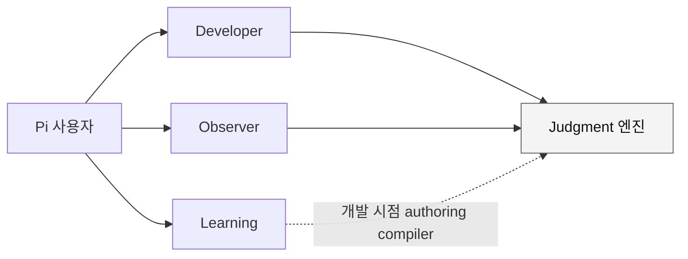
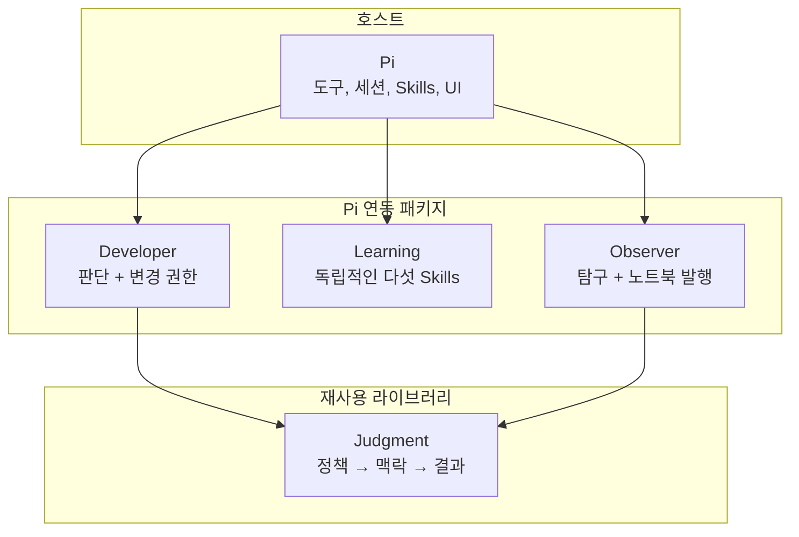

# Pi용 Hobin 패키지

[English](./README.md) | 한국어

[Pi](https://pi.dev)에서 맥락에 따른 판단, 더 안전한 개발 의사결정,
출처에 근거한 학습, 로컬 우선 탐구 노트를 제공하는 네 개의 독립 버전
패키지를 관리하는 모노레포입니다.

필요한 기능만 설치하세요. 저장소 루트는 개발 워크스페이스이며, 네 패키지를
합친 하나의 Pi 패키지가 아닙니다.

## 빠른 시작

Pi 연동 패키지에는 Pi가 필요합니다. 모든 패키지에는 Node.js 22.19 이상이
필요합니다.

```sh
pi install npm:@hobin/developer
pi install npm:@hobin/learning
pi install npm:@hobin/observer
```

Pi 연동 패키지를 한 번의 실행에서 시험하려면:

```sh
pi -e npm:@hobin/developer
```

`@hobin/judgment`는 Pi 사용자 인터페이스가 아니라 라이브러리와 CLI입니다.

```sh
npm install @hobin/judgment
```

## 패키지

| 패키지 | 종류 | 용도 | 설치 |
| --- | --- | --- | --- |
| [`@hobin/developer`](./packages/developer/README.ko.md) | Pi 확장 + Skills | 중요한 코딩 결정을 명확히 하고, 변경 권한을 제한하며, 변경이 실제로 무엇을 입증하는지 검증 | `pi install npm:@hobin/developer` |
| [`@hobin/learning`](./packages/learning/README.ko.md) | Pi 확장 + Skills | 기술 자료와 저장소 읽기, 개념과 패턴 형성, 연습 설계 | `pi install npm:@hobin/learning` |
| [`@hobin/observer`](./packages/observer/README.ko.md) | Pi 확장 | Pi 세션에서 탐구를 이어가고 검토한 Markdown을 로컬 노트북에 발행 | `pi install npm:@hobin/observer` |
| [`@hobin/judgment`](./packages/judgment/README.ko.md) | 라이브러리 + CLI | 정책 기반 맥락 선택, 봉인, 커버리지, 결과를 다른 어댑터에 내장 | `npm install @hobin/judgment` |

각 패키지는 자체 manifest, 버전, README, 상세 문서, 검사, 발행 경계를 가집니다.
패키지 README는 독립적인 사용자 진입점이고, 루트 README는 패키지 카탈로그이자
저장소 안내서입니다.



화살표는 의존성을 나타낼 뿐 필수 워크플로를 뜻하지 않습니다. Developer,
Learning, Observer는 서로 분리된 제품입니다.

## 어떤 패키지를 선택해야 하나요?

| Pi가 다음을 하길 원한다면 | 선택 |
| --- | --- |
| 코드를 수정하기 전에 무엇이 참이어야 하는지 결정 | Developer |
| 구현 근거와 완료 주장을 비교 | Developer |
| 명세의 경계를 뭉개지 않고 설명 | Learning |
| 오픈 소스 저장소에서 공개 API 하나를 추적 | Learning |
| 여러 통찰을 재사용 가능한 개념이나 연습 세트로 변환 | Learning |
| 다른 작업 중에도 출처 연결 탐구 노트를 축적 | Observer |
| 로컬 저장 전에 정확한 Markdown 묶음을 검토 | Observer |
| 다른 어댑터에 정책, provenance, 선택, 봉인, 커버리지를 추가 | Judgment |

## 설치 범위

프로젝트의 `.pi/settings.json`에 패키지를 기록하려면 `-l`을 사용합니다.

```sh
pi install -l npm:@hobin/learning
```

네 패키지가 모두 등록될 것이라 기대하며 저장소 루트를 설치하지 마세요. 루트에는
결합된 Pi manifest가 없습니다. 공개된 패키지를 개별 설치하거나, 소스 체크아웃의
정확한 패키지 디렉터리를 실행하세요.

```sh
pi -e ./packages/developer
```

이 경계는 모노레포 체크아웃이 사용자가 받는 확장이나 Skill 집합을 몰래 바꾸지
못하게 합니다.

## 패키지 경계



- **Judgment**는 Pi Skill, 명령, 도구, 프롬프트, UI를 등록하지 않습니다.
- **Developer**는 질문, 워크벤치, 도구 게이팅, 변경 승인, landing 프로토콜을
  소유합니다.
- **Learning**은 영속적인 학습 세션이나 노트북을 소유하지 않습니다.
- **Observer**는 로컬 노트북 형식과 명시적 발행 흐름을 소유하지만 Git, 원격
  동기화, 모델의 진실성은 소유하지 않습니다.
- 어느 패키지도 운영체제 샌드박스가 아닙니다. Pi 패키지는 Pi 프로세스 권한으로
  실행되므로 설치 전에 소스를 검토하세요.

## 저장소 구조

```text
packages/
├── judgment/   재사용 엔진, 스키마, API, CLI
├── developer/  Pi 확장, 워크벤치, 프로토콜, 열한 Skills
├── learning/   Pi 선택기와 독립적인 다섯 학습 Skills
└── observer/   Pi sidecar, 탐구 워크벤치, 노트북 발행기
```

저장소 전체 스크립트는 검사만 조정합니다. 런타임 소유권과 Pi 리소스는 각
패키지 내부에 남습니다.

## 문서 언어

영어는 GitHub, npm, Pi 갤러리의 기본 진입 언어입니다. 한국어는 동등한 형제
번역으로 제공합니다.

- 저장소와 패키지 진입 문서: `README.md`, `README.ko.md`
- 패키지 상세 문서: `docs/*.md`, 대응하는 `docs/ko/*.md`
- 번역된 모든 문서 상단에 언어 전환 링크 배치

동작이나 경계가 바뀌면 영어/한국어 문서 쌍을 함께 수정합니다.

## 개발

이 저장소는 private pnpm 워크스페이스입니다. 각 패키지의 버전과 발행은
독립적으로 관리합니다.

```sh
corepack enable pnpm
pnpm install
pnpm check
pnpm eval
```

패키지 하나만 실행하려면:

```sh
pnpm --filter @hobin/developer check
pnpm --filter @hobin/developer eval
pi -e ./packages/developer
```

워크스페이스는 pnpm의 기본 isolated linker를 사용합니다. `pnpm pack`은
`workspace:` 범위를 공개 semver 범위로 바꾸며, 형제 Pi 리소스를 암묵적으로
묶지 않습니다. `pnpm check:isolation`이 소스 수준 패키지 격리를 검사합니다.

## 라이선스

[MIT](./LICENSE)
