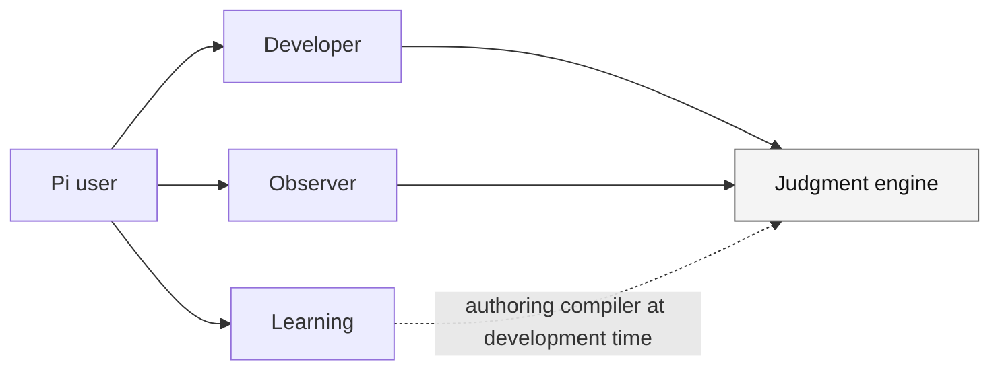
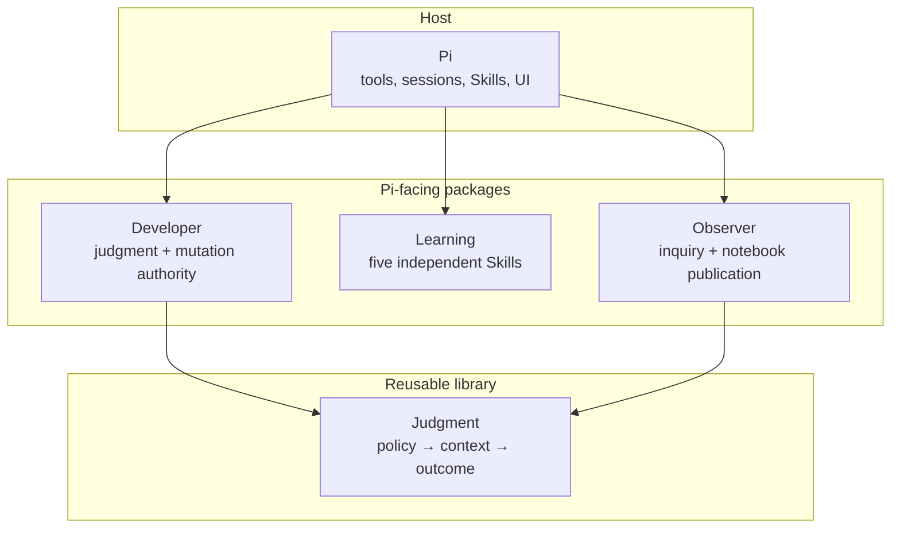

# Hobin packages for Pi

English | [한국어](./README.ko.md)

A monorepo of four independently versioned packages for contextual judgment,
safer development decisions, source-grounded learning, and local-first inquiry
notes in [Pi](https://pi.dev).

Install only the capability you need. This repository root is a development
workspace, not one combined Pi package.

## Quick start

Pi-facing packages require Pi. All packages require Node.js 22.19 or newer.

```sh
pi install npm:@hobin/developer
pi install npm:@hobin/learning
pi install npm:@hobin/observer
```

Try a Pi-facing package for one run:

```sh
pi -e npm:@hobin/developer
```

`@hobin/judgment` is a library and CLI, not a Pi user interface:

```sh
npm install @hobin/judgment
```

## Packages

| Package | Kind | Use it for | Install |
| --- | --- | --- | --- |
| [`@hobin/developer`](./packages/developer) | Pi extension + Skills | Clarifying consequential coding decisions, gating mutation, and verifying what a change proves | `pi install npm:@hobin/developer` |
| [`@hobin/learning`](./packages/learning) | Pi extension + Skills | Reading technical sources and repositories, forming concepts and patterns, and designing practice | `pi install npm:@hobin/learning` |
| [`@hobin/observer`](./packages/observer) | Pi extension | Following an inquiry across a Pi session and publishing reviewed Markdown to a local notebook | `pi install npm:@hobin/observer` |
| [`@hobin/judgment`](./packages/judgment) | Library + CLI | Building policy-aware context selection, sealing, coverage, and outcomes into another adapter | `npm install @hobin/judgment` |

Every package has its own manifest, version, README, documentation, checks, and
publication boundary. Package READMEs are standalone consumer landing pages; the
root README is a catalog and repository guide.



The arrows show dependencies, not a required workflow. Developer, Learning, and
Observer remain separate products.

## Which package should I choose?

| If you want Pi to… | Choose |
| --- | --- |
| Decide what must be true before editing code | Developer |
| Compare implementation evidence with a completion claim | Developer |
| Explain a specification without flattening its boundaries | Learning |
| Trace one public API through an open-source repository | Learning |
| Turn several insights into a reusable concept or practice set | Learning |
| Accumulate source-linked inquiry notes while doing other work | Observer |
| Review an exact Markdown batch before saving it locally | Observer |
| Add policy, provenance, selection, sealing, and coverage to another adapter | Judgment |

## Installation scope

Use `-l` to record a package in project-local `.pi/settings.json`:

```sh
pi install -l npm:@hobin/learning
```

Do not install the repository root expecting all four packages to register. The
root has no combined Pi manifest. Install a published package individually, or
run an exact package directory from a source checkout:

```sh
pi -e ./packages/developer
```

This prevents a monorepo checkout from silently changing which extensions or
Skills a user receives.

## Package boundaries



- **Judgment** registers no Pi Skill, command, tool, prompt, or UI.
- **Developer** owns its questions, workbench, tool gating, authorization, and
  landing protocol.
- **Learning** owns no persistent learning session or notebook.
- **Observer** owns its local notebook format and explicit publication flow, not
  Git, remote sync, or model truth.
- No package is an operating-system sandbox. Pi packages execute with Pi's
  process permissions; review source before installation.

## Repository layout

```text
packages/
├── judgment/   reusable engine, schema, API, and CLI
├── developer/  Pi extension, workbench, protocol, and eleven Skills
├── learning/   Pi chooser and five independent learning Skills
└── observer/   Pi sidecar, inquiry workbench, and notebook publisher
```

Repository-wide scripts coordinate checks only. Runtime ownership and package
resources remain inside each package.

## Documentation languages

English is the default GitHub, npm, and Pi-gallery landing language. Korean is a
first-class sibling translation:

- repository and package landing pages: `README.md` and `README.ko.md`;
- detailed package documentation: `docs/*.md` and mirrored `docs/ko/*.md`;
- a language switch appears at the top of every translated document.

Update an English/Korean pair together when behavior or boundaries change.

## Development

This is a private pnpm workspace. Package versions and publication are managed
independently.

```sh
corepack enable pnpm
pnpm install
pnpm check
pnpm eval
```

Run one package:

```sh
pnpm --filter @hobin/developer check
pnpm --filter @hobin/developer eval
pi -e ./packages/developer
```

The workspace uses pnpm's default isolated linker. `pnpm pack` rewrites
`workspace:` ranges to public semver ranges; sibling Pi resources are never
silently bundled. Source-level package isolation is checked by
`pnpm check:isolation`.

## License

[MIT](./LICENSE)
