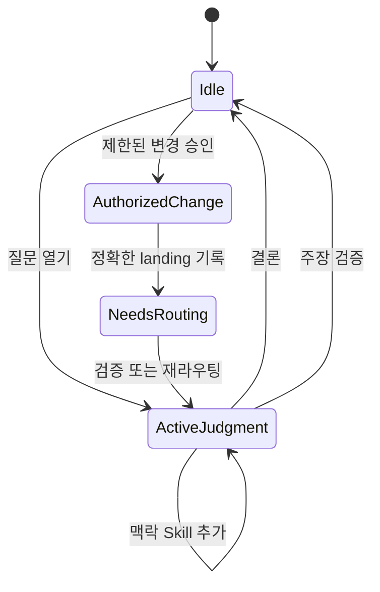
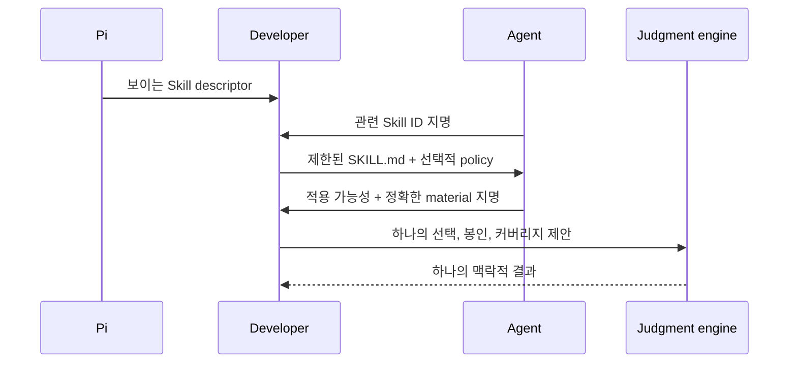

# @hobin/developer

[English](./README.md) | 한국어

변경 전후와 변경 중에 중요한 코딩 결정을 명시적으로 만드는 Pi 워크벤치입니다.

Developer는 Pi가 알맞은 추론 방법을 선택하고, 정확한 근거를 모으며, 판단과 변경
권한을 분리하고, landing이 실제로 무엇을 입증하는지 검증하도록 돕습니다. 단순한
작업은 단순하게 유지하고, 불확실한 작업에서만 가장 작은 관련 판단을 여는 적응형
도구입니다.

## 설치

[Pi](https://pi.dev)와 Node.js 22.19 이상이 필요합니다.

```sh
pi install npm:@hobin/developer
```

한 번의 실행에서 시험하려면:

```sh
pi -e npm:@hobin/developer
```

Pi 안에서 Developer를 활성화합니다.

```text
/developer on
```

## 먼저 해보기

제품 변경을 평소처럼 요청하세요. 내부 Skill을 고르거나 프로토콜 도구를 직접
호출할 필요가 없습니다.

```text
/developer on
The selected payment method disappears after navigating back to checkout.
Find the cause and fix it, but do not guess at missing product behavior.
```

다른 예시:

```text
This parser rewrite is green, but the conditionals are spreading.
Decide whether structural work belongs now.
```

```text
The tests pass after this cache change. Check what they do not prove before
calling it complete.
```

```text
Run a Doctor review of the checkout request-to-persistence flow. Preserve
external behavior and produce a now/next/observe/leave-alone plan without
modifying files.
```

## Developer가 바꾸는 것

| 명시적인 판단이 없을 때 | Developer를 사용할 때 |
| --- | --- |
| 빠진 제품 결정이 구현 추측으로 바뀜 | 모르는 내용을 소유자가 있는 질문으로 만듦 |
| 습관에 따라 방법을 선택 | 하나의 집중된 Skill이 현재 질문을 소유 |
| 사용 가능한 guidance를 필수 맥락으로 취급 | 결과를 바꿀 수 있는 맥락만 선택 |
| “테스트 통과”를 완료 주장으로 사용 | 정확한 주장과 근거를 대응 |
| 수정과 추론이 섞임 | 판단과 변경 권한을 분리 |
| landing이 성공을 의미 | landing이 별도의 검증 의무를 생성 |

Developer는 작업을 조정하고, Pi는 평소 도구로 계속 읽고, 수정하고, 실행하고,
테스트합니다.

## 작동 방식


이것은 권한 흐름이지 모든 개발이 따라야 하는 절차가 아닙니다. 이미 결정되었고
근거가 충분한 요청은 제한된 승인으로 바로 진행할 수 있습니다. 새로운 근거가
다른 판단이나 사용자 질문을 열 수도 있습니다.

### 근거와 변경을 분리



`ActiveJudgment`가 열려 있는 동안 Pi는 근거를 조사할 수 있지만 Developer가
통제하는 `edit`와 `write`를 사용할 수 없습니다. 해당 도구는
`AuthorizedChange`에서만 돌아옵니다. 이것은 워크플로 무결성이지 운영체제
샌드박스가 아닙니다.

## Skills

Developer는 독립적으로 호출할 수 있는 열한 개의 Skill을 포함합니다. Pi가
요청에서 하나를 고르거나 `/skill:<name>`으로 직접 호출할 수 있습니다.

| Skill | 결정할 내용 |
| --- | --- |
| `doctor` | 제한된 기존 코드 범위에서 지금, 나중, 관찰, 그대로 둘 것 |
| `specify` | 제품 요구사항이 실제로 뜻하는 것 |
| `model` | 존재하는 case, rule, state, contract, 금지 조건 |
| `sketch` | 필요한 data, interface, collaboration, flow, code shape |
| `signal` | 코드가 실제 구조적 압력을 보이는지 |
| `naming-judgment` | 안정적인 도메인 의미를 보존하고 효과를 드러내는 이름 |
| `abstraction-review` | 구체적 추상화를 유지, 수정, 분리, 거부, 연기할지 |
| `schedule` | 구조적 작업을 지금, 나중, 또는 하지 않을지 |
| `verify` | 현재 근거가 지지하는 주장과 pass-but-wrong 위험 |
| `adversarial-eval` | 워크플로 또는 구현 주장을 반증할 수 있는 유한한 반례 |
| `visualize` | 결정을 더 쉽게 검토하게 하는 가장 작은 시각적 표면 |

각 Skill은 완전한 질문, 방법, 결과, 중지 조건을 소유합니다. Doctor는 제한된
진단을 조정하지만 다른 Skill을 하나의 보편적 체크리스트로 대체하지 않습니다.

## 외부 Skill 맥락

Developer는 다른 설치된 Pi 패키지의 Skill을 Developer 소유 방법으로 바꾸지
않고 맥락으로 사용할 수 있습니다.



지명된 source만 엽니다. 선택적 `judgment.json`은 적용 가능성을 평가하기 전에
보여주며, root `unless`가 우선합니다. 정책이 없는 것은 정상이고, 존재하는 잘못된
정책은 해당 source batch만 거부합니다. 적용 가능한 외부 방법과 reference는
저장소 근거와 같은 Developer 판단에 참여합니다.

## 명령

| 명령 | 효과 |
| --- | --- |
| `/developer` | 읽기 전용 워크벤치 열기 |
| `/developer on` | 적응형 판단과 변경 게이팅 활성화 |
| `/developer off` | 필요 시 확인 후 Developer 비활성화 및 현재 프로토콜 상태 정리 |
| `/developer status` | 현재 상태 열기 또는 출력 |
| `/developer questions` | 미해결 질문 조사, 답변, 검토 |
| `/developer settings` | 활성화 설정 열기 |

Developer를 활성화한 상태로 Pi를 시작하려면:

```sh
pi --developer
```

## 워크벤치

`/developer`는 현재 의무를 변경하지 않고 보여줍니다.

```text
Overview → Active Judgment → Questions → Judgments → Landings → Settings
```

화살표 또는 `j/k`로 이동하고, Enter로 열고, Escape로 돌아가며, Tab으로 focus를
옮깁니다. Page Up/Page Down 또는 Home/End로 스크롤하고, `y`로 선택한 semantic
record를 복사하며, `?`로 도움말을 봅니다. 워크벤치는 읽기 전용이므로 열거나
복사해도 세션 event를 추가하거나 파일을 쓰지 않습니다.

## 경계

- Developer 상태는 현재 Pi 세션 branch에서 replay됩니다.
- 사용자, agent, environment 질문은 서로 다른 owner와 gate를 유지합니다.
- 맥락 hash는 identity와 drift를 입증할 뿐 의미상의 진실을 입증하지 않습니다.
- Landing은 정확한 변경 경로를 기록하지만 완료를 입증하지 않습니다.
- Developer는 shell 명령을 보안 정책으로 파싱하지 않습니다.
- 설치된 Pi 패키지는 Pi 프로세스 권한으로 실행됩니다. 신뢰하지 않는 작업에는
  소스를 검토하고 외부 샌드박스를 사용하세요.

## 문서

| 문서 | 대상 |
| --- | --- |
| [사용자 가이드](./docs/ko/user-guide.md) | 명령, 워크벤치 탐색, 일반 워크플로, 복구 |
| [아키텍처](./docs/ko/architecture.md) | 상태, 권한, replay, 도구 접근, component 소유권 |
| [맥락과 근거](./docs/ko/context-and-evidence.md) | 내부 근거, 외부 Skills, 정책 admission, 봉인, assurance |
| [런타임 프로토콜](./docs/ko/runtime-protocol.md) | 다섯 프로토콜 operation, event, 합법적 transition, maintainer 불변식 |

## 개발

```sh
pnpm --filter @hobin/developer check
pnpm --filter @hobin/developer eval
pi -e ./packages/developer
```

`check`는 결정적인 프로토콜, 맥락, UI, 패키지 동작을 검사합니다. `eval`은 하나의
확률적 모델 실행에 의존하지 않고 실제 Pi RPC 표면을 실행합니다.

## 라이선스

[MIT](./LICENSE)
