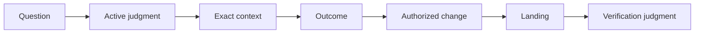
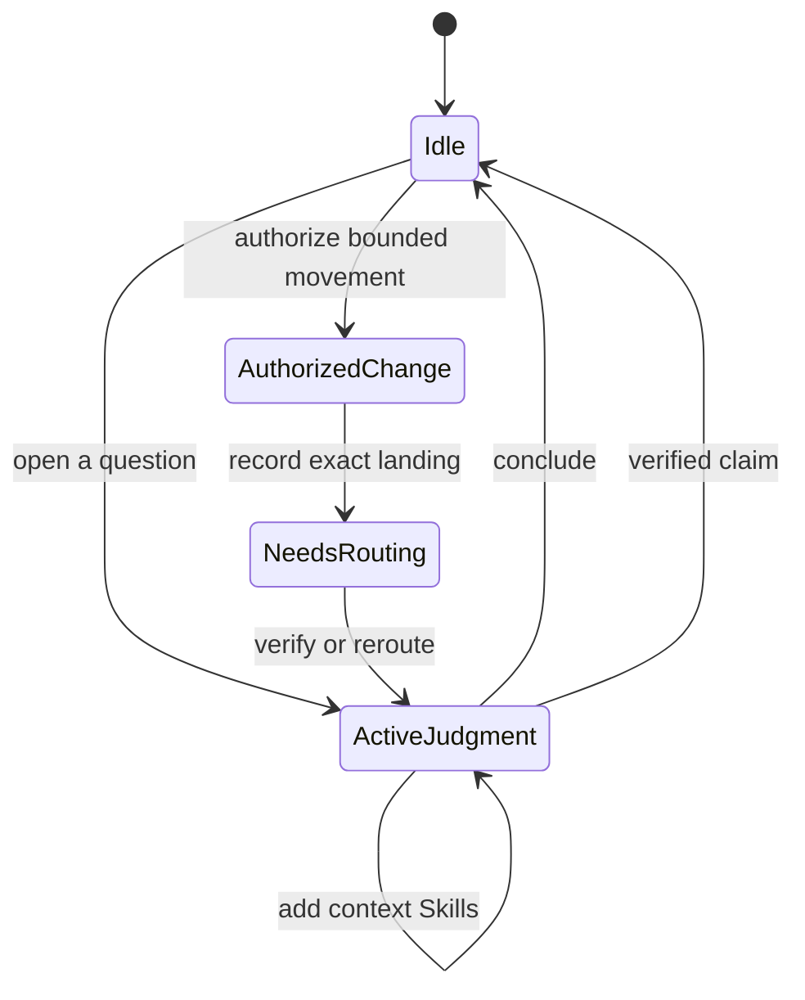
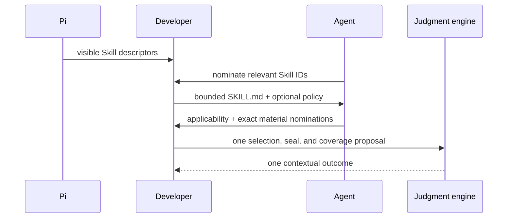

# @hobin/developer

A Pi workbench for making consequential coding decisions explicit before,
during, and after a change.

Developer helps Pi choose the right reasoning method, gather exact evidence,
separate judgment from mutation authority, and verify what a landing actually
proves. It is adaptive: simple work stays simple, while uncertain work opens the
smallest relevant judgment.

## Install

Requires [Pi](https://pi.dev) and Node.js 22.19 or newer.

```sh
pi install npm:@hobin/developer
```

Try it for one run:

```sh
pi -e npm:@hobin/developer
```

Enable Developer inside Pi:

```text
/developer on
```

## Try this first

Ask for the product change normally. You do not need to choose an internal Skill
or call a protocol tool.

```text
/developer on
The selected payment method disappears after navigating back to checkout.
Find the cause and fix it, but do not guess at missing product behavior.
```

Other useful prompts:

```text
This parser rewrite is green, but the conditionals are spreading.
Decide whether structural work belongs now.
```

```text
The tests pass after this cache change. Check what they do not prove before
calling it complete.
```

```text
Run a Doctor review of the checkout request-to-persistence flow. Preserve
external behavior and produce a now/next/observe/leave-alone plan without
modifying files.
```

## What Developer changes

| Without an explicit judgment | With Developer |
| --- | --- |
| Missing product decisions become implementation guesses | Unknowns become owned questions |
| A method is chosen from habit | One focused Skill owns the current question |
| Available guidance is treated as required context | Only materially useful context is selected |
| “Tests pass” becomes a completion claim | Evidence is matched to the exact claim |
| Editing and reasoning blur together | Judgment and mutation authority are separate |
| A landing implies success | Landing creates a distinct verification obligation |

Developer coordinates the work; Pi still reads, edits, runs, and tests through
its normal tools.

## How it works



This is an authority flow, not a mandatory development process. A settled,
well-evidenced request may proceed directly to a bounded authorization. New
evidence may instead open another judgment or a user question.

### Evidence and mutation stay separate



While an `ActiveJudgment` is open, Pi may inspect evidence but cannot use
Developer-controlled `edit` or `write`. Those tools return only for an
`AuthorizedChange`. This is workflow integrity, not an operating-system sandbox.

## Skills

Developer includes eleven independently invocable Skills. Pi may select one from
the request, or you can invoke it explicitly with `/skill:<name>`.

| Skill | Use it to decide… |
| --- | --- |
| `doctor` | What a bounded existing-code scope should treat now, later, observe, or leave alone |
| `specify` | What the product requirement actually means |
| `model` | Which cases, rules, states, contracts, and forbidden conditions exist |
| `sketch` | What data, interfaces, collaboration, flow, and code shape should exist |
| `signal` | Whether code shows real structural pressure |
| `naming-judgment` | Which name preserves stable domain meaning and exposes effects |
| `abstraction-review` | Whether a concrete abstraction should be kept, revised, split, rejected, or deferred |
| `schedule` | Whether structural work belongs now, after, or never |
| `verify` | Which claims current evidence supports and where pass-but-wrong risk remains |
| `adversarial-eval` | Which finite counterexamples could falsify a workflow or implementation claim |
| `visualize` | Which small visual surface makes a decision easier to inspect |

Each Skill owns a complete question, method, result, and stop. Doctor coordinates
a bounded diagnosis; it does not replace the other Skills with one universal
checklist.

## External Skill context

Developer can use Skills from other installed Pi packages as context without
turning them into Developer-owned methods:



Only nominated sources are opened. An optional `judgment.json` is shown before
applicability is assessed; root `unless` wins. Policy absence is normal, while a
malformed present policy rejects only that source batch. Applicable external
methods and references join the same Developer judgment as repository evidence.

## Commands

| Command | Effect |
| --- | --- |
| `/developer` | Open the read-only workbench |
| `/developer on` | Enable adaptive judgment and mutation gating |
| `/developer off` | Disable Developer and clear current protocol state after confirmation when needed |
| `/developer status` | Open or print current state |
| `/developer questions` | Inspect, answer, or investigate unresolved questions |
| `/developer settings` | Open activation settings |

Start Pi with Developer enabled:

```sh
pi --developer
```

## Workbench

`/developer` exposes current obligations without changing them:

```text
Overview → Active Judgment → Questions → Judgments → Landings → Settings
```

Use arrows or `j/k` to move, Enter to inspect, Escape to go back, Tab to change
focus, Page Up/Page Down or Home/End to scroll, `y` to copy the focused semantic
record, and `?` for help. The workbench is read-only; opening or copying it does
not append session events or write files.

## Boundaries

- Developer state is replayed from the current Pi session branch.
- Pending user, agent, and environment questions keep distinct owners and gates.
- A context hash proves identity and drift, not semantic truth.
- Landing records exact changed paths but never proves completion.
- Developer does not parse shell commands as a security policy.
- Installed Pi packages execute with Pi's process permissions; review source and
  use an external sandbox for untrusted work.

## Documentation

| Document | For |
| --- | --- |
| [User guide](./docs/user-guide.md) | Commands, workbench navigation, common workflows, and recovery |
| [Architecture](./docs/architecture.md) | State, authority, replay, tool access, and component ownership |
| [Context and evidence](./docs/context-and-evidence.md) | Internal evidence, external Skills, policy admission, sealing, and assurance |
| [Runtime protocol](./docs/runtime-protocol.md) | The five protocol operations, events, legal transitions, and maintainer invariants |

## Development

```sh
pnpm --filter @hobin/developer check
pnpm --filter @hobin/developer eval
pi -e ./packages/developer
```

`check` covers deterministic protocol, context, UI, and package behavior. `eval`
exercises the real Pi RPC surface without relying on one stochastic model run.

## License

[MIT](./LICENSE)
