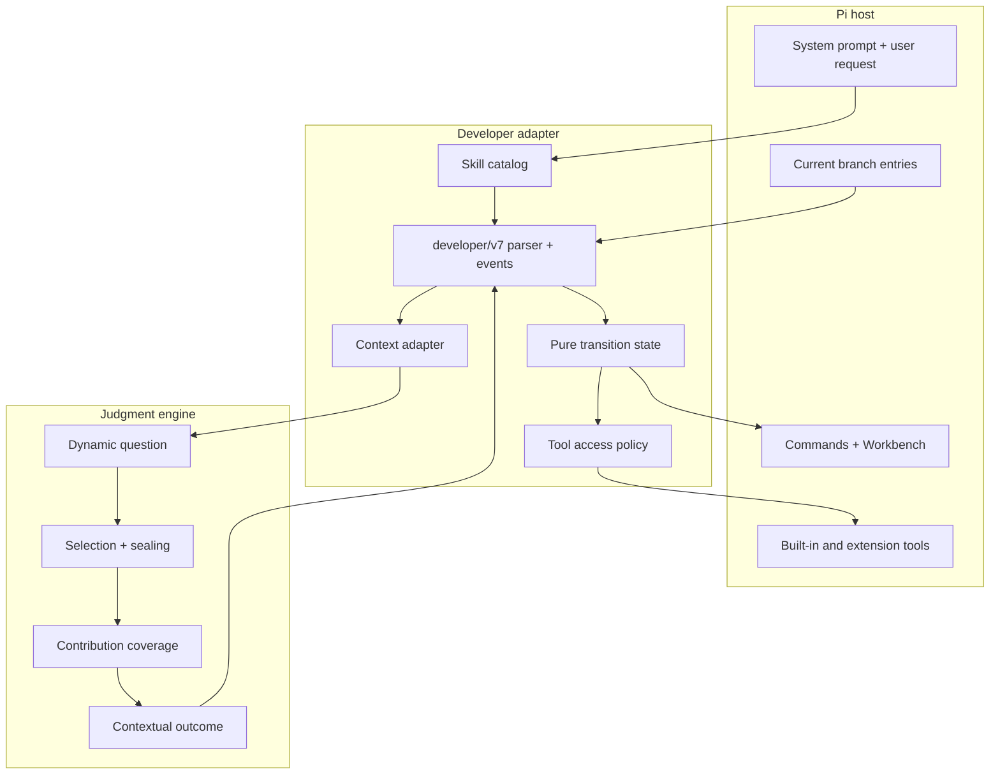
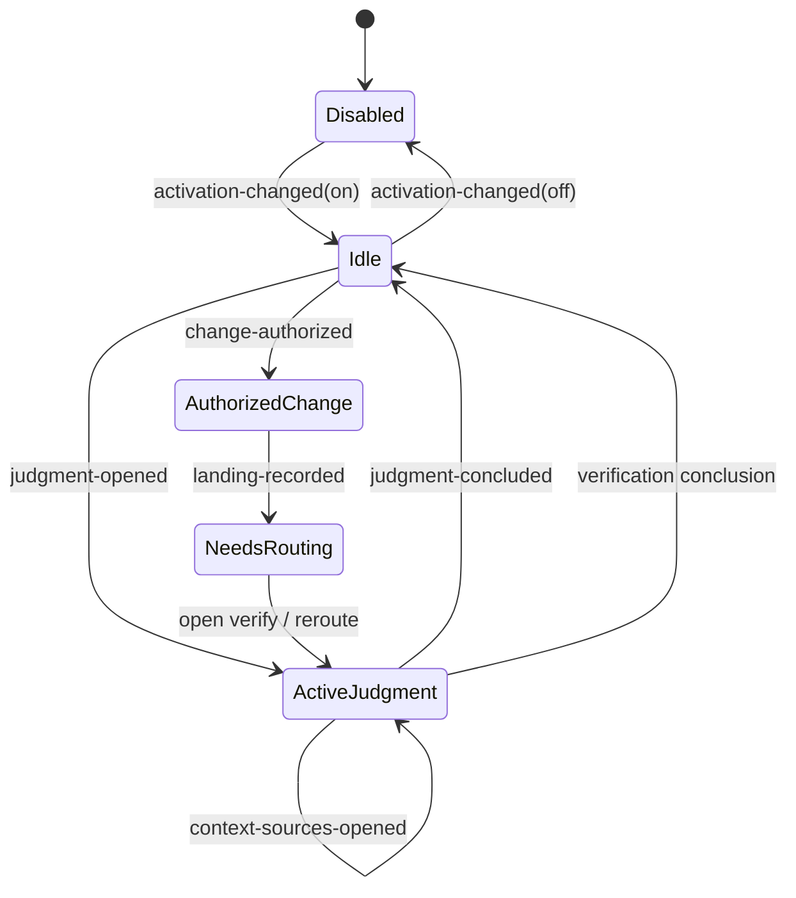
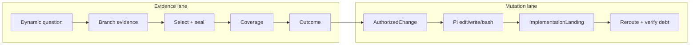
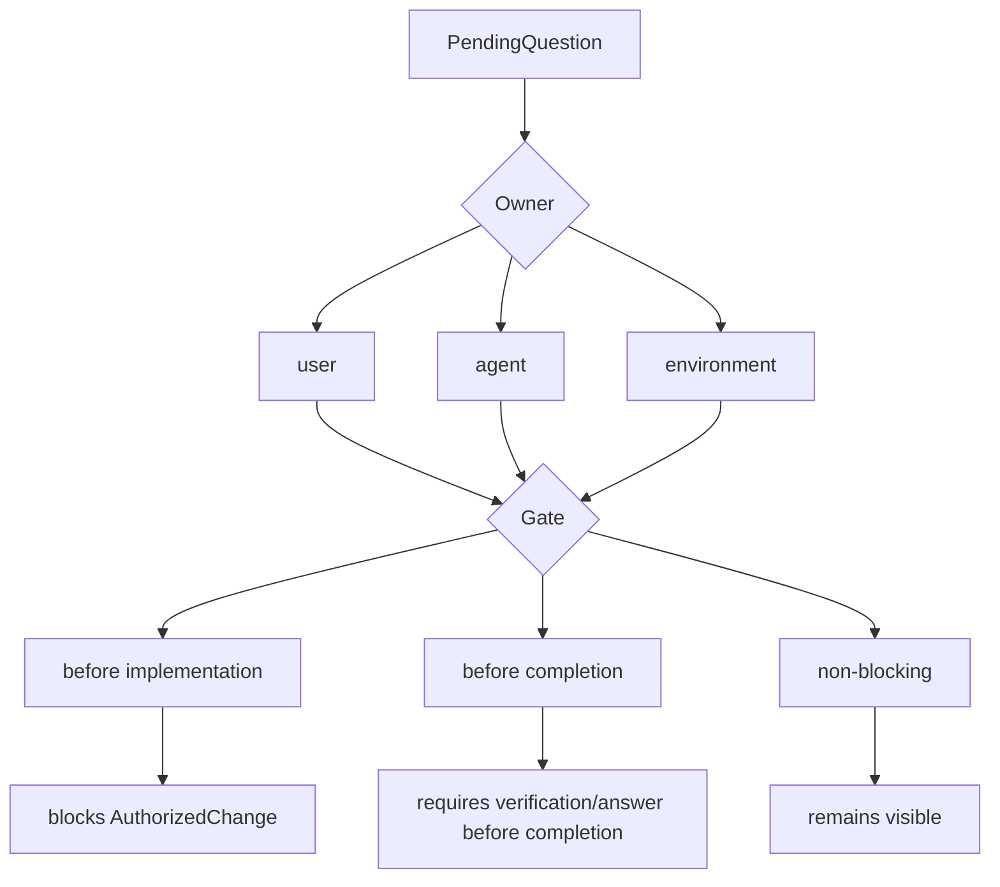
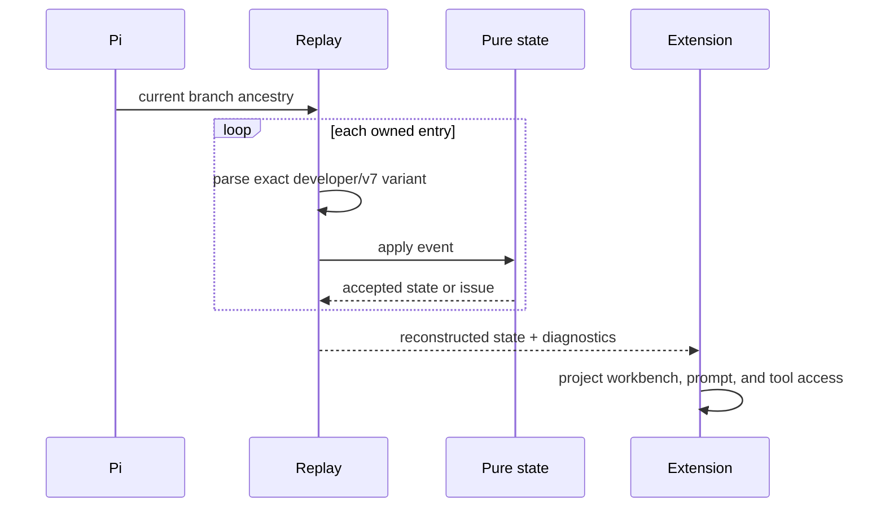

# Developer architecture

**Audience:** maintainers and reviewers.

Developer is a Pi adapter around one branch-local state machine. It combines
focused Skills and the reusable Judgment engine while keeping repository mutation
under a separate Developer-owned authorization.

## Layer map



Judgment has no knowledge of Developer commands, PendingQuestions, mutation,
landings, or UI. Developer has no private access to another package's Skill
implementation beyond normal Pi-visible descriptors and nominated files.

## Authority state machine



Only the pure transition accepts or rejects an event. The extension parses raw
tool input, constructs an exact event, asks `transitionDeveloper`, and appends the
serialized event only when the transition is accepted.

## Evidence lane and mutation lane



A contextual outcome does not grant mutation authority. `AuthorizedChange`
contains the bounded movement, stable landing, verification target, and optional
revert or refinement boundary. `ImplementationLanding` contains exact changed
paths and references that authorization.

## State and obligations

`DeveloperState` consists of:

```text
enabled
+ activeWork: ActiveJudgment | AuthorizedChange | none
+ pendingQuestions
+ completedJudgments
+ completedLandings
+ obligations:
    implementationFramingRequired
    verificationRequired
    rerouteRequired
```

The transition derives obligations from accepted events; tool code does not
patch state ad hoc.

### Question gates



Question IDs identify Developer PendingQuestions, never Judgment runtime
questions or Skill policies.

## Tool access projection

The state machine projects access instead of letting commands toggle arbitrary
tool names.

| State | Evidence work | Built-in `bash` | Built-in `edit` / `write` |
| --- | --- | --- | --- |
| Disabled | Host default | Host default | Host default |
| Enabled idle | Known bounded context only | Withheld by idle policy | Withheld |
| ActiveJudgment | Allowed | Allowed | Withheld |
| AuthorizedChange | Allowed | Allowed | Restored |
| NeedsRouting / verification debt | Allowed as needed | Policy-derived | No new authority |

`extensions/tool-policy.ts` records and restores only Developer's delta. It does
not replace unrelated tools or reinterpret extension tools named `edit` as Pi's
built-in editor.

## Branch replay



Malformed or illegal events become replay diagnostics. Unsupported v6 entries
remain historical evidence and are never reinterpreted as v7 events.

A hot reload is safe only when the lifecycle marker establishes which tool delta
this runtime owns. Otherwise Developer requests a restart.

## Context basis

A completed conclusion stores a compact basis binding:

```text
judgment and question identities
+ owner policy identity
+ opened context-source descriptor/policy/applicability identities
+ selection and sealed-content identities
+ material and contribution summaries
+ conflict and limitation IDs
+ coverage and outcome identities
→ contextBasisSha256
```

The basis is an audit/replay artifact, not a copy of every source byte. Exact
selected content remains bound by hashes and host provenance.

## Component map

| Area | Main files | Responsibility |
| --- | --- | --- |
| Protocol values | `src/protocol.ts` | Exact event/value parsers and serializers |
| Pure transitions | `src/transition.ts` | Legal state movement, obligations, operations, access projection |
| Replay | `src/replay.ts` | Current-branch reconstruction and diagnostics |
| Context integration | `extensions/developer-context.ts` | Inventory, observations, provider admission, Judgment calls |
| Skill discovery | `extensions/skill-catalog.ts`, `extensions/skills.ts` | Exact bundled and Pi-visible Skill identity |
| Runtime adapter | `extensions/developer.ts` | Pi commands, tools, events, prompts, append boundary |
| Tool policy | `extensions/tool-policy.ts` | Developer-owned tool delta and restart safety |
| Read-only UI | `extensions/developer-workbench*.ts`, `extensions/tui.ts` | Workbench projection and question interaction |

## Non-goals

- enforcing operating-system security;
- proving a model conclusion true;
- turning every task into a fixed phase sequence;
- owning implementation tools or replacing Pi's normal execution loop;
- importing another package's private Skills or references;
- treating a landing event as verified completion.
