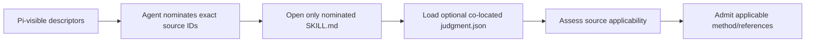
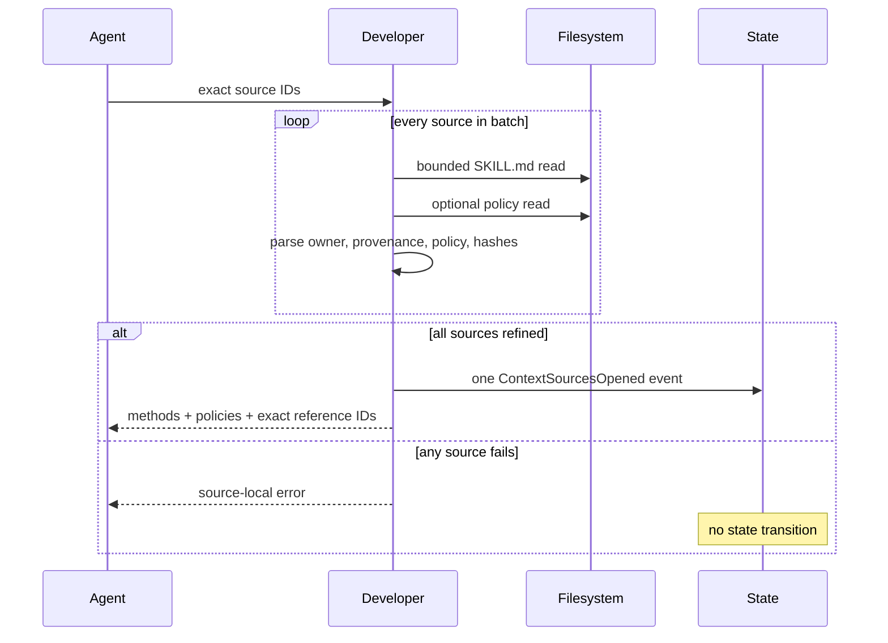
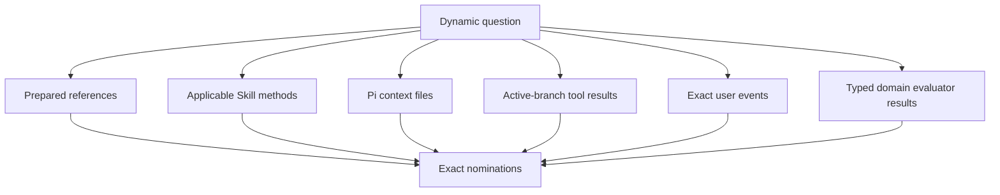
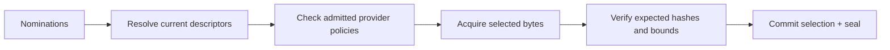
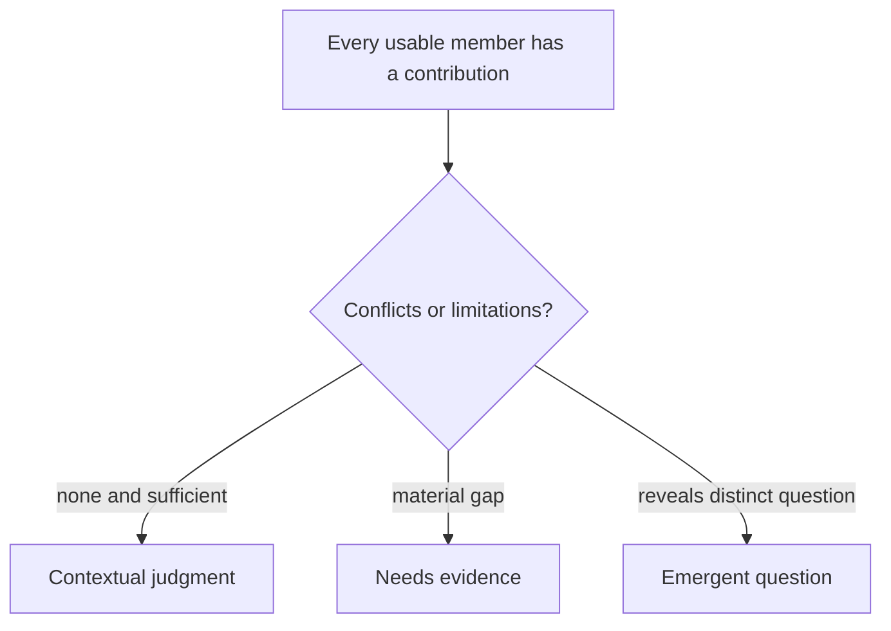

# Context and evidence

**Audience:** users who need auditability and maintainers changing Skill policies
or context integration.

Developer asks one dynamic question at a time. Its context may include the owning
Skill, conditional packaged references, other Pi-visible Skills, repository/tool
observations, context files, user events, and typed evaluator results.

## Candidate discovery stays cheap



Descriptor discovery does not crawl every Skill body, policy, or reference.
Developer opens one bounded batch of 1–16 sources and may open another batch
later if new evidence makes another Skill relevant.

## Owning Skill versus context Skill

| Property | Owning Developer Skill | External context Skill |
| --- | --- | --- |
| Count per judgment | Exactly one | Zero or more |
| Chooses dynamic question owner | Yes | No |
| Starts another judgment | Yes, the one active judgment | Never |
| Method may contribute | Yes | Only when applicable or policy-free |
| Prepared references | Optional policy | Optional source-specific policy |
| Can authorize mutation | No | No |

Roles are request-relative. A Skill may own one request and contribute method or
guidance to another.

## Optional Skill policy

A complete method lives in `SKILL.md`. A Skill owns `judgment.json` only when it
has conditional packaged references:

```json
{
  "specVersion": "0.1",
  "when": [
    "Caller-facing operations or ownership still need an implementable shape."
  ],
  "unless": [
    "A concrete candidate already exists and only its stability must be reviewed."
  ],
  "references": [
    {
      "path": "references/design-levels-and-boundaries.md",
      "when": [
        "A dependency boundary needs explicit caller, owner, hidden-mechanism, and direction distinctions."
      ]
    }
  ]
}
```

Root `unless` wins. Ambiguity becomes `needs-context`, not a guessed positive
match. Each reference remains an independent candidate.

```text
policy absent            → complete method, no prepared references
policy present and valid → model-visible conditions + owner-bound policy
policy present malformed → reject that source batch
```

See Judgment's [policy authoring guide](../../judgment/docs/policy-authoring.md)
for the exact vocabulary and containment rules.

## Batch opening is atomic



Earlier successful batches remain in the active judgment. Duplicate source IDs
are rejected.

## Inventory lanes



Availability is not relevance. Relevance is not selection. Selection is not
authority.

A current specification or repository observation can make packaged guidance
redundant. Developer records the actual selected sources rather than requiring
all applicable references to be read.

## Active-branch observations

A compact `branchResultId` in model input resolves to one exact Pi tool call and
result:

```text
tool call ID
+ tool name
+ arguments hash
+ result sequence
+ ordered content hash
+ success/error/truncation state
+ current branch
```

Alias collision, absent calls, sibling-branch results, changed content, errors,
and truncation fail closed for positive selection.

## Selection and sealing

The model nominates exact inventory, branch-result, or user-event IDs. Developer
then delegates one atomic selection/sealing transition to Judgment.



Every provider reference uses a reader contained to that provider's physical
root. A failed member read, symlink escape, invalid UTF-8, cancellation, size
limit, or content drift commits neither selection nor seal.

Unrelated inventory additions do not invalidate selected work. Changes to a
selected descriptor, policy, question, branch, or content do.

## Contributions

Every usable selected material must say how it changes the current judgment:

| `useAs` | Meaning |
| --- | --- |
| `constraint` | Bounds legal outcomes or execution |
| `evidence` | Supports or challenges a factual claim |
| `decision` | Records an authorized choice within its owner boundary |
| `method` | Organizes how the question should be investigated |
| `guidance` | Adds distinctions, counterexamples, or review criteria |

```text
selected material
+ useAs
+ concrete contribution
+ bounded assurance
→ contribution identity
```

Generic statements such as “this was useful” do not establish a contribution.

## Assurance

| Assurance | Required provenance |
| --- | --- |
| `agent-asserted` | Model interpretation tied to exact selected material |
| `domain-verified` | Matching selected typed evaluator relation |
| `user-accepted` | Matching selected user event |

A user answer can settle user-owned policy but cannot make a test pass. A typed
evaluator establishes only its declared relation. Packaged guidance cannot
override system or project constraints.

## Coverage and outcomes



A contextual judgment cites contribution identities. A needs-evidence result
accounts for exact conflict/limitation identities. An emergent question must be
meaningfully distinct from the current dynamic question.

None of these outcomes is mutation authority. `developer_authorize_change` is a
separate Developer transition after all before-implementation gates close.

## Maintainer checks

When changing context behavior, test at least:

- policy-free and policy-bearing external Skills in one judgment;
- several policy roots with identical-looking relative paths;
- winning root `unless` and `needs-context` assessments;
- malformed policy source-local failure;
- duplicate and repeated batch admission;
- descriptor, policy, content, question, and branch drift;
- unadmitted policy reference rejection;
- error/truncated observed results;
- atomic failure before state append; and
- assurance forgery attempts.
