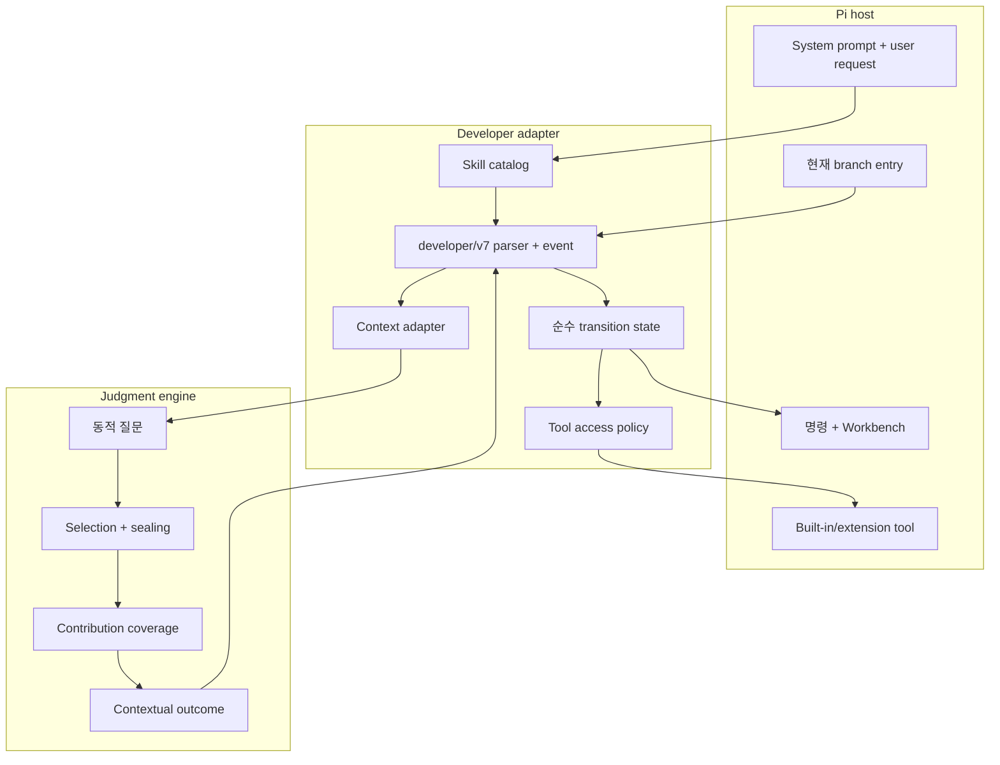
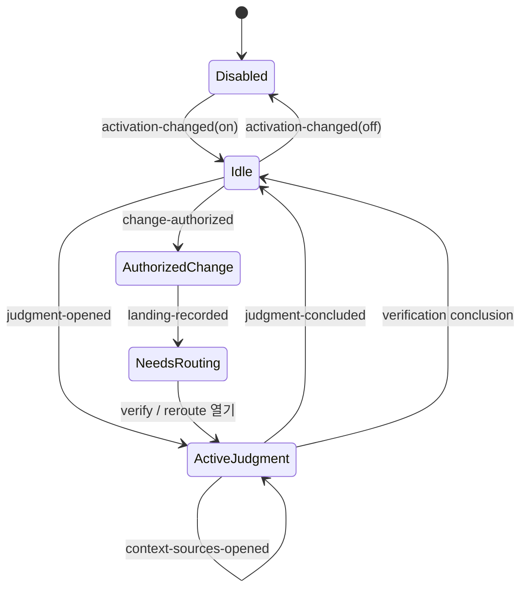
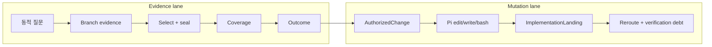
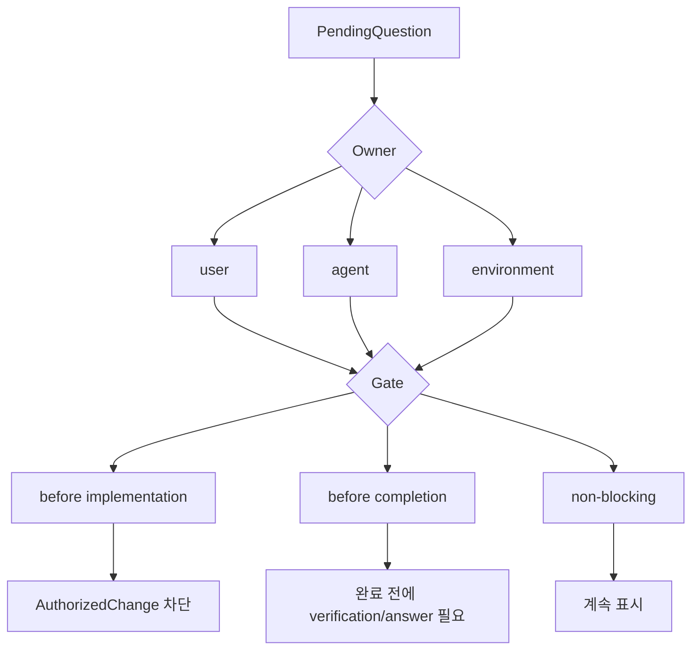
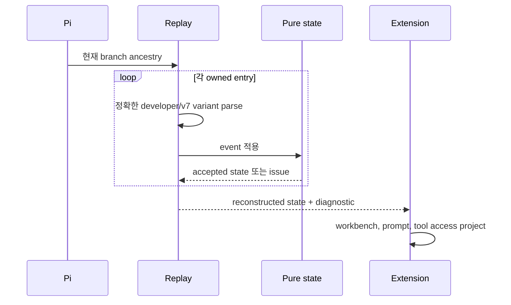

# Developer 아키텍처

[English](../architecture.md) | 한국어

**대상:** maintainer와 reviewer

Developer는 하나의 branch-local state machine을 감싼 Pi adapter입니다. 집중된
Skill과 재사용 가능한 Judgment engine을 결합하면서 저장소 변경은 별도의 Developer
소유 authorization 아래 둡니다.

## Layer 지도



Judgment는 Developer command, PendingQuestion, mutation, landing, UI를 알지
못합니다. Developer는 일반적인 Pi-visible descriptor와 지명된 파일 외에는 다른
package의 Skill implementation에 private하게 접근하지 않습니다.

## 권한 state machine



순수 transition만 event를 accept 또는 reject합니다. Extension은 raw tool input을
parse하고, exact event를 만들고, `transitionDeveloper`에 요청한 뒤 transition이
accept된 경우에만 serialized event를 append합니다.

## Evidence lane과 mutation lane



Contextual outcome은 mutation authority를 부여하지 않습니다. `AuthorizedChange`는
bounded movement, stable landing, verification target, 선택적 revert/refinement
boundary를 포함합니다. `ImplementationLanding`은 정확한 changed path와 해당
authorization reference를 포함합니다.

## State와 의무

`DeveloperState`의 구성:

```text
enabled
+ activeWork: ActiveJudgment | AuthorizedChange | none
+ pendingQuestions
+ completedJudgments
+ completedLandings
+ obligations:
    implementationFramingRequired
    verificationRequired
    rerouteRequired
```

Transition은 accepted event에서 obligation을 도출합니다. Tool code가 state를 ad
hoc으로 patch하지 않습니다.

### Question gate



Question ID는 Developer PendingQuestion을 식별하며 Judgment runtime question이나
Skill policy를 식별하지 않습니다.

## Tool access projection

State machine은 command가 임의의 tool name을 toggle하게 하지 않고 access를
project합니다.

| State | Evidence work | Built-in `bash` | Built-in `edit` / `write` |
| --- | --- | --- | --- |
| Disabled | Host default | Host default | Host default |
| Enabled idle | 알려진 bounded context만 | Idle policy로 보류 | 보류 |
| ActiveJudgment | 허용 | 허용 | 보류 |
| AuthorizedChange | 허용 | 허용 | 복원 |
| NeedsRouting / verification debt | 필요에 따라 허용 | Policy-derived | 새 권한 없음 |

`extensions/tool-policy.ts`는 Developer의 delta만 기록하고 복원합니다. 관련 없는
tool을 대체하거나 `edit`라는 이름의 extension tool을 Pi built-in editor로
재해석하지 않습니다.

## Branch replay



Malformed 또는 illegal event는 replay diagnostic이 됩니다. 지원하지 않는 v6
entry는 historical evidence로 남으며 v7 event로 재해석하지 않습니다.

Lifecycle marker가 runtime이 소유한 tool delta를 확립할 때만 hot reload가
안전합니다. 그렇지 않으면 Developer가 restart를 요청합니다.

## Context basis

완료된 conclusion은 다음을 결속하는 compact basis를 저장합니다.

```text
judgment와 question identity
+ owner policy identity
+ 열린 context-source descriptor/policy/applicability identity
+ selection과 sealed-content identity
+ material과 contribution summary
+ conflict와 limitation ID
+ coverage와 outcome identity
→ contextBasisSha256
```

Basis는 audit/replay artifact이지 모든 source byte의 복사본이 아닙니다. 정확한
selected content는 hash와 host provenance로 계속 결속됩니다.

## Component 지도

| 영역 | 주요 파일 | 책임 |
| --- | --- | --- |
| Protocol value | `src/protocol.ts` | 정확한 event/value parser와 serializer |
| Pure transition | `src/transition.ts` | 합법적 state movement, obligation, operation, access projection |
| Replay | `src/replay.ts` | Current-branch reconstruction과 diagnostic |
| Context integration | `extensions/developer-context.ts` | Inventory, observation, provider admission, Judgment call |
| Skill discovery | `extensions/skill-catalog.ts`, `extensions/skills.ts` | 정확한 bundled/Pi-visible Skill identity |
| Runtime adapter | `extensions/developer.ts` | Pi command, tool, event, prompt, append boundary |
| Tool policy | `extensions/tool-policy.ts` | Developer-owned tool delta와 restart safety |
| Read-only UI | `extensions/developer-workbench*.ts`, `extensions/tui.ts` | Workbench projection과 question interaction |

## 하지 않는 일

- 운영체제 보안 강제
- 모델 결론이 참임을 증명
- 모든 작업을 고정된 단계로 변환
- 구현 tool을 소유하거나 Pi의 일반 execution loop 대체
- 다른 package의 private Skill 또는 reference import
- Landing event를 검증된 완료로 취급
