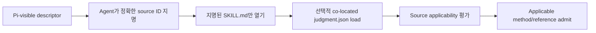
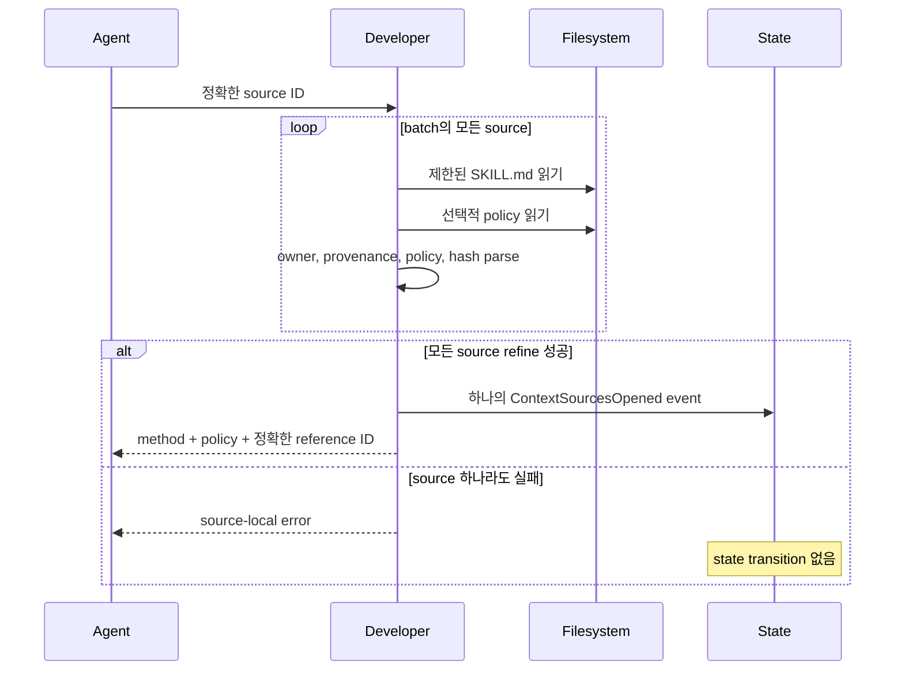
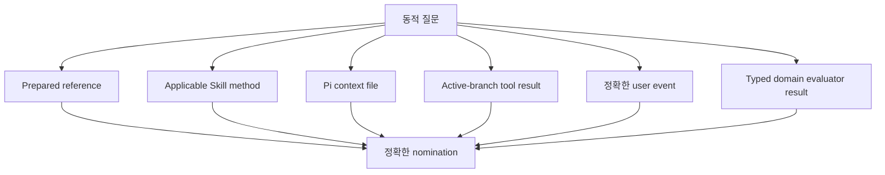
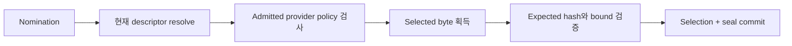
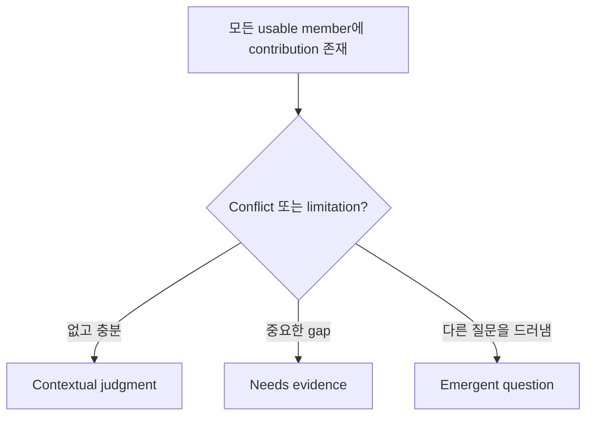

# 맥락과 근거

[English](../context-and-evidence.md) | 한국어

**대상:** auditability가 필요한 사용자와 Skill policy 또는 context integration을
변경하는 maintainer

Developer는 한 번에 하나의 동적 질문을 합니다. 맥락에는 owning Skill, 조건부
packaged reference, 다른 Pi-visible Skill, repository/tool observation, context
file, user event, typed evaluator result가 포함될 수 있습니다.

## 후보 발견은 저비용으로 유지



Descriptor discovery는 모든 Skill body, policy, reference를 탐색하지 않습니다.
Developer는 1–16개 source의 제한된 batch를 열고, 새로운 근거로 다른 Skill이
관련되면 다음 batch를 열 수 있습니다.

## Owning Skill과 context Skill

| Property | Owning Developer Skill | External context Skill |
| --- | --- | --- |
| Judgment당 개수 | 정확히 하나 | 0개 이상 |
| 동적 질문 owner 선택 | 예 | 아니요 |
| 다른 judgment 시작 | 현재 활성 judgment 하나 | 절대 안 함 |
| Method 기여 | 예 | Applicable 또는 policy-free일 때만 |
| Prepared reference | 선택적 policy | 선택적 source별 policy |
| Mutation 승인 | 불가 | 불가 |

Role은 요청에 상대적입니다. 어떤 Skill이 한 요청을 소유하고 다른 요청에는 method
또는 guidance로 기여할 수 있습니다.

## 선택적 Skill policy

완전한 method는 `SKILL.md`에 있습니다. Skill은 조건부 packaged reference가 있을
때만 `judgment.json`을 소유합니다.

```json
{
  "specVersion": "0.1",
  "when": [
    "Caller-facing operations or ownership still need an implementable shape."
  ],
  "unless": [
    "A concrete candidate already exists and only its stability must be reviewed."
  ],
  "references": [
    {
      "path": "references/design-levels-and-boundaries.md",
      "when": [
        "A dependency boundary needs explicit caller, owner, hidden-mechanism, and direction distinctions."
      ]
    }
  ]
}
```

Root `unless`가 우선합니다. 모호함은 positive match 추측이 아니라
`needs-context`가 됩니다. 각 reference는 독립적인 candidate입니다.

```text
policy absent            → complete method, prepared reference 없음
policy present and valid → model-visible condition + owner-bound policy
policy present malformed → 해당 source batch 거부
```

정확한 vocabulary와 containment rule은 Judgment의
[정책 작성 가이드](../../../judgment/docs/ko/policy-authoring.md)를 참고하세요.

## Batch opening은 atomic



이전 성공 batch는 활성 judgment에 남습니다. Duplicate source ID는 거부합니다.

## Inventory lane



Availability는 relevance가 아닙니다. Relevance는 selection이 아닙니다. Selection은
authority가 아닙니다.

현재 specification 또는 repository observation이 packaged guidance를 불필요하게
만들 수 있습니다. Developer는 적용 가능한 모든 reference를 읽게 하지 않고 실제
selected source를 기록합니다.

## Active-branch observation

Model input의 compact `branchResultId`는 정확한 Pi tool call/result 하나로
resolve됩니다.

```text
tool call ID
+ tool name
+ arguments hash
+ result sequence
+ ordered content hash
+ success/error/truncation state
+ current branch
```

Alias collision, absent call, sibling-branch result, changed content, error,
truncation은 positive selection에서 fail closed합니다.

## Selection과 sealing

모델이 정확한 inventory, branch-result, user-event ID를 지명합니다. 그 뒤
Developer가 Judgment에 하나의 atomic selection/sealing transition을 위임합니다.



모든 provider reference는 해당 provider의 physical root에 contained된 reader를
사용합니다. Member read 실패, symlink escape, invalid UTF-8, cancellation, size
limit, content drift가 있으면 selection과 seal 어느 것도 commit하지 않습니다.

관련 없는 inventory addition은 selected work를 무효화하지 않습니다. Selected
descriptor, policy, question, branch, content의 변경은 무효화합니다.

## Contribution

사용 가능한 모든 selected material은 현재 judgment를 어떻게 바꾸는지 표현해야
합니다.

| `useAs` | 의미 |
| --- | --- |
| `constraint` | 합법적 outcome 또는 execution 제한 |
| `evidence` | 사실 claim 지지 또는 challenge |
| `decision` | Owner boundary 안에서 승인된 choice 기록 |
| `method` | 질문 조사 방식을 조직 |
| `guidance` | Distinction, counterexample, review criteria 추가 |

```text
selected material
+ useAs
+ concrete contribution
+ bounded assurance
→ contribution identity
```

“유용했다” 같은 일반 문장은 contribution을 확립하지 못합니다.

## Assurance

| Assurance | 필요한 provenance |
| --- | --- |
| `agent-asserted` | 정확한 selected material에 결속된 model interpretation |
| `domain-verified` | 일치하는 selected typed evaluator relation |
| `user-accepted` | 일치하는 selected user event |

사용자 답변은 user-owned policy를 결정할 수 있지만 test를 통과시킬 수 없습니다.
Typed evaluator는 자신이 선언한 relation만 확립합니다. Packaged guidance는 system
또는 project constraint를 덮어쓸 수 없습니다.

## Coverage와 outcome



Contextual judgment는 contribution identity를 인용합니다. Needs-evidence 결과는
정확한 conflict/limitation identity를 설명합니다. Emergent question은 현재 동적
질문과 의미 있게 달라야 합니다.

어느 outcome도 mutation authority가 아닙니다. 모든 before-implementation gate가
닫힌 뒤 별도의 Developer transition인 `developer_authorize_change`를 사용합니다.

## Maintainer 검사

Context behavior를 바꿀 때 최소한 다음을 테스트하세요.

- 하나의 judgment에 policy-free와 policy-bearing external Skill
- 서로 비슷한 relative path를 가진 여러 policy root
- 우선하는 root `unless`와 `needs-context` assessment
- Malformed policy의 source-local failure
- Duplicate/repeated batch admission
- Descriptor, policy, content, question, branch drift
- Unadmitted policy reference rejection
- Error/truncated observed result
- State append 이전 atomic failure
- Assurance forgery 시도
