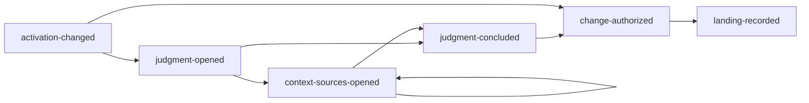
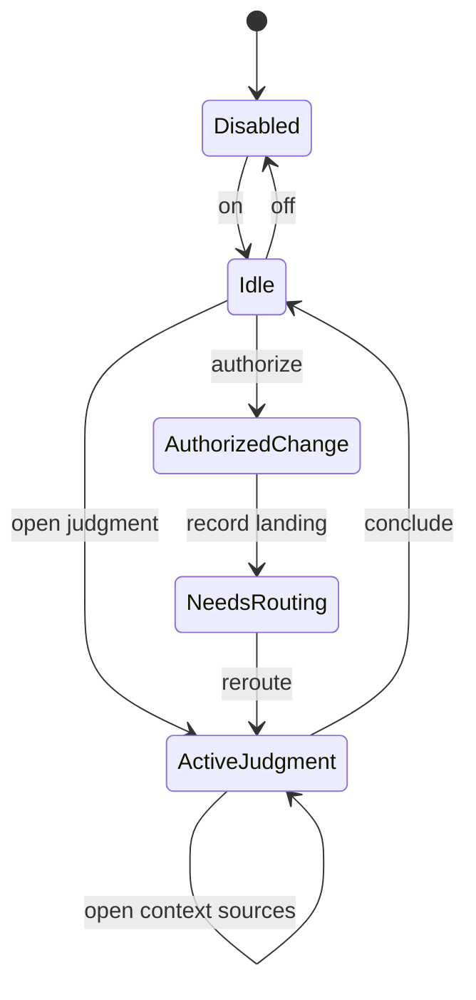
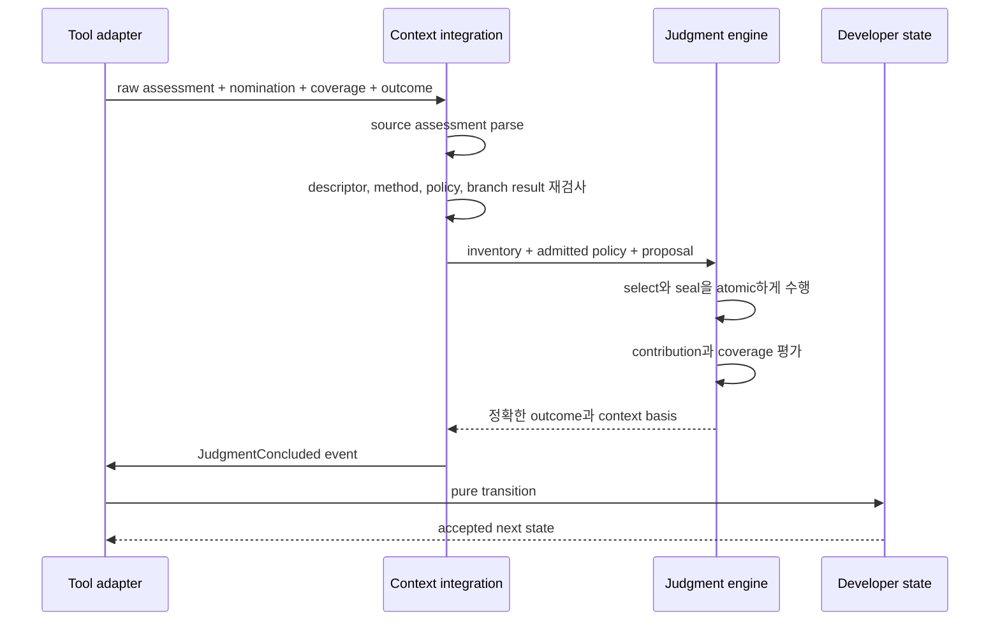

# Developer 런타임 프로토콜

[English](../runtime-protocol.md) | 한국어

**대상:** maintainer, automation author, persisted session behavior reviewer

Developer는 정확한 `developer/v7` event와 모델에 보이는 다섯 operation을
사용합니다. Protocol은 semantic judgment와 repository mutation을 분리합니다.

## Operation

| Operation | Input 책임 | Accepted effect |
| --- | --- | --- |
| `developer_open_judgment` | 하나의 bundled Developer Skill, 정확한 동적 질문, 선택적 target PendingQuestion | Immutable `ActiveJudgment` 하나 생성 |
| `developer_open_context_sources` | Active judgment ID와 1–16개 정확한 Pi-visible Skill source ID | 하나의 atomic batch로 judgment 확장 |
| `developer_conclude_judgment` | Source applicability, nomination, contribution, coverage, outcome, question update | Semantic work를 닫고 completed judgment 기록 |
| `developer_authorize_change` | Bounded movement, stable landing, verification target, 선택적 boundary/revert condition | `AuthorizedChange` 하나 생성 |
| `developer_record_landing` | Authorization ID, 정확한 non-empty changed path, observed landing | Landing을 기록하고 reroute/verification obligation 생성 |

Operation은 alias가 아닙니다. Judgment ID로 authorization을 닫을 수 없고,
authorization ID로 judgment를 conclude할 수 없습니다.

## Event stream



직접적인 `activation-changed → change-authorized` path는 movement가 이미 정당하고
열린 implementation gate가 없을 때만 유효합니다.

정확한 event variant는 `src/protocol.ts`가 parse합니다. Unknown field와 병합된
“mode” object는 거부합니다.

## 합법적인 다음 operation



| Active state | 노출되는 protocol operation |
| --- | --- |
| Disabled | Activation command만 |
| Enabled idle | Gate가 허용하면 `developer_open_judgment`, `developer_authorize_change` |
| ActiveJudgment | `developer_open_context_sources`, `developer_conclude_judgment` |
| AuthorizedChange | `developer_record_landing` |
| NeedsRouting | 다음 judgment 열기 또는 obligation이 허용한 뒤에만 authorize |

`developerNextOperations`와 `developerToolAccess`는 pure state의 projection이지
extension이 관리하는 mutable registry가 아닙니다.

## Judgment 열기

Adapter는 정확한 Pi inventory에서 selected Developer Skill을 resolve하고 method를
load하며 선택적 policy를 compile합니다. Opening event는 다음을 결속합니다.

```text
judgmentId
+ DeveloperSkillRef
+ dynamic question
+ optional targetQuestionId
+ optional CompiledJudgmentPolicy
+ branchRef
+ empty contextSources
```

Policy가 없는 Skill도 완전히 유효하며 prepared reference만 없습니다.

## Context source 열기

Source operation은 하나의 active judgment 안에서 반복할 수 있습니다. 성공한 각
event는 refined `OpenedContextSource` value를 포함합니다.

```text
inventorySourceId
+ exact descriptor
+ methodContentSha256
+ optional owner-bound compiled policy
```

다음 조건에서만 event를 accept합니다.

- Judgment ID가 active judgment와 일치
- Batch 안의 각 source ID가 unique
- 이미 열린 source가 없음
- 모든 Skill method를 bound 안에서 읽음
- 존재하는 모든 policy를 해당 source provenance 아래 parse/compile

Event는 아직 applicability를 주장하지 않습니다. 먼저 policy condition이 모델에
보여야 합니다.

## Judgment 결론

Model boundary의 `branchResultId`는 정확한 current-branch Pi tool call/result 하나의
compact alias입니다. Adapter가 Judgment에 observed context를 전달하기 전에
resolve합니다.



모든 policy-bearing opened source는 정확히 하나의 applicability assessment를
받습니다. Policy-free source에는 필요 없습니다. Applicable source method와
reference만 positive nomination에 들어갈 수 있습니다.

Conclusion은 기존 PendingQuestion을 update하거나 정확한 owner/gate/criteria를 가진
새 질문을 만들 수 있습니다. Changed path나 mutation authority는 담을 수 없습니다.

## 변경 승인

`AuthorizedChange`는 다음 조건을 만족할 때만 accept됩니다.

- Developer가 enabled이고 다른 active work가 없음
- 제공된 target PendingQuestion이 실제로 존재
- 미해결 before-implementation question 없음
- Movement와 stable landing이 non-empty이고 bounded
- Verification target이 explicit
- Refinement boundary 또는 trusted-compiler gap이 자체 exact variant로 parse됨

Trusted-compiler gap은 제한된 escape-hatch evidence이지 일반 cast permission이
아닙니다.

## Landing 기록

`developer_record_landing`에는 정확한 active authorization과 최소 하나의 changed
path가 필요합니다. Transition은 다음을 기록합니다.

```text
authorizationId
+ changedPaths
+ observed stable landing
+ optional implementation evidence
```

그 뒤 mutation authority를 지우고 reroute와 verification debt를 설정합니다.
Landing은 `verified` boolean을 만들지 않습니다.

## PendingQuestion transition 규칙

Conclusion은 다음을 할 수 있습니다.

- Evidence 또는 explicit user answer로 기존 question resolve
- Owner와 gate를 보존하며 defer
- 이유와 함께 supersede
- 구별되는 question 생성

ID, owner, gate, resolution criteria가 현재 state와 맞지 않으면 question change를
거부합니다. `user-accepted` context라고 주장하는 user-owned resolution에는 일치하는
branch-local user event가 필요합니다.

## Replay

```text
현재 Pi branch entry
→ Developer-owned custom entry 식별
→ exact event variant parse
→ 순서대로 pure transition 적용
→ reconstructed state + bounded replay issue
```

Exact duplicate event entry는 protocol이 명시적으로 허용하는 곳에서만 stutter할 수
있습니다. Conflicting duplicate와 illegal order는 fail closed합니다. Sibling-branch
entry는 제공된 ancestry에 없습니다.

### 지원하지 않는 v6 history

이전 `developer/v6` entry는 unsupported history를 보고하기 위해서만 인식합니다.
Route, guidance, judgment, mutation, landing authority가 일대일로 대응하지 않으므로
v7로 번역하지 않습니다.

## Append boundary

Extension은 다음 순서를 따릅니다.

```text
raw tool input
→ exact parser/refinement
→ current evidence 도출
→ event 구성
→ pure transition preview
→ custom session entry append
→ projected runtime state update
```

Context selection에서는 모든 filesystem acquisition과 Judgment transition이 성공한
뒤에만 Developer event를 append합니다. Tool output bounding도 state publication 전에
수행합니다.

## Protocol 검토 checklist

- 모든 raw variant를 exact key로 parse하는가?
- 하나의 operation이 하나의 authority만 가지는가?
- `developerNextOperations`가 합법적 transition만 노출하는가?
- Stale 또는 sibling-branch identity를 replay할 수 없는가?
- ActiveJudgment가 artifact를 변경할 수 없는가?
- Landing이 verification debt를 우회할 수 없는가?
- External source batch가 all-or-nothing인가?
- Persisted `DeveloperContextBasis`가 active question/source와 일치하는가?
- Hot reload가 Developer의 tool delta만 복원하거나 restart를 요청하는가?
