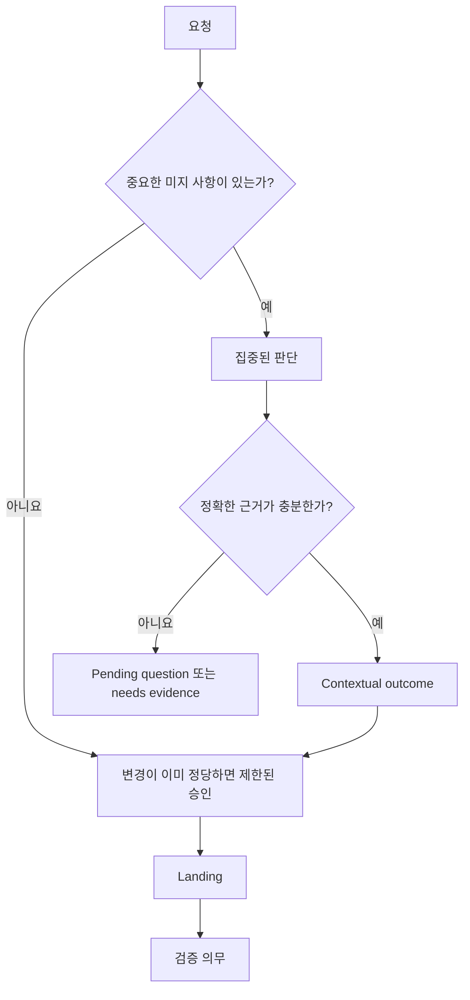

# Developer 사용자 가이드

[English](../user-guide.md) | 한국어

Developer는 검토 가능한 판단과 변경 권한 계층을 Pi에 추가합니다. 사용자는 계속
평소처럼 작업을 설명하고 Pi를 사용합니다. 요청, 근거, 현재 branch에 중요한
미결정 사항이 있을 때 Developer가 개입합니다.

## 시작과 종료

```text
/developer on
/developer off
```

`on`은 적응형 판단과 Developer 소유 tool gating을 활성화합니다. 활성 작업이나
질문이 남아 있다면 `off`는 확인 후 현재 Developer protocol state를 정리합니다.
과거 Pi session entry는 해당 branch에 남습니다.

Developer를 활성화한 상태로 Pi를 시작하려면:

```sh
pi --developer
```

## 자연스럽게 요청하기

일반 작업에서는 Skill을 언급할 필요가 없습니다.

```text
Add scheduled invoice delivery. Clarify any missing product rules before editing.
```

```text
This serializer replacement is green. Verify source compatibility, persisted
values, and plausible pass-but-wrong cases.
```

```text
Review whether the new cache wrapper has earned a stable abstraction boundary.
```

질문 owner를 이미 안다면 Skill을 직접 호출하세요.

```text
/skill:model Model the replacement and default semantics of this config change.
/skill:sketch Shape the caller-facing interface for the approved requirement.
/skill:verify Judge whether these checks support the completion claim.
```

## 화면에 나타나는 것



Developer는 다음을 할 수 있습니다.

- 제품 결정을 사용자에게 질문
- 저장소 또는 runtime evidence 조사를 agent에게 요청
- environment가 소유하는 접근 또는 observation gap 식별
- 하나의 집중된 Developer Skill 열기
- 다른 설치된 Pi Skill의 method를 정확한 맥락으로 사용
- implementation gate가 닫힌 뒤 한정된 변경 하나를 승인
- landing 이후 별도의 verification judgment 요구

## 명령

| 명령 | 용도 |
| --- | --- |
| `/developer` | Workbench 열기 |
| `/developer status` | Workbench Overview 열기. 비대화형 TUI mode에서는 state 출력 |
| `/developer questions` | Pending question 검토, 답변, defer, 조사 |
| `/developer settings` | 활성화 설정 열기 |
| `/developer on` | Developer 활성화 |
| `/developer off` | Developer 비활성화 및 현재 protocol state 정리 |

모든 bundled Skill에는 Pi의 일반 `/skill:<name>` 명령을 계속 사용할 수 있습니다.

## Workbench 지도

```text
Overview
├── 현재 routing state와 다음 operation
├── implementation/completion gate
└── verification debt
Active Judgment
├── owning Skill과 동적 질문
├── 열린 외부 context Skill
├── selected/sealed material
└── contribution, conflict, limitation, outcome
Questions
├── user-owned
├── agent-owned
└── environment-owned
Judgments
└── 완료된 결과와 정확한 context basis
Landings
└── authorization, changed path, stable landing, verification target
Settings
└── activation
```

### Keyboard control

| 키 | 동작 |
| --- | --- |
| `↑` / `↓`, `j` / `k` | 선택 이동 |
| Enter | 선택 항목 열기 또는 활성화 |
| Escape | 한 단계 돌아가기 |
| Tab | Pane/region 사이 focus 이동 |
| Page Up / Page Down | 제한된 viewport 스크롤 |
| Home / End | Viewport 경계로 이동 |
| `y` | 선택한 전체 semantic record 복사 |
| `?` | 맥락 도움말 표시 |

Workbench inspection은 읽기 전용입니다. Protocol event 추가, message 전송, tool
변경, 파일 쓰기를 하지 않습니다.

## 질문과 gate

모든 pending question은 resolution owner와 gate를 기록합니다.

| Owner | 해결 방식 |
| --- | --- |
| User | 명시적인 제품 결정 또는 수락 |
| Agent | Pi가 조사할 수 있는 repository, runtime, test, source evidence |
| Environment | Access, credential, external observation, unavailable system fact |

| Gate | 효과 |
| --- | --- |
| Before implementation | 변경 승인 차단 |
| Before completion | Landing은 존재할 수 있지만 완료는 계속 차단 |
| Non-blocking | 현재 진행을 막지 않고 계속 표시 |

`/developer questions`는 답변 control보다 먼저 설명을 엽니다. 모델은 사용자 대신
user-owned question에 답할 수 없습니다.

## 일반 워크플로

### 모호한 bug 수정

```text
request
→ 현재 behavior 조사
→ 중요하다면 빠진 product rule 노출
→ user answer 또는 evidence
→ 제한된 fix 승인
→ changed path 기록
→ repaired claim 검증
```

### 이미 명확한 local change

```text
exact requirement + known path + existing check
→ 제한된 movement 승인
→ 일반 Pi tool로 edit/test
→ landing 기록
→ changed claim만 검증
```

요청과 근거가 이미 movement를 정당화하면 Developer는 불필요한 절차를 만들지
않습니다.

### 수정하지 않고 기존 scope 진단

```text
명시적 Doctor request + bounded scope
→ 저비용 orientation
→ trigger된 judgment owner 참고
→ now / next / observe / leave-alone plan 종합
```

Doctor는 requested, inspected, claim scope를 따로 보고합니다. Sample을 전체 저장소
review인 것처럼 제시하지 않습니다.

### 구조 재검토

```text
signal로 structural movement 관찰
→ 필요하면 sketch로 candidate 형성
→ abstraction-review로 concrete candidate 검토
→ now / after / never schedule
```

이 Skill은 질문에 따라 선택하며 필수 단계가 아닙니다.

## Routing state

| State | 의미 |
| --- | --- |
| `idle` | 활성 Developer work 또는 미해결 Developer question 없음 |
| `needs-judgment` | 활성 질문에 아직 outcome 필요 |
| `needs-evidence` | Agent/environment evidence 누락 |
| `needs-answer` | User decision 누락 |
| `needs-routing` | Landing에 다음 judgment 또는 authorization 필요 |
| `needs-verification` | 변경 artifact에 claim-relative verification 필요 |
| `blocked` | 필요한 evidence, answer, access를 사용할 수 없음 |

`idle`은 사용자 전체 작업이 완료됐다는 주장이 아닙니다.

## Tool 동작

| Developer state | `bash` | `edit` / `write` |
| --- | --- | --- |
| 활성화된 Idle | Developer safe idle policy로 제한 | 보류 |
| Active judgment | Evidence work에 사용 가능 | 보류 |
| Authorized change | 사용 가능 | 한정된 movement에 사용 가능 |
| Landing needs routing | Rerouting에 필요한 범위에서 사용 | 새 mutation authority 없음 |

Developer는 자신이 소유하는 built-in tool delta만 복원합니다. 관련 없는 extension
tool과 사용자가 비활성화한 tool은 host 설정을 유지합니다.

이 mechanism은 우발적인 workflow bypass를 막지만 shell command나 악성 Pi package를
sandbox하지 않습니다.

## Branch, compaction, reload

Developer event는 현재 Pi branch에서 replay됩니다. Fork는 자체 ancestry를
상속하며 sibling branch의 evidence는 active-branch material로 선택할 수 없습니다.

Compaction은 Pi가 소유합니다. Developer는 Pi의 일반 compactor가 보존할 수 있도록
제한된 state/context를 제공합니다.

Hot reload가 안전한 lifecycle marker 없는 오래된 Developer history를 만나면 Pi를
재시작하세요. Extension은 이전 tool configuration을 추측하지 않고 이 상황을
보고합니다.

## 업데이트와 제거

```sh
pi list
pi config
pi update npm:@hobin/developer
pi remove npm:@hobin/developer
```

저장소가 project-local Pi setting에 package를 선언해야 한다면
`pi install -l npm:@hobin/developer`를 사용합니다.
