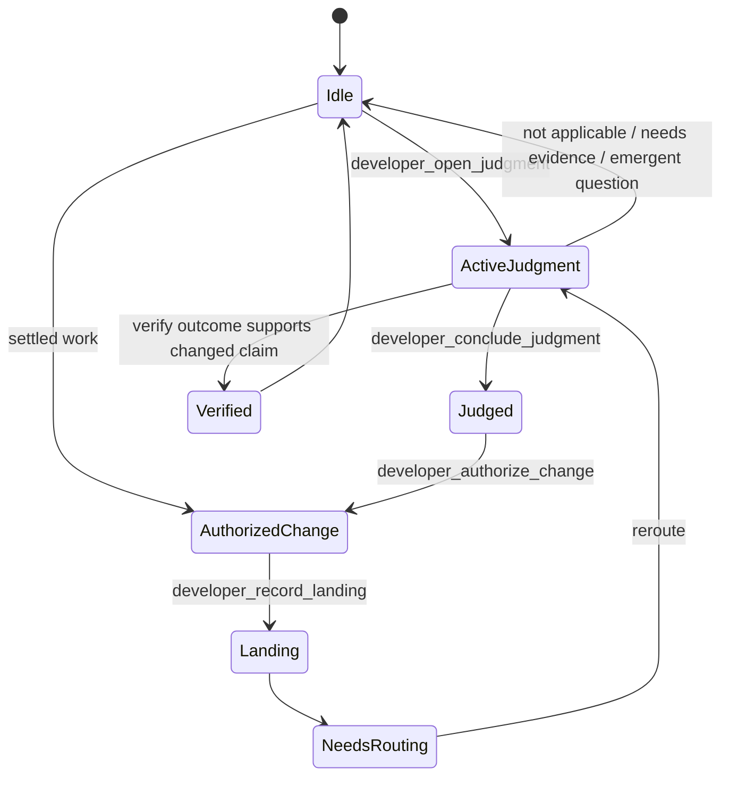
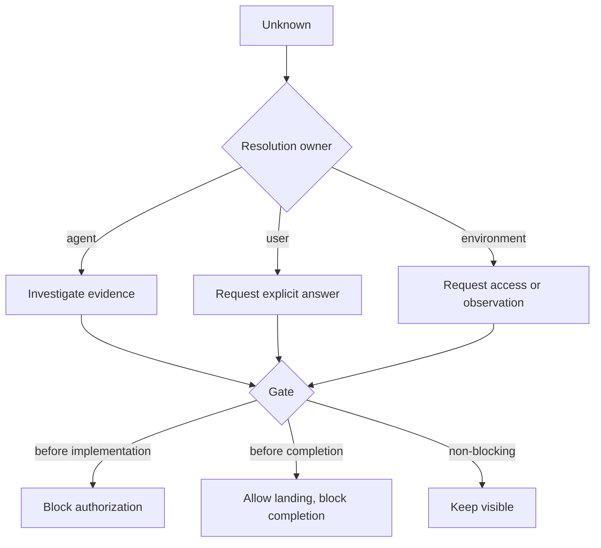

# Developer Runtime Flow

Developer coordinates branch-local judgment and bounded mutation. This diagram
shows authority transitions; it is not a mandatory product-development phase
sequence.

## Authority state model



A later observation can reopen work. `Idle` and `Landing` are not completion
claims.

## Evidence lane versus mutation lane

```mermaid
flowchart LR
  Q[Dynamic question] --> J[ActiveJudgment]
  J --> E[Exact branch evidence]
  E --> S[Select + seal]
  S --> C[Contribution coverage]
  C --> O[Judgment outcome]
  O --> A[AuthorizedChange]
  A --> M[Pi edit/write/bash]
  M --> L[Exact landing paths]
  L --> V[Separate verify judgment]
```



| Runtime state | Read/evidence work | `bash` | `edit` / `write` | May claim completion |
| --- | --- | --- | --- | --- |
| Idle | only already-known bounded paths | restricted | no | no |
| ActiveJudgment | yes | yes | no | no |
| AuthorizedChange | yes | yes | yes, within bounded movement | no |
| Landing / NeedsRouting | yes | as required to reroute | no new mutation authority | no |
| Verified | recorded evidence only | n/a | n/a | only within the verified claim boundary |

## Questions and gates



A `pending_question_id` always refers to an existing Developer PendingQuestion.
It is never a Judgment runtime ID.

## Optional skill policy

A Developer skill remains complete in `SKILL.md`. Seven skills additionally own
conditional packaged references:

```text
selected skill
→ optional {when, unless, references[{path, when}]}
→ zero, one, or several prepared references
→ exact material contributions
```

Policy can improve selection and replayability. It cannot authorize mutation or
replace current repository evidence.
