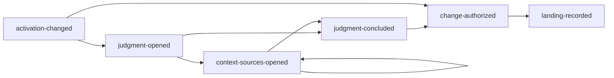
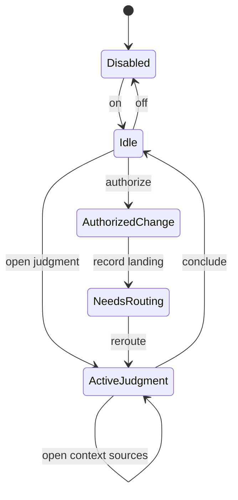
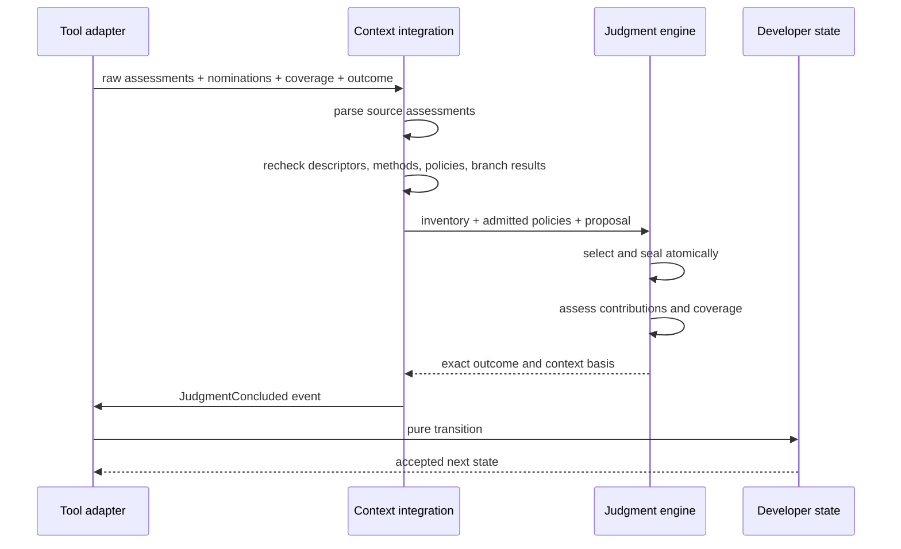

# Developer runtime protocol

English | [한국어](./ko/runtime-protocol.md)

**Audience:** maintainers, automation authors, and reviewers of persisted session
behavior.

Developer uses exact `developer/v7` events and five model-facing operations. The
protocol separates semantic judgment from repository mutation.

## Operations

| Operation | Input responsibility | Accepted effect |
| --- | --- | --- |
| `developer_open_judgment` | One bundled Developer Skill, exact dynamic question, optional target PendingQuestion | Creates one immutable `ActiveJudgment` |
| `developer_open_context_sources` | Active judgment ID and 1–16 exact Pi-visible Skill source IDs | Extends that judgment with one atomic batch |
| `developer_conclude_judgment` | Source applicability, nominations, contributions, coverage, outcome, question updates | Closes semantic work and records a completed judgment |
| `developer_authorize_change` | Bounded movement, stable landing, verification target, optional boundary/revert condition | Creates one `AuthorizedChange` |
| `developer_record_landing` | Authorization ID, exact non-empty changed paths, observed landing | Records landing and creates reroute/verification obligations |

Operations are not aliases. A judgment ID cannot close an authorization, and an
authorization ID cannot conclude a judgment.

## Event stream



A direct `activation-changed → change-authorized` path is valid only when the
movement is already justified and no implementation gate is open.

The exact event variants are parsed by `src/protocol.ts`; unknown fields and
merged “mode” objects are rejected.

## Legal next operations



| Active state | Protocol operations exposed |
| --- | --- |
| Disabled | Activation command only |
| Enabled idle | `developer_open_judgment`, `developer_authorize_change` when gates allow |
| ActiveJudgment | `developer_open_context_sources`, `developer_conclude_judgment` |
| AuthorizedChange | `developer_record_landing` |
| NeedsRouting | Open the next judgment or authorize only after obligations allow |

`developerNextOperations` and `developerToolAccess` are projections of the pure
state, not mutable registries maintained by the extension.

## Open judgment

The adapter resolves the selected Developer Skill from the exact Pi inventory,
loads its method, and compiles its optional policy. The opening event binds:

```text
judgmentId
+ DeveloperSkillRef
+ dynamic question
+ optional targetQuestionId
+ optional CompiledJudgmentPolicy
+ branchRef
+ empty contextSources
```

A Skill without policy is fully valid and simply has no prepared references.

## Open context sources

The source operation is repeatable during one active judgment. Each successful
event contains refined `OpenedContextSource` values:

```text
inventorySourceId
+ exact descriptor
+ methodContentSha256
+ optional owner-bound compiled policy
```

The event is accepted only when:

- its judgment ID matches the active judgment;
- each source ID is unique in the batch;
- no source is already open;
- all Skill methods were read within bounds; and
- every present policy parsed and compiled under that source's provenance.

The event does not yet claim applicability. Policy conditions must first be
visible to the model.

## Conclude judgment

At the model boundary, `branchResultId` is a compact alias for one exact
current-branch Pi tool call/result. The adapter resolves it before Judgment sees
observed context.



Every policy-bearing opened source receives exactly one applicability assessment.
Policy-free sources need none. Only applicable source methods and references can
be nominated positively.

The conclusion may update existing PendingQuestions or create new ones under
exact owner/gate/criteria fields. It cannot carry changed paths or mutation
authority.

## Authorize change

An `AuthorizedChange` is accepted only when:

- Developer is enabled and no other work is active;
- the target PendingQuestion exists when supplied;
- no before-implementation question remains unresolved;
- the movement and stable landing are non-empty and bounded;
- the verification target is explicit; and
- any refinement boundary or trusted-compiler gap parses as its own exact
  variant.

The trusted-compiler gap is bounded escape-hatch evidence, not a generic cast
permission.

## Record landing

`developer_record_landing` requires the exact active authorization and at least
one changed path. The transition records:

```text
authorizationId
+ changedPaths
+ observed stable landing
+ optional implementation evidence
```

It then clears mutation authority and sets reroute plus verification debt.
Landing never creates a `verified` boolean.

## PendingQuestion transition rules

A conclusion can:

- resolve an existing question with evidence or an explicit user answer;
- defer it while preserving owner and gate;
- supersede it with a reason; or
- create a distinct question.

Question changes are rejected when IDs, owner, gate, or resolution criteria do
not match current state. User-owned resolution requires the matching branch-local
user event when claimed as `user-accepted` context.

## Replay

```text
current Pi branch entries
→ identify Developer-owned custom entries
→ parse exact event variant
→ apply pure transition in order
→ reconstructed state + bounded replay issues
```

Exact duplicate event entries can stutter only where the protocol explicitly
permits it; conflicting duplicates and illegal order fail closed. Sibling-branch
entries are absent from the supplied ancestry.

### Unsupported v6 history

Older `developer/v6` entries are recognized only to report unsupported history.
They are not translated into v7 because route, guidance, judgment, mutation, and
landing authorities do not map one-to-one.

## Append boundary

The extension follows this ordering:

```text
raw tool input
→ exact parser/refinement
→ derive current evidence
→ build event
→ preview pure transition
→ append custom session entry
→ update projected runtime state
```

For context selection, all filesystem acquisition and Judgment transitions must
succeed before the Developer event is appended. Tool output bounding also occurs
before state publication.

## Protocol review checklist

- Is every raw variant parsed with exact keys?
- Does one operation have one authority?
- Does `developerNextOperations` expose only legal transitions?
- Can a stale or sibling-branch identity be replayed? It must not.
- Can an ActiveJudgment mutate artifacts? It must not.
- Can a landing bypass verification debt? It must not.
- Are external source batches all-or-nothing?
- Does persisted `DeveloperContextBasis` match the active question and sources?
- Does hot reload restore only Developer's tool delta or request restart?
