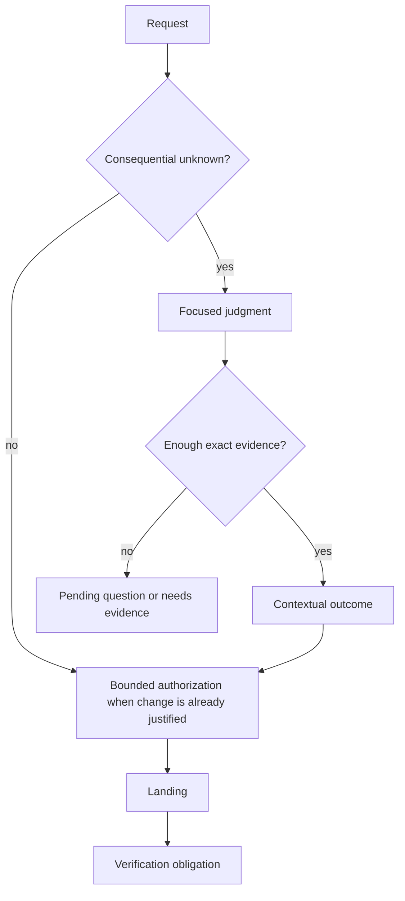

# Developer user guide

English | [한국어](./ko/user-guide.md)

Developer adds an inspectable judgment and mutation-authority layer to Pi. You
continue describing work and using Pi normally; Developer intervenes when the
request, evidence, or current branch leaves a consequential decision unresolved.

## Start and stop

```text
/developer on
/developer off
```

`on` activates adaptive judgment and Developer-owned tool gating. `off` clears
current Developer protocol state after confirmation when active work or questions
remain. Historical Pi session entries remain on their branch.

Start Pi with Developer already enabled:

```sh
pi --developer
```

## Ask naturally

You do not need to mention a Skill for ordinary work:

```text
Add scheduled invoice delivery. Clarify any missing product rules before editing.
```

```text
This serializer replacement is green. Verify source compatibility, persisted
values, and plausible pass-but-wrong cases.
```

```text
Review whether the new cache wrapper has earned a stable abstraction boundary.
```

Invoke a Skill explicitly when you already know the question owner:

```text
/skill:model Model the replacement and default semantics of this config change.
/skill:sketch Shape the caller-facing interface for the approved requirement.
/skill:verify Judge whether these checks support the completion claim.
```

## What you will see



Developer may:

- ask the user for a product decision;
- ask the agent to inspect repository or runtime evidence;
- identify an environment-owned access or observation gap;
- open one focused Developer Skill;
- use methods from other installed Pi Skills as exact context;
- authorize one bounded change after implementation gates close; or
- require a separate verification judgment after landing.

## Commands

| Command | Use |
| --- | --- |
| `/developer` | Open the Workbench |
| `/developer status` | Open Workbench Overview; print state outside interactive TUI mode |
| `/developer questions` | Review, answer, defer, or investigate a pending question |
| `/developer settings` | Open activation settings |
| `/developer on` | Enable Developer |
| `/developer off` | Disable Developer and clear current protocol state |

Pi's normal `/skill:<name>` commands remain available for all bundled Skills.

## Workbench map

```text
Overview
├── current routing state and next operation
├── implementation/completion gates
└── verification debt
Active Judgment
├── owning Skill and dynamic question
├── opened external context Skills
├── selected and sealed material
└── contributions, conflicts, limitations, and outcome
Questions
├── user-owned
├── agent-owned
└── environment-owned
Judgments
└── completed result and exact context basis
Landings
└── authorization, changed paths, stable landing, verification target
Settings
└── activation
```

### Keyboard controls

| Key | Action |
| --- | --- |
| `↑` / `↓`, `j` / `k` | Move selection |
| Enter | Open or activate focused item |
| Escape | Return one level |
| Tab | Move focus between panes/regions |
| Page Up / Page Down | Scroll a bounded viewport |
| Home / End | Jump to viewport boundary |
| `y` | Copy the complete focused semantic record |
| `?` | Show contextual help |

Workbench inspection is read-only. It does not append protocol events, send
messages, change tools, or write files.

## Questions and gates

Every pending question records a resolution owner and gate:

| Owner | Resolution |
| --- | --- |
| User | An explicit product decision or acceptance |
| Agent | Repository, runtime, test, or source evidence Pi can investigate |
| Environment | Access, credential, external observation, or unavailable system fact |

| Gate | Effect |
| --- | --- |
| Before implementation | Blocks change authorization |
| Before completion | A landing may exist, but completion remains blocked |
| Non-blocking | Remains visible without blocking current movement |

`/developer questions` opens the explanation before answer controls. A model
cannot answer a user-owned question on the user's behalf.

## Common workflows

### Fix an ambiguous bug

```text
request
→ inspect current behavior
→ expose missing product rule if consequential
→ user answer or evidence
→ authorize bounded fix
→ record changed paths
→ verify the repaired claim
```

### Make an already specified local change

```text
exact requirement + known path + existing checks
→ authorize bounded movement
→ edit/test with normal Pi tools
→ record landing
→ verify only the changed claim
```

Developer need not create ceremony when the request and evidence already justify
the movement.

### Diagnose an existing scope without editing

```text
explicit Doctor request + bounded scope
→ cheap orientation
→ consult triggered judgment owners
→ synthesize now / next / observe / leave-alone plan
```

Doctor reports requested, inspected, and claim scope separately. It does not
present a sample as an exhaustive repository review.

### Reconsider structure

```text
observe structural movement with signal
→ shape a candidate with sketch if needed
→ review a concrete candidate with abstraction-review
→ schedule now / after / never
```

These Skills are selected by question, not required stages.

## Routing states

| State | Meaning |
| --- | --- |
| `idle` | No active Developer work or unresolved Developer question |
| `needs-judgment` | An active question still needs an outcome |
| `needs-evidence` | Agent/environment evidence is missing |
| `needs-answer` | A user decision is missing |
| `needs-routing` | A landing needs the next judgment or authorization |
| `needs-verification` | Changed artifacts still need claim-relative verification |
| `blocked` | Required evidence, answer, or access is unavailable |

`idle` is not a claim that the user's entire task is complete.

## Tool behavior

| Developer state | `bash` | `edit` / `write` |
| --- | --- | --- |
| Idle while enabled | Restricted to Developer's safe idle policy | Withheld |
| Active judgment | Available for evidence work | Withheld |
| Authorized change | Available | Available for the bounded movement |
| Landing needs routing | Available only as rerouting requires | No new mutation authority |

Developer restores only the built-in tool delta it owns. Unrelated extension
tools and user-disabled tools keep their host configuration.

This mechanism prevents accidental workflow bypass; it does not sandbox shell
commands or malicious Pi packages.

## Branches, compaction, and reload

Developer events replay from the current Pi branch. A fork inherits its own
ancestry, and evidence from a sibling branch cannot be selected as active-branch
material.

Pi owns compaction. Developer supplies bounded state/context so Pi's normal
compactor can preserve it.

If a hot reload encounters old Developer history without a safe lifecycle marker,
restart Pi. The extension reports this instead of guessing the previous tool
configuration.

## Update and remove

```sh
pi list
pi config
pi update npm:@hobin/developer
pi remove npm:@hobin/developer
```

Use `pi install -l npm:@hobin/developer` when the repository should declare the
package in project-local Pi settings.
