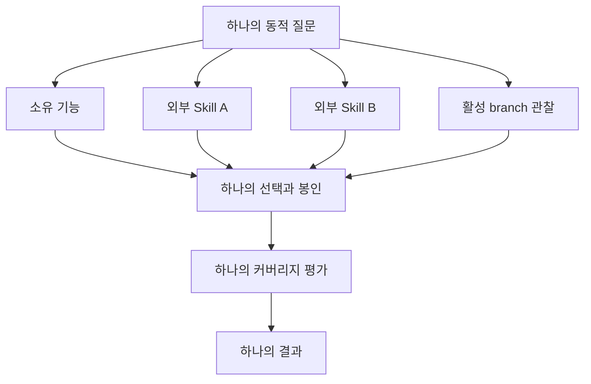

# @hobin/judgment

[English](./README.md) | 한국어

정확한 맥락을 검토 가능한 작업별 판단으로 바꾸는 부수 효과 없는 엔진입니다.

Judgment는 어댑터 작성자를 위한 패키지입니다. Pi 명령, Skill, 도구, 프롬프트,
UI를 등록하지 않으면서 정책 파싱, 동적 질문, 맥락 인벤토리, 정확한 선택과 봉인,
기여 커버리지, 맥락적 결과를 제공합니다.

## 설치

```sh
npm install @hobin/judgment
```

`judgment` 정책 작성 CLI도 포함합니다.

```sh
npx judgment check path/to/judgment.json
npx judgment explain path/to/judgment.json
npx judgment compile path/to/judgment.json
```

Pi 워크플로를 기대하며 Judgment를 설치하지 마세요. `pi` manifest가 비어 있어
어떤 Pi 리소스도 등록하지 않습니다. 대화형 제품이 필요하면 Pi 연동 어댑터를
설치하세요.

## 먼저 해보기

정책은 기능이 언제 적용되는지, 패키지에 포함된 각 reference가 언제 유용한
차이를 더할 수 있는지 표현합니다. 호출자가 기능의 실제 identity를 제공합니다.

```ts
import {
  compileJudgmentPolicy,
  decodePolicyOwnerData,
  jsonValueFromUnknown,
  parseJudgmentAuthoringPolicyJson,
  parsePolicyOwner,
} from "@hobin/judgment";

const policy = parseJudgmentAuthoringPolicyJson(policyJson);
const owner = parsePolicyOwner(
  decodePolicyOwnerData(
    jsonValueFromUnknown({
      kind: "pi-skill",
      namespace: "project-skills",
      name: "api-conventions",
      provenance: {
        source: "project-skills",
        scope: "project",
        origin: "top-level",
        path: "/skills/api-conventions/SKILL.md",
      },
    }),
  ),
);

const compiled = compileJudgmentPolicy({ owner, policy });
console.log(compiled.policySha256);
```

외부 표현은 parser 경계를 통과한 뒤 그 경계에서 확인한 불변식을 담은 불변 값으로
돌아옵니다. Judgment는 원시 입력을 검증한 다음 cast로 버린 정보를 복구하지
않습니다.

## 제공 기능


| 기능 | Judgment가 보장하는 것 |
| --- | --- |
| 정책 작성 | 정확한 `when`, 우선하는 `unless`, 독립적인 reference 조건 |
| Owner 결속 | 정책이 어댑터가 제공한 owner를 바꿀 수 없음 |
| 맥락 인벤토리 | 준비된 source와 관찰된 source가 서로 다른 identity와 provenance를 유지 |
| 선택 | 정확히 지명된 항목만 선택 집합에 진입 |
| 봉인 | 내용의 크기와 경로를 제한하고 hash한 뒤 선택과 함께 원자적으로 commit |
| 커버리지 | 사용 가능한 모든 선택 항목에 구체적인 역할과 기여가 존재 |
| Assurance | agent, domain evaluator, 사용자 권한을 서로 구분 |
| 결과 | 결론이 기여 identity를 인용하고 한계를 보존 |

## 하나의 질문, 여러 맥락 source

어댑터는 하나의 주 기능과 0개 이상의 외부 Pi Skill을 맥락 provider로 사용할 수
있습니다.



Judgment는 모든 Skill을 탐색하지 않습니다. 어댑터가 먼저 가벼운 Skill
descriptor를 노출하고, agent가 후보를 지명하며, 정확히 지명된 `SKILL.md`와
선택적 `judgment.json`만 엽니다. 맥락 Skill은 두 번째 Judgment lifecycle을
만들지 않습니다.

## 패키지 export

| Export | 용도 |
| --- | --- |
| `@hobin/judgment` | 정책, 질문, 맥락, 커버리지, lifecycle, 결과 type/parser |
| `@hobin/judgment/node` | 경로가 제한된 파일 reader와 크기가 제한된 원자적 맥락 봉인 |
| `@hobin/judgment/pi-context` | Pi descriptor/관찰 어댑터와 `ContextAttempt` |
| `@hobin/judgment/schema` | `judgment.json`용 JSON Schema |

## 의도적으로 하지 않는 일

Judgment는 다음을 하지 않습니다.

- 도메인 기능 선택 또는 순위 지정
- Skill, 정책, reference 전체 탐색
- Pi 세션 프로토콜, UI, persistence 형식 소유
- 코드 변경 승인
- reference의 존재를 관련성이나 충분성으로 취급
- 일반적인 모델 문장을 도메인 검증 또는 사용자 수락 권한으로 승격

이 책임은 사용자 워크플로를 소유하는 어댑터에 남습니다.

## 문서

| 문서 | 대상 |
| --- | --- |
| [아키텍처](./docs/ko/architecture.md) | 엔진의 데이터 모델, lifecycle, identity chain 이해 |
| [정책 작성](./docs/ko/policy-authoring.md) | 선택적 `judgment.json` 작성과 검사 |
| [어댑터 가이드](./docs/ko/adapter-guide.md) | 하나 이상의 맥락 provider를 소유 워크플로에 통합 |
| [보안과 불변식](./docs/ko/security-and-invariants.md) | 경로 containment, drift, assurance, fail-closed 동작 |

## 개발

```sh
pnpm --filter @hobin/judgment check
pnpm --filter @hobin/judgment pack
```

생성된 `dist/index.mjs`와 `bin/judgment.mjs`는 패키지에 함께 commit하는 결정적
build artifact입니다.

## 라이선스

[MIT](./LICENSE)
