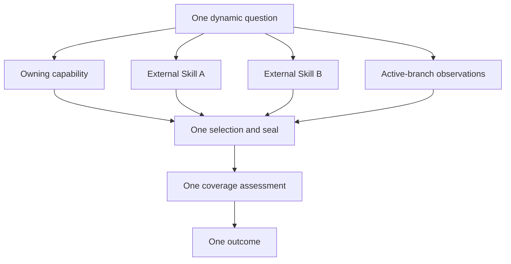

# @hobin/judgment

English | [한국어](./README.ko.md)

A side-effect-free engine for turning exact context into an inspectable,
task-specific judgment.

Judgment is for adapter authors. It provides policy parsing, dynamic questions,
context inventory, exact selection and sealing, contribution coverage, and
contextual outcomes without registering any Pi command, Skill, tool, prompt, or
UI.

## Install

```sh
npm install @hobin/judgment
```

The package also ships the `judgment` authoring CLI:

```sh
npx judgment check path/to/judgment.json
npx judgment explain path/to/judgment.json
npx judgment compile path/to/judgment.json
```

Do not install Judgment expecting a Pi workflow. Its `pi` manifest is empty so it
registers no Pi resources. Install a Pi-facing adapter when you want an
interactive product.

## Try this first

A policy says when a capability applies and when each packaged reference may add
something useful. The caller supplies the capability's real identity.

```ts
import {
  compileJudgmentPolicy,
  decodePolicyOwnerData,
  jsonValueFromUnknown,
  parseJudgmentAuthoringPolicyJson,
  parsePolicyOwner,
} from "@hobin/judgment";

const policy = parseJudgmentAuthoringPolicyJson(policyJson);
const owner = parsePolicyOwner(
  decodePolicyOwnerData(
    jsonValueFromUnknown({
      kind: "pi-skill",
      namespace: "project-skills",
      name: "api-conventions",
      provenance: {
        source: "project-skills",
        scope: "project",
        origin: "top-level",
        path: "/skills/api-conventions/SKILL.md",
      },
    }),
  ),
);

const compiled = compileJudgmentPolicy({ owner, policy });
console.log(compiled.policySha256);
```

External representations cross parsers and return immutable values carrying the
invariants learned at that boundary. Judgment does not validate raw input and
then recover discarded information with a cast.

## What it does


| Capability | What Judgment guarantees |
| --- | --- |
| Policy authoring | Exact `when`, winning `unless`, and independent reference conditions |
| Owner binding | A policy cannot replace the owner supplied by its adapter |
| Context inventory | Prepared and observed sources keep distinct identities and provenance |
| Selection | Only exact nominations enter the selected set |
| Sealing | Content is bounded, contained, hashed, and committed atomically with selection |
| Coverage | Every usable selected item has a concrete role and contribution |
| Assurance | Agent, domain-evaluator, and user authority remain distinct |
| Outcome | Conclusions cite contribution identities and preserve limitations |

## One question, many context sources

An adapter may use one primary capability and zero or more external Pi Skills as
context providers:



Judgment never crawls every Skill. The adapter first exposes lightweight Skill
descriptors; the agent nominates candidates; only those exact `SKILL.md` and
optional `judgment.json` files are opened. A context Skill does not create a
second Judgment lifecycle.

## Package exports

| Export | Use |
| --- | --- |
| `@hobin/judgment` | Policy, question, context, coverage, lifecycle, and outcome types/parsers |
| `@hobin/judgment/node` | Contained file readers and bounded atomic context sealing |
| `@hobin/judgment/pi-context` | Pi descriptor/observation adapters and `ContextAttempt` |
| `@hobin/judgment/schema` | JSON Schema for `judgment.json` |

## What it deliberately does not do

Judgment does not:

- choose or rank a domain capability;
- crawl Skills, policies, or references;
- own a Pi session protocol, UI, or persistence format;
- authorize code mutation;
- treat reference availability as relevance or completeness;
- turn generic model prose into domain-verified or user-accepted authority.

Those responsibilities stay with the adapter that owns the user workflow.

## Documentation

| Document | For |
| --- | --- |
| [Architecture](./docs/architecture.md) | Understanding the engine's data model, lifecycle, and identity chain |
| [Policy authoring](./docs/policy-authoring.md) | Writing and checking optional `judgment.json` files |
| [Adapter guide](./docs/adapter-guide.md) | Integrating one or many context providers into an owning workflow |
| [Security and invariants](./docs/security-and-invariants.md) | Containment, drift, assurance, and fail-closed behavior |

## Development

```sh
pnpm --filter @hobin/judgment check
pnpm --filter @hobin/judgment pack
```

The generated `dist/index.mjs` and `bin/judgment.mjs` are deterministic build
artifacts checked into the package.

## License

[MIT](./LICENSE)
