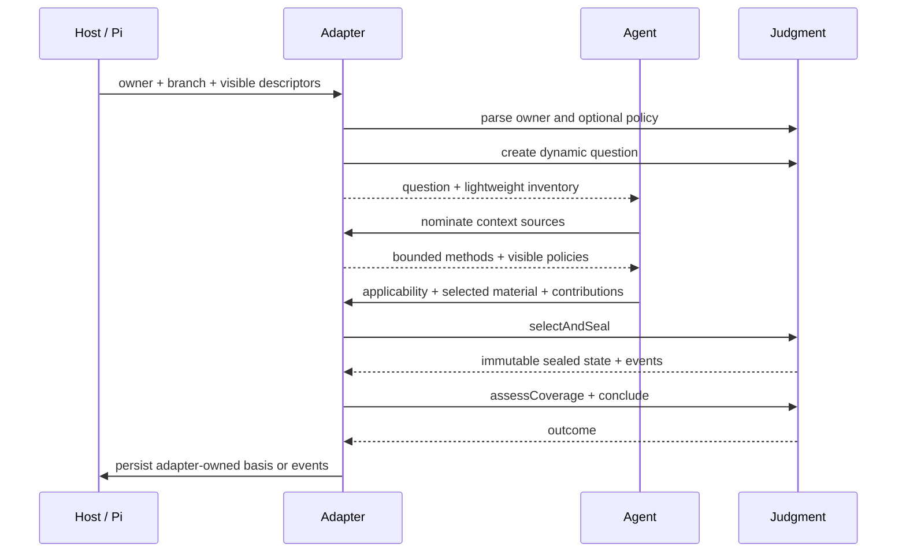
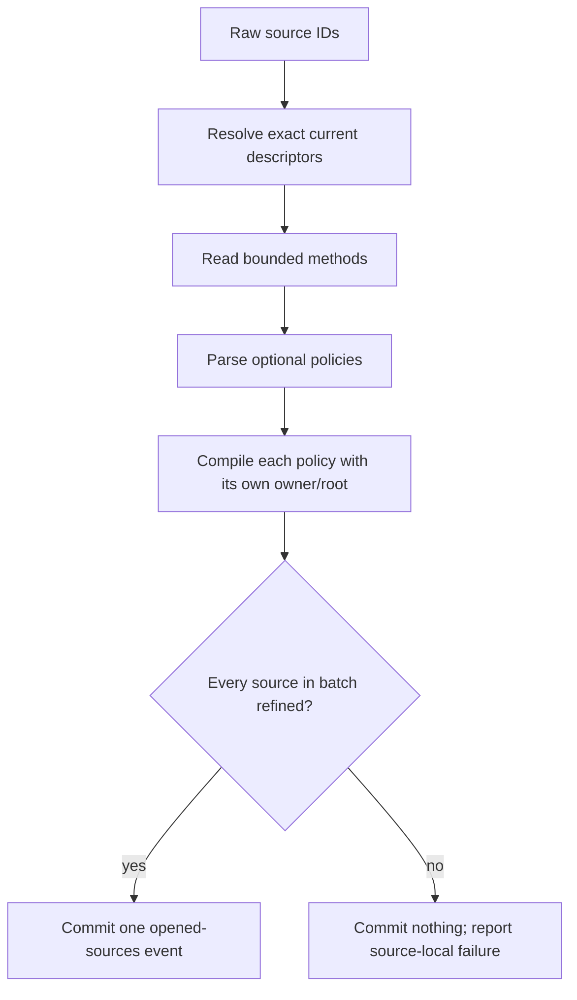

# Adapter guide

**Audience:** maintainers integrating Judgment into a stateful Pi extension,
build-time generator, or typed domain sidecar.

The integration rule is simple: Judgment owns context semantics; the adapter owns
the product.

## Choose an integration depth

| Consumer | Use from Judgment | Keep in the consumer |
| --- | --- | --- |
| Stateful Pi adapter | Policy, dynamic question, inventory, observations, selection, sealing, coverage, outcome | Tools, prompt, replay, UI, domain questions, authorization |
| Build-time generator | Authoring parser, compiler, deterministic directions | Runtime Skill method and ordinary Pi acquisition |
| Typed sidecar | Context, evaluator assurance, coverage, outcome primitives | Domain records, mutation gates, persistence |
| CLI or service | Any pure engine layer needed | Transport, storage, access control, presentation |

## Integration sequence



No source content is opened merely because its descriptor exists.

## Open external Skills in batches

A Pi adapter can compose several context Skills into one owning question:

```text
Pi-visible descriptors
→ exact source ID nominations
→ bounded SKILL.md reads
→ optional co-located judgment.json reads
→ owner-bound policy compilation
→ model-visible method and policy
→ source-specific applicability
→ admitted methods and references
```

Batch admission should be atomic:



The adapter may call the operation again for newly relevant sources. Reject a
source already open in the active judgment. One invalid source batch must not
erase providers admitted by earlier successful calls.

## Build the inventory

`buildPiContextInventory` combines descriptor metadata without reading prepared
reference bytes.

For every applicable policy-bearing provider, pass a separate
`PreparedContextProviderInput` containing:

- its `CompiledJudgmentPolicy`;
- its own `decisionUnitRoot` / policy root; and
- only the references admitted for this question.

Do not use one root reader for another provider. Identical relative paths in two
Skills are different sources because owner, policy, root, and provenance differ.

A provider assessed `not-applicable` or `needs-context` must not contribute
positive method/reference material. The adapter may retain the assessment as
basis or a limitation.

## Resolve observed context

Observed material should be reconstructed from current host facts, not trusted
from a model payload.

| Observation | Required identity |
| --- | --- |
| Tool result | Active-branch call ID, tool name, arguments hash, sequence, status, ordered content hash |
| User event | Exact branch-local user event ID and content |
| Domain evaluator | Typed evaluator ID, declared relation, and exact basis |
| Context file | Current Pi descriptor and content identity |

Error or truncated results may explain a gap but cannot become positive selected
material.

## Select and seal

Use `ContextAttempt.selectAndSeal` when you want the facade to preserve transition
order:

```ts
const transition = await attempt.selectAndSeal({
  inventory,
  observedContext,
  proposal,
  admittedPolicySha256s,
  acquisition,
  signal,
});

// Persist or apply only after the whole call succeeds.
const nextState = transition.value;
const events = transition.events;
```

`ContextAcquisition.acquirePreparedReference` receives the exact prepared source,
including its policy identity. Route it to the contained reader owned by that
policy. `acquireSkill` and observed-result acquisition must recheck the expected
content identity.

## Assess contributions

Every usable selected member needs at least one exact relation to the current
question:

```text
materialId
+ useAs: constraint | evidence | decision | method | guidance
+ concrete contribution
+ assurance
→ contributionId
```

Assurance ceilings:

| Assurance | Who can establish it |
| --- | --- |
| `agent-asserted` | Model interpretation of exact selected material |
| `domain-verified` | Matching typed evaluator event for its declared relation |
| `user-accepted` | Matching selected user event |

The adapter must not upgrade assurance because prose sounds authoritative.

## Conclude

| Coverage | Valid outcome |
| --- | --- |
| `sufficient`, no conflicts | Contextual judgment citing contribution IDs |
| `needs-evidence` with exact conflicts or limitations | Needs-evidence outcome accounting for those IDs |
| Current question reveals a different unresolved question | Emergent question distinct from the current text |

The outcome is semantic evidence only. An adapter that can mutate files must
create a separate domain authorization value.

## Persistence and replay

Judgment does not prescribe a session record. A stateful adapter should persist:

- owner, question, and branch identities;
- opened provider descriptor and policy identities;
- source applicability assessments;
- selection and sealed-content hashes;
- material and contribution summaries;
- conflict, limitation, coverage, and outcome identities.

On replay, parse persisted data and recompute canonical identities. Never trust
stored hashes without reconstructing the values they claim to identify.

## Failure matrix

| Failure | Adapter response |
| --- | --- |
| Policy absent | Continue with a complete method and no prepared references |
| Policy malformed or escaping root | Reject that source batch |
| Provider unresolved or excluded | Keep it out of positive inventory |
| Selected content changed | Reacquire and reassess |
| Unrelated descriptor added | Keep existing selected work valid |
| Acquisition cancelled or exceeds bounds | Commit neither selection nor seal |
| Contribution missing for usable material | Reject coverage |
| Assurance provenance missing | Reject the stronger assurance |
| Adapter persistence fails | Keep domain state unchanged or use its own atomic protocol |
