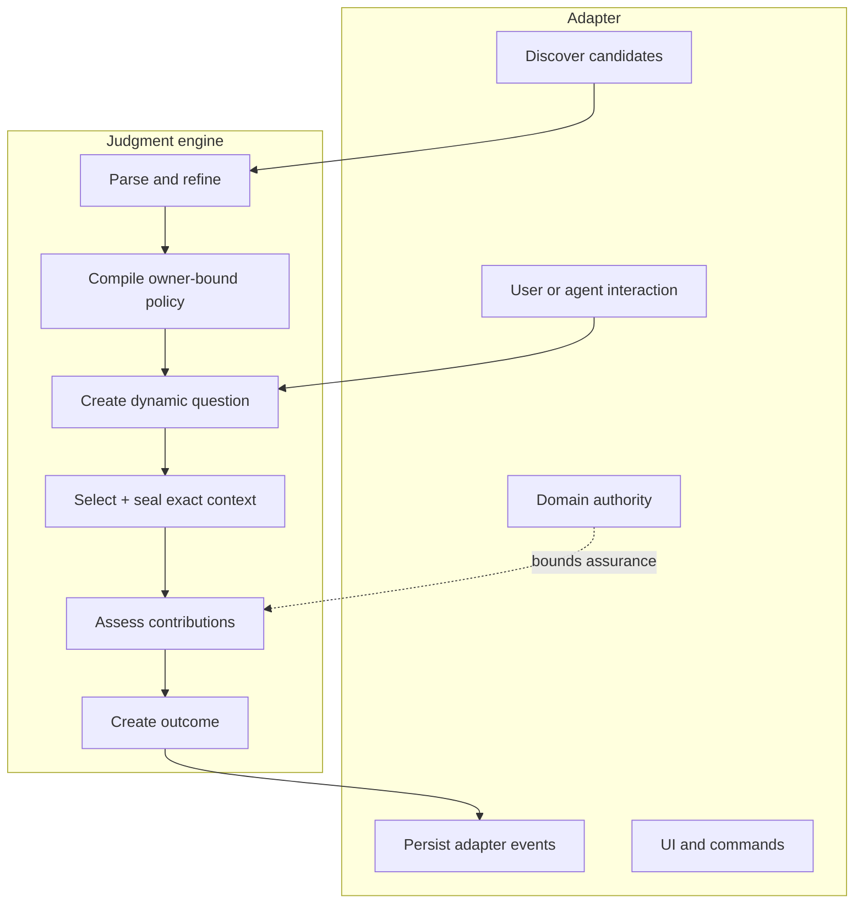
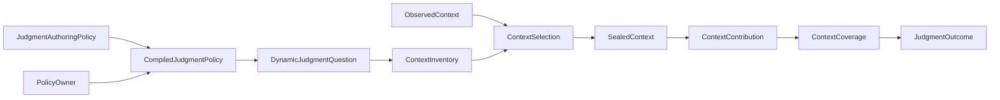
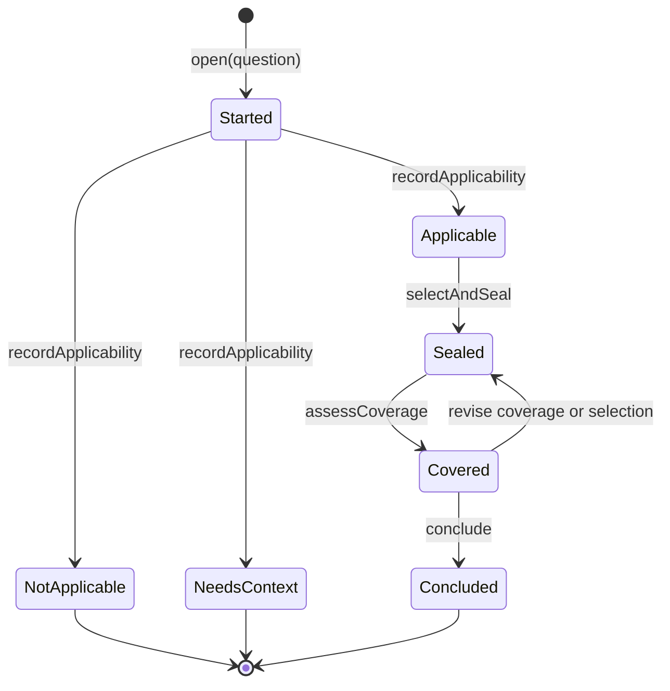
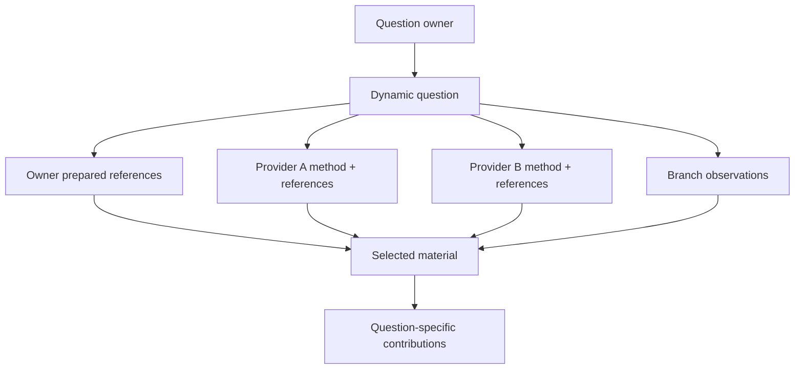

# Judgment architecture

**Audience:** adapter authors and maintainers.

Judgment is a reusable decision engine. It owns the representation and
transitions between a policy-aware question, exact context, contribution
coverage, and an outcome. It owns no user workflow.

## Responsibility boundary



The adapter chooses the domain capability and decides what an outcome permits.
Judgment only establishes what context and relations support that outcome.

## Core value graph



These values are immutable. A parser or smart constructor creates each stronger
representation after checking its complete invariant, so downstream code does
not carry “validated separately” booleans.

## Lifecycle

`ContextAttempt` is a convenience facade over the pure engine transitions.



`selectAndSeal` is one logical transition. It first derives the exact selection,
then performs bounded acquisition, then returns both events and the new state. A
failed read returns no transition value and leaves the caller's prior immutable
state unchanged.

## One owner, many providers

The dynamic question has one owner. Its context can come from several applicable
providers without transferring ownership.



A source has no permanent semantic role. One exact item can be `method` for one
question and `evidence` or `guidance` for another. The contribution relation,
not source kind alone, records that meaning.

## Identity chain

```text
PolicyOwner + normalized authoring policy
→ authoringSha256 + policySha256

owner + policy? + question + basis + branch
→ judgmentId + questionSha256

question + admitted provider policies + selected descriptors + basis
→ selectionSha256

selection + exact acquired bytes
→ sealedContextSha256

selected material + useAs + contribution + assurance
→ contributionId

contributions + conflicts + limitations + status
→ coverageSha256

question + coverage + cited contribution/conflict/limitation IDs
→ outcomeSha256
```

Hashes identify representations and detect drift. They do not establish source
quality, semantic truth, or authority.

## Package modules

| Area | Primary modules | Responsibility |
| --- | --- | --- |
| Authoring | `src/authoring.ts`, `src/authoring-json-schema.ts` | Exact JSON vocabulary and immutable policy |
| Compilation | `src/compiled-policy.ts`, `src/directions.ts` | Owner binding, canonical identity, deterministic directions |
| Question | `src/question.ts` | Dynamic question and branch identity |
| Context | `src/context.ts`, `src/sealed-context.ts` | Inventory, nominations, selection, sealed members |
| Coverage | `src/coverage.ts`, `src/outcome.ts` | Contributions, assurance, conflicts, limitations, closure |
| Lifecycle | `src/lifecycle.ts`, `src/pi-context/context-attempt.ts` | Legal transitions and event-producing facade |
| Node acquisition | `src/node/*` | Optional policy loading, containment, bounded reads, sealing |
| Pi adaptation | `src/pi-context/*` | Pi descriptors and active-branch observations without Pi registration |

## Event ownership

Judgment events are engine transition facts, not a generic Pi session protocol.
An adapter may persist them inside its own event, keep only the resulting basis,
or use the engine transiently. The adapter must preserve enough exact identity to
replay any claim it later exposes.

## Design consequences

- A missing `judgment.json` is a normal capability with no prepared references.
- A malformed present policy is a source error, not absence.
- Inventory discovery does not read prepared-reference content.
- Unrelated inventory growth does not stale selected work.
- Selected policy, descriptor, question, branch, or content drift does.
- Contextual outcomes never imply permission to mutate a repository.
