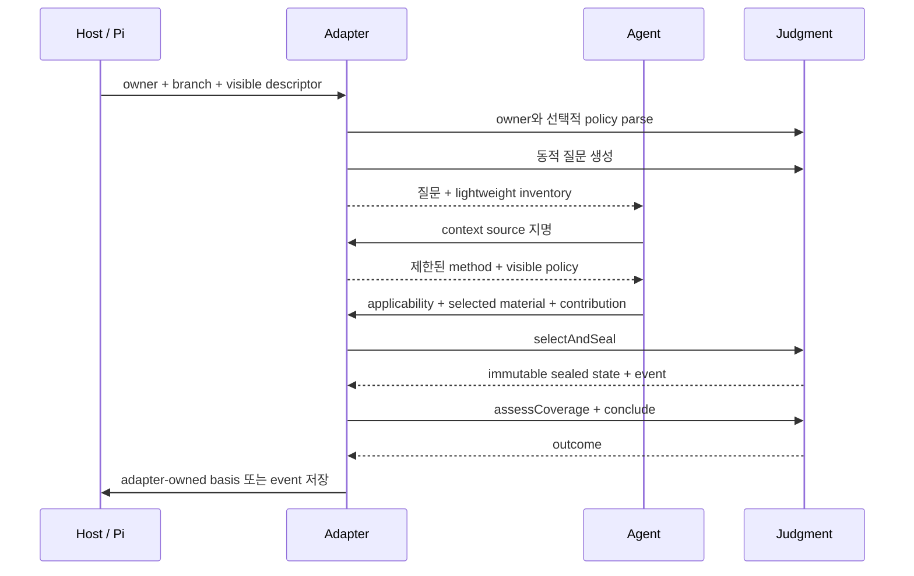
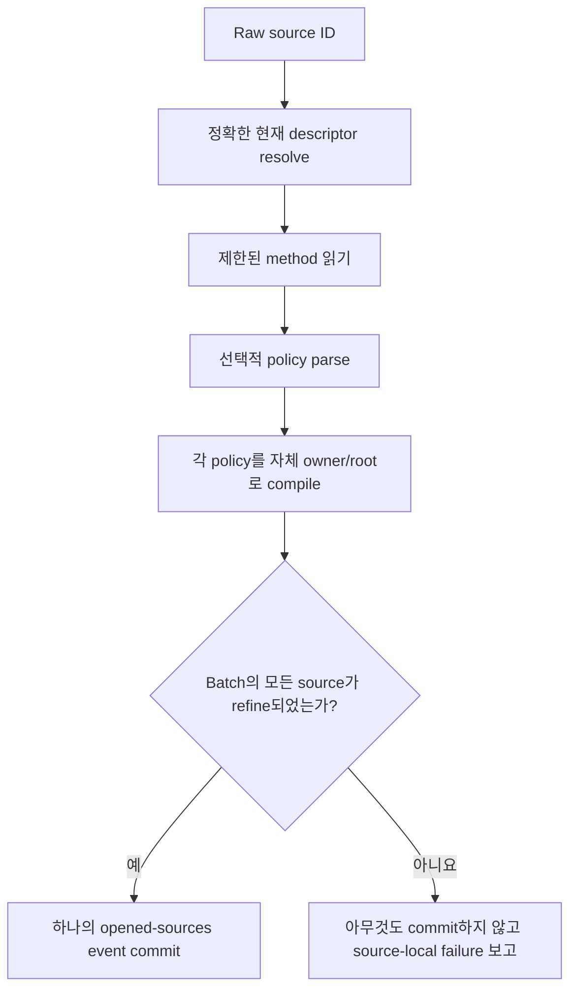

# 어댑터 가이드

[English](../adapter-guide.md) | 한국어

**대상:** Judgment를 stateful Pi extension, build-time generator, typed domain
sidecar에 통합하는 maintainer

통합 규칙은 간단합니다. Judgment는 맥락의 의미를 소유하고, 어댑터는 제품을
소유합니다.

## 통합 깊이 선택

| Consumer | Judgment에서 사용할 것 | Consumer에 남길 것 |
| --- | --- | --- |
| Stateful Pi adapter | 정책, 동적 질문, inventory, observation, selection, sealing, coverage, outcome | 도구, 프롬프트, replay, UI, 도메인 질문, authorization |
| Build-time generator | Authoring parser, compiler, deterministic directions | Runtime Skill method와 일반 Pi acquisition |
| Typed sidecar | Context, evaluator assurance, coverage, outcome primitive | 도메인 record, mutation gate, persistence |
| CLI 또는 service | 필요한 순수 엔진 layer | Transport, storage, access control, presentation |

## 통합 순서



Descriptor가 존재한다는 이유만으로 source content를 열지 않습니다.

## 외부 Skill을 batch로 열기

Pi 어댑터는 여러 context Skill을 하나의 소유 질문에 결합할 수 있습니다.

```text
Pi-visible descriptor
→ 정확한 source ID 지명
→ 제한된 SKILL.md 읽기
→ co-located judgment.json 선택적 읽기
→ owner-bound policy compile
→ 모델에 보이는 method와 policy
→ source별 applicability
→ admitted method와 reference
```

Batch admission은 atomic해야 합니다.



새롭게 관련된 source가 있으면 어댑터가 operation을 다시 호출할 수 있습니다.
활성 judgment에서 이미 열린 source는 거부하세요. 하나의 invalid source batch가
이전 성공 호출에서 admitted된 provider를 지워서는 안 됩니다.

## Inventory 구성

`buildPiContextInventory`는 prepared reference byte를 읽지 않고 descriptor
metadata를 결합합니다.

적용 가능한 policy-bearing provider마다 별도의 `PreparedContextProviderInput`을
전달해야 합니다. 각 값에는 다음이 포함됩니다.

- 해당 `CompiledJudgmentPolicy`
- 자체 `decisionUnitRoot` / policy root
- 현재 질문에 admitted된 reference만

한 provider의 root reader를 다른 provider에 사용하지 마세요. 두 Skill에 같은
relative path가 있어도 owner, policy, root, provenance가 다르므로 서로 다른
source입니다.

`not-applicable` 또는 `needs-context`로 평가된 provider는 positive method/reference
material에 기여하면 안 됩니다. 어댑터는 해당 평가를 basis 또는 limitation으로
보존할 수 있습니다.

## Observed context resolve

관찰된 material은 model payload를 신뢰하지 말고 현재 host fact에서 재구성해야
합니다.

| Observation | 필수 identity |
| --- | --- |
| Tool result | Active-branch call ID, tool name, arguments hash, sequence, status, ordered content hash |
| User event | 정확한 branch-local user event ID와 content |
| Domain evaluator | Typed evaluator ID, declared relation, exact basis |
| Context file | 현재 Pi descriptor와 content identity |

Error 또는 truncated result는 gap을 설명할 수 있지만 positive selected material이
될 수 없습니다.

## 선택과 봉인

Facade가 transition 순서를 보존하게 하려면 `ContextAttempt.selectAndSeal`을
사용합니다.

```ts
const transition = await attempt.selectAndSeal({
  inventory,
  observedContext,
  proposal,
  admittedPolicySha256s,
  acquisition,
  signal,
});

// 전체 호출 성공 후에만 저장하거나 적용합니다.
const nextState = transition.value;
const events = transition.events;
```

`ContextAcquisition.acquirePreparedReference`는 policy identity를 포함한 정확한
prepared source를 받습니다. 해당 policy가 소유한 contained reader로 route하세요.
`acquireSkill`과 observed-result acquisition은 예상 content identity를 다시
검사해야 합니다.

## Contribution 평가

사용 가능한 모든 selected member에는 현재 질문과의 정확한 relation이 하나 이상
필요합니다.

```text
materialId
+ useAs: constraint | evidence | decision | method | guidance
+ concrete contribution
+ assurance
→ contributionId
```

Assurance ceiling:

| Assurance | 확립할 수 있는 주체 |
| --- | --- |
| `agent-asserted` | 정확한 selected material에 대한 model interpretation |
| `domain-verified` | declared relation과 일치하는 typed evaluator event |
| `user-accepted` | 일치하는 selected user event |

문장이 authoritative하게 들린다는 이유로 어댑터가 assurance를 승격하면 안 됩니다.

## 결론

| Coverage | 유효한 outcome |
| --- | --- |
| `sufficient`, conflict 없음 | Contribution ID를 인용하는 contextual judgment |
| 정확한 conflict 또는 limitation이 있는 `needs-evidence` | 해당 ID를 설명하는 needs-evidence outcome |
| 현재 질문에서 다른 미해결 질문이 드러남 | 현재 text와 구별되는 emergent question |

Outcome은 semantic evidence일 뿐입니다. 파일을 변경할 수 있는 어댑터는 별도의
domain authorization value를 만들어야 합니다.

## Persistence와 replay

Judgment는 session record 형식을 정하지 않습니다. Stateful adapter는 다음을
저장해야 합니다.

- owner, question, branch identity
- 열린 provider descriptor, policy, applicability identity
- source applicability assessment
- selection과 sealed-content hash
- material과 contribution summary
- conflict, limitation, coverage, outcome identity

Replay할 때 persisted data를 parse하고 canonical identity를 다시 계산하세요. 저장된
hash가 식별한다고 주장하는 값을 재구성하지 않고 hash를 신뢰하면 안 됩니다.

## 실패 matrix

| 실패 | Adapter 대응 |
| --- | --- |
| Policy 없음 | 완전한 method와 prepared reference 없음으로 계속 |
| Policy malformed 또는 root escape | 해당 source batch 거부 |
| Provider unresolved 또는 excluded | Positive inventory에서 제외 |
| Selected content 변경 | 재획득하고 재평가 |
| 관련 없는 descriptor 추가 | 기존 selected work 유지 |
| Acquisition 취소 또는 bound 초과 | Selection과 seal 모두 commit하지 않음 |
| 사용 가능한 material의 contribution 누락 | Coverage 거부 |
| Assurance provenance 누락 | 더 강한 assurance 거부 |
| Adapter persistence 실패 | Domain state를 그대로 두거나 자체 atomic protocol 사용 |
