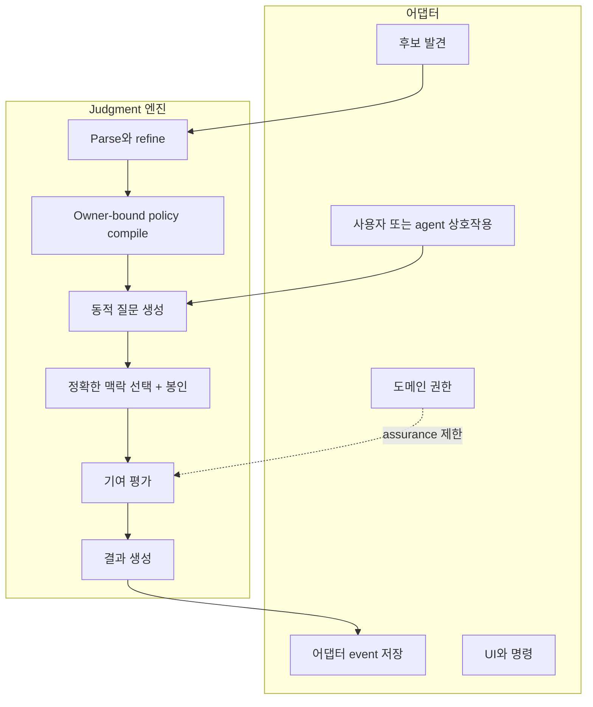
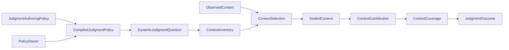
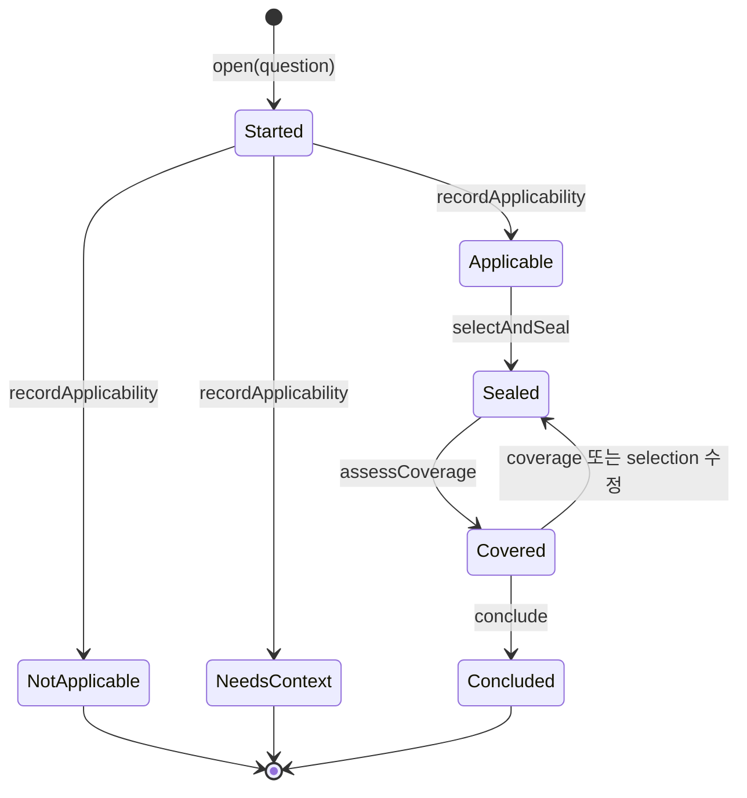
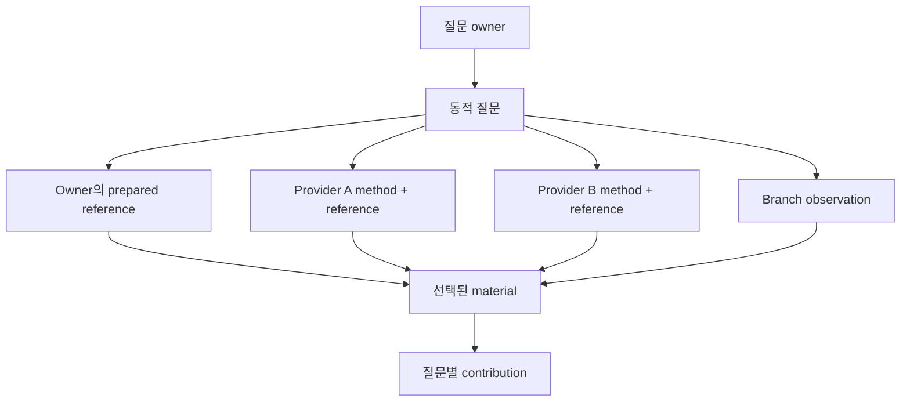

# Judgment 아키텍처

[English](../architecture.md) | 한국어

**대상:** 어댑터 작성자와 maintainer

Judgment는 재사용 가능한 의사결정 엔진입니다. 정책을 인식하는 질문, 정확한
맥락, 기여 커버리지, 결과 사이의 표현과 transition을 소유하지만 사용자
워크플로는 소유하지 않습니다.

## 책임 경계



어댑터가 도메인 기능을 선택하고 결과가 무엇을 허용하는지 결정합니다.
Judgment는 어떤 맥락과 관계가 그 결과를 지지하는지만 확립합니다.

## 핵심 값 그래프



이 값들은 immutable입니다. 각 parser 또는 smart constructor는 완전한 불변식을
검사한 뒤 더 강한 표현을 만듭니다. 따라서 downstream code가 “별도로 검증됨”
boolean을 들고 다니지 않습니다.

## Lifecycle

`ContextAttempt`는 순수 엔진 transition을 감싼 편의 facade입니다.



`selectAndSeal`은 하나의 논리적 transition입니다. 정확한 selection을 먼저
도출하고, 제한된 acquisition을 수행한 뒤, event와 새 state를 함께 반환합니다.
읽기에 실패하면 transition value를 반환하지 않으므로 호출자의 이전 immutable
state는 그대로 남습니다.

## 하나의 owner, 여러 provider

동적 질문에는 owner가 하나 있습니다. 맥락은 여러 적용 가능한 provider에서 올
수 있지만 ownership은 이전되지 않습니다.



Source에는 영구적인 semantic role이 없습니다. 정확히 같은 항목도 어떤 질문에는
`method`, 다른 질문에는 `evidence`나 `guidance`가 될 수 있습니다. Source kind
자체가 아니라 contribution relation이 그 의미를 기록합니다.

## Identity chain

```text
PolicyOwner + normalized authoring policy
→ authoringSha256 + policySha256

owner + policy? + question + basis + branch
→ judgmentId + questionSha256

question + admitted provider policies + selected descriptors + basis
→ selectionSha256

selection + exact acquired bytes
→ sealedContextSha256

selected material + useAs + contribution + assurance
→ contributionId

contributions + conflicts + limitations + status
→ coverageSha256

question + coverage + cited contribution/conflict/limitation IDs
→ outcomeSha256
```

Hash는 표현을 식별하고 drift를 탐지합니다. Source 품질, 의미상의 진실, 권한을
확립하지는 않습니다.

## 패키지 module

| 영역 | 주요 module | 책임 |
| --- | --- | --- |
| Authoring | `src/authoring.ts`, `src/authoring-json-schema.ts` | 정확한 JSON vocabulary와 immutable policy |
| Compilation | `src/compiled-policy.ts`, `src/directions.ts` | Owner binding, canonical identity, deterministic directions |
| Question | `src/question.ts` | 동적 질문과 branch identity |
| Context | `src/context.ts`, `src/sealed-context.ts` | Inventory, nomination, selection, sealed member |
| Coverage | `src/coverage.ts`, `src/outcome.ts` | Contribution, assurance, conflict, limitation, closure |
| Lifecycle | `src/lifecycle.ts`, `src/pi-context/context-attempt.ts` | 합법적 transition과 event-producing facade |
| Node acquisition | `src/node/*` | 선택적 정책 loading, containment, bounded read, sealing |
| Pi adaptation | `src/pi-context/*` | Pi를 등록하지 않는 Pi descriptor와 active-branch observation |

## Event 소유권

Judgment event는 엔진 transition fact이지 범용 Pi session protocol이 아닙니다.
어댑터는 event를 자신의 event 안에 저장하거나, 결과 basis만 보관하거나, 엔진을
일시적으로 사용할 수 있습니다. 나중에 노출하는 주장을 replay할 수 있을 만큼
정확한 identity는 보존해야 합니다.

## 설계의 결과

- `judgment.json`이 없는 것은 prepared reference가 없는 정상적인 기능입니다.
- 존재하는 malformed policy는 absence가 아니라 source error입니다.
- Inventory discovery는 prepared-reference content를 읽지 않습니다.
- 관련 없는 inventory 증가는 선택된 작업을 stale하게 만들지 않습니다.
- 선택된 policy, descriptor, question, branch, content의 변경은 stale하게 만듭니다.
- 맥락적 결과는 저장소를 변경할 권한을 뜻하지 않습니다.
