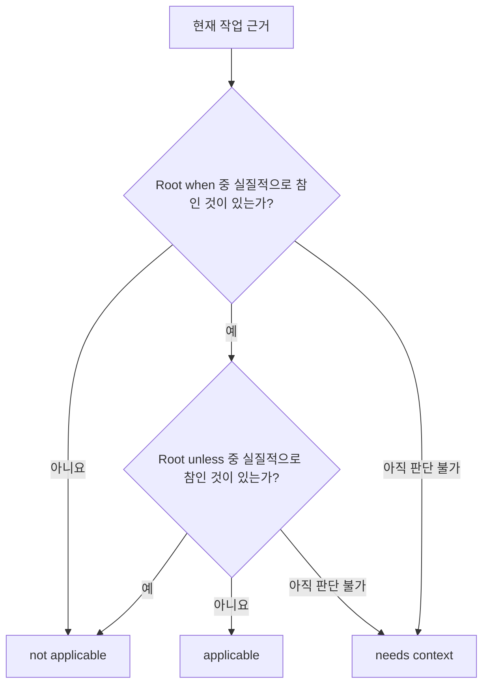

# 정책 작성

[English](../policy-authoring.md) | 한국어

**대상:** Skill 작성자와 패키지 maintainer

`judgment.json` 파일에는 두 가지 역할이 있습니다.

1. 명시적인 제외가 우선하지 않는 한 소유 기능이 언제 적용되는지 표현합니다.
2. 패키지의 각 reference가 언제 중요한 차이를 더할 수 있는지 표현합니다.

런타임 질문, route, source catalog, assurance, 변경 권한은 정의하지 않습니다.

## 전체 예시

```json
{
  "$schema": "https://raw.githubusercontent.com/dev-hobin/agent/main/packages/judgment/schemas/judgment-authoring.schema.json",
  "specVersion": "0.1",
  "when": [
    "Caller-facing operations, ownership, data flow, or implementation shape still need to be invented."
  ],
  "unless": [
    "A concrete candidate already exists and only its stability must be reviewed.",
    "The unresolved issue is product meaning rather than implementation shape."
  ],
  "references": [
    {
      "path": "references/meaning-preserving-conversions.md",
      "when": [
        "A cross-representation design needs explicit preserved-observer, loss, ambiguity, cycle, or unsupported-path checks."
      ]
    },
    {
      "path": "references/design-levels-and-boundaries.md",
      "when": [
        "A design needs an explicit caller vocabulary, owner, hidden mechanism, or dependency direction."
      ]
    }
  ]
}
```

규범적인 machine-readable schema는 `@hobin/judgment/schema`로 export하며
[`../../schemas/judgment-authoring.schema.json`](../../schemas/judgment-authoring.schema.json)에
저장되어 있습니다.

## 적용 가능성 규칙



`unless`는 명시적인 제외이며 양쪽이 모두 맞으면 우선합니다. 일반적인 불확실성을
표현하는 데 사용하지 마세요. 근거가 더 필요하면 런타임 평가는
`needs-context`여야 합니다.

## Reference 규칙

각 reference는 독립적입니다.

```text
현재 질문 + 현재 근거
→ 각 reference.when 비교
→ 실질적으로 유용한 reference를 0개, 1개, 여러 개 읽기
```

좋은 reference `when` 문장은 두 요소를 모두 포함합니다.

```text
관찰 가능한 압력 + 파일이 더할 수 있는 차이
```

약한 표현:

```text
When conversions are involved.
```

유용한 표현:

```text
A cross-representation design needs explicit preserved-observer, loss,
ambiguity, cycle, or unsupported-path checks.
```

조건이 맞으면 reference가 후보가 될 뿐 필수이거나 authoritative한 것은 아닙니다.
배열 순서는 identity를 위해 canonicalize되며 우선순위를 표현하지 않습니다.

## Property contract

| Property | 필수 | 의미 |
| --- | --- | --- |
| `$schema` | 아니요, 권장 | Editor discovery 전용이며 semantic policy identity에서 제외 |
| `specVersion` | 예 | 정확히 `"0.1"` |
| `when` | 예 | 소유 기능에 대한 positive applicability statement |
| `unless` | 예 | positive applicability보다 우선하는 명시적 제외 |
| `references` | 예 | 독립적으로 선택할 수 있는 패키지 파일 하나 이상 |
| `references[].path` | 예 | policy directory 기준 normalized relative POSIX path |
| `references[].when` | 예 | 해당 파일의 완전한 relevance statement |

정책에는 의도적으로 owner field가 없습니다. Pi 어댑터는 정확히 load한 Skill에서
owner identity를 도출하고, 다른 어댑터는 typed capability identity를 제공합니다.
Compiler가 외부 owner를 policy에 결속합니다.

## 정책을 만들지 않아야 할 때

기능에 조건부 패키지 reference가 없다면 `judgment.json`을 만들지 마세요.
`SKILL.md` 또는 adapter contract는 빈 정책 없이도 완전합니다.

```text
file absent            → prepared reference가 없는 정상 기능
file present + valid   → compiled owner-bound policy
file present + invalid → 해당 source를 fail closed
```

Absence를 빈 정책으로 합성하거나 malformed presence를 absence로 재해석하지 마세요.

## 경로와 containment

Reference path는 다음 조건을 충족해야 합니다.

- 상대 경로이며 `/` separator를 사용할 것
- 비어 있는 segment, `.`, `..` segment가 없을 것
- policy root 내부에 lexically 머물 것
- 허용된 root 내부로 physically resolve될 것
- directory 또는 escaping symlink가 아니라 regular file을 가리킬 것

Parser가 normalized path를 확립하고, Node acquisition이 byte를 읽기 전에 physical
containment를 다시 검사합니다.

## 작성 값과 생성 값

| 작성하는 값 | 런타임에 생성 또는 제공하는 값 |
| --- | --- |
| `when`, `unless` 문장 | `PolicyOwner`와 provenance |
| Reference path와 relevance | `policySha256`와 source ID |
| `specVersion` | 동적 질문 text와 `judgmentId` |
| 그 외 없음 | Inventory, nomination, content hash, contribution, assurance, coverage, outcome |

이 구분은 작성 vocabulary를 안정적으로 유지하면서 각 작업이 서로 다른 정확한
질문을 하게 합니다.

## 작성 워크플로

```sh
judgment check skills/example/judgment.json
judgment explain skills/example/judgment.json
judgment compile skills/example/judgment.json
```

- `check`는 source를 parse하고 canonical authoring hash를 출력합니다.
- `explain`은 모델에 보이는 결정적 applicability/reference directions를 만듭니다.
- `compile`은 CLI owner를 결속한 뒤 canonical compiled JSON을 출력합니다.

패키지 검사는 선언된 모든 reference가 존재하는지, 모델에 보이는 생성 directions가
drift하지 않았는지도 검사해야 합니다.

## 거부되는 형태

Parser는 unknown field, semantic duplicate statement, duplicate reference path,
surrounding whitespace, 파일 경계의 invalid UTF-8, unsafe path, 그리고 static route,
question, need, source ID, role, assurance 같은 legacy graph vocabulary를 거부합니다.
