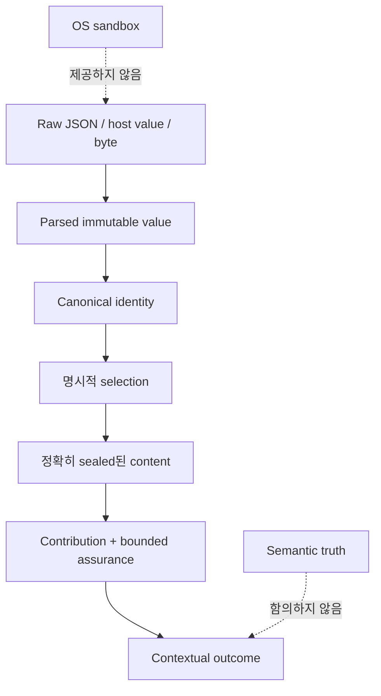
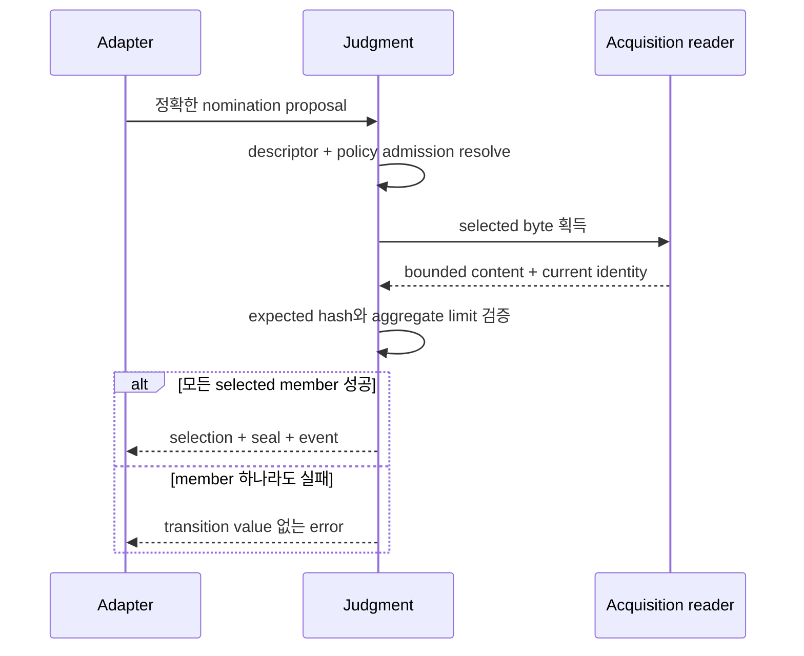
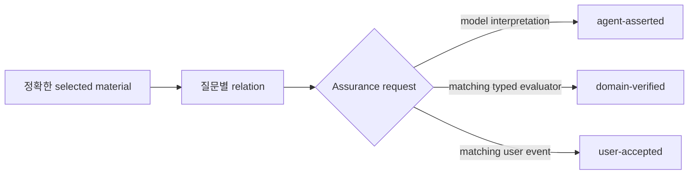

# 보안과 불변식

[English](../security-and-invariants.md) | 한국어

**대상:** 어댑터 작성자, reviewer, maintainer

Judgment는 근거 identity와 워크플로 무결성을 보존합니다. 샌드박스, source trust
service, 결론이 참이라는 증명은 제공하지 않습니다.

## 신뢰 계층



각 화살표는 더 좁은 보장을 추가합니다. 어느 계층의 보장도 뒤 계층의 보장으로
해석하면 안 됩니다.

## Validate하지 말고 parse하기

성공한 경계는 그 경계에서 알아낸 내용을 표현하는 값을 반환합니다.

```text
unknown
→ JsonValue
→ exact data variant
→ immutable domain value
```

Compiled 또는 persisted value의 parser는 semantic payload를 재구성하고 hash를
다시 계산합니다. 별도의 `isValid` flag와 cast는 호출자가 불변식을 잃거나 우회하게
하므로 허용되는 경계가 아닙니다.

## Selection과 sealing transaction



어댑터는 호출 성공 후에만 반환된 transition을 적용합니다. Acquisition failure가
selected-but-unsealed state를 남길 수 없습니다.

## 파일 containment

Node reader는 lexical containment와 physical containment를 모두 강제합니다.

```text
normalized relative path
→ source별 root에 join
→ root와 target realpath
→ target이 root 내부에 남는지 확인
→ regular file
→ bounded byte
→ fatal UTF-8 decode
```

두 검사가 모두 필요한 이유:

| 검사 | 방지하는 문제 |
| --- | --- |
| Relative POSIX normalization | Absolute path, traversal, ambiguous separator, dot segment |
| Root별 join | 잘못된 root를 통해 다른 provider 읽기 |
| `realpath` containment | Lexical validation 이후 symlink escape |
| Regular-file 검사 | Directory/device 예상 밖 동작 |
| Member별/aggregate byte limit | 제한 없는 context acquisition |
| Fatal UTF-8 | Content identity의 replacement-character ambiguity |

각 외부 policy root는 자체 contained reader를 가집니다. Provider A의 relative
path는 provider B 아래에서 resolve되지 않습니다.

## Drift model

| Selection 이후 변경 | 효과 |
| --- | --- |
| 관련 없는 inventory source 추가 | 기존 selection 유지 |
| Selected descriptor 변경 | 거부하고 다시 선택 |
| Selected policy 또는 admitted policy set 변경 | 거부하고 재평가 |
| 동적 질문 text, owner, basis, branch 변경 | 새 judgment identity 필요 |
| Selected content byte 변경 | Seal/replay 거부 후 재획득 |
| Tool result가 다른 branch로 이동 | Active-branch resolution 거부 |
| Persisted hash만 payload와 다르게 수정 | Parser recomputation에서 거부 |

엔진은 judgment가 사용한 것만 결속합니다. 이 방식은 under-binding으로 selected work가
조용히 drift하는 문제와 over-binding으로 관련 없는 catalog 증가가 유용한 작업을
무효화하는 문제를 모두 피합니다.

## Provenance와 assurance



`domain-verified`는 evaluator가 선언한 predicate에만 적용됩니다. 해당 source의 모든
주장을 domain-verified로 만들지 않습니다. `user-accepted`는 특정 사용자 소유 결정
또는 수락을 기록하며, 관찰 사실을 참으로 만들거나 host constraint를 덮어쓸 수
없습니다.

## Fail-closed case

- Unknown 또는 extra data field
- 지원하지 않는 `specVersion`
- Semantic duplicate statement 또는 path
- Malformed present policy
- Policy 또는 reference path escape
- Duplicate source 또는 nomination identity
- 현재 policy set에 명시적으로 admitted되지 않은 source
- Error 또는 truncated positive material
- 누락된 selected content
- Stale question, branch, policy, descriptor, content
- Contribution이 없는 usable selected member
- 해결되지 않은 conflict가 있는 sufficient coverage
- Matching provenance가 없는 stronger assurance
- 현재 coverage 밖의 outcome citation

Provider failure는 해당 provider 또는 accepted batch에 국한됩니다. 이전에 admitted된
독립적으로 유효한 context를 지우면 안 됩니다.

## 위협 경계

Judgment는 filesystem access가 있는 malicious adapter로부터 보호하지 않습니다.
Source의 거짓 여부, Skill 실행 안전성, model interpretation의 정확성도 평가하지
않습니다. Pi package code는 Pi process 권한으로 실행됩니다. 신뢰하지 않는 package
또는 content에는 운영체제 격리를 사용하세요.

## 검토 checklist

어댑터 통합을 release하기 전에 다음을 확인하세요.

1. Raw tool과 persisted payload가 exact parser를 통과하는가?
2. 지명된 provider만 여는가?
3. Applicability를 받기 전에 policy가 보이는가?
4. Source별 reader가 lexical/physical containment를 보존하는가?
5. Admitted policy identity를 selection에 전달하는가?
6. Selection과 sealing을 원자적으로 적용하는가?
7. 모든 usable member에 concrete contribution이 있는가?
8. Typed/user assurance를 문장에서 합성할 수 없는가?
9. Replay가 identity를 다시 계산하고 branch/content drift를 검사하는가?
10. Domain mutation authority가 contextual outcome 밖에 남는가?
