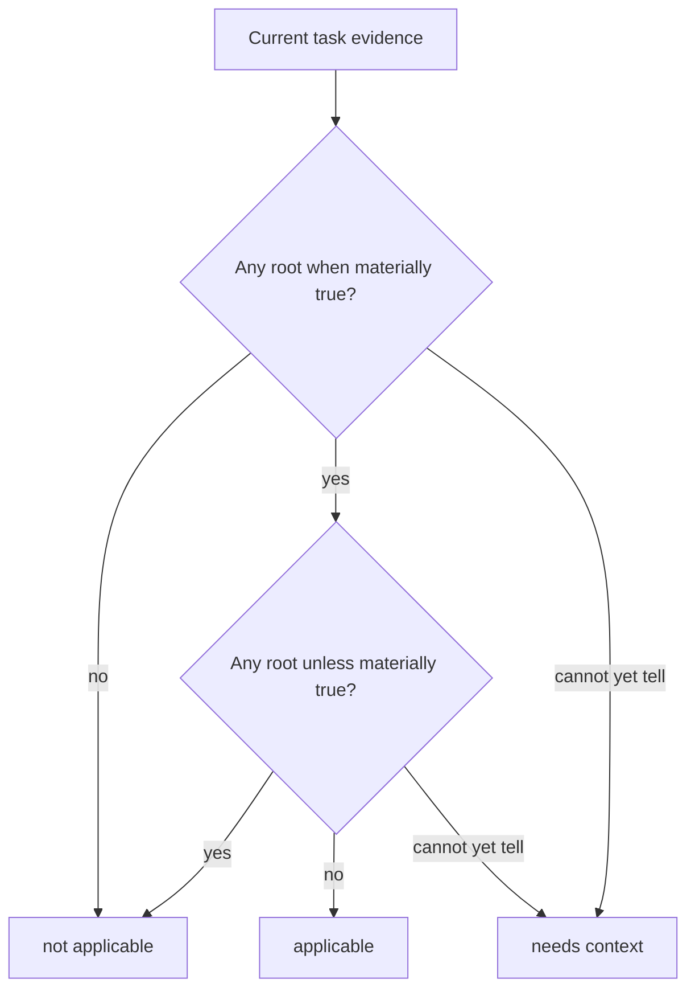

# Policy authoring

**Audience:** Skill authors and package maintainers.

A `judgment.json` file has two jobs:

1. say when its owning capability is applicable unless an explicit exclusion
   wins; and
2. say when each packaged reference may add a material distinction.

It does not define runtime questions, routes, source catalogs, assurance, or
mutation authority.

## Complete example

```json
{
  "$schema": "https://raw.githubusercontent.com/dev-hobin/agent/main/packages/judgment/schemas/judgment-authoring.schema.json",
  "specVersion": "0.1",
  "when": [
    "Caller-facing operations, ownership, data flow, or implementation shape still need to be invented."
  ],
  "unless": [
    "A concrete candidate already exists and only its stability must be reviewed.",
    "The unresolved issue is product meaning rather than implementation shape."
  ],
  "references": [
    {
      "path": "references/meaning-preserving-conversions.md",
      "when": [
        "A cross-representation design needs explicit preserved-observer, loss, ambiguity, cycle, or unsupported-path checks."
      ]
    },
    {
      "path": "references/design-levels-and-boundaries.md",
      "when": [
        "A design needs an explicit caller vocabulary, owner, hidden mechanism, or dependency direction."
      ]
    }
  ]
}
```

The normative machine-readable schema is exported as
`@hobin/judgment/schema` and stored at
[`../schemas/judgment-authoring.schema.json`](../schemas/judgment-authoring.schema.json).

## Applicability rule



`unless` is an explicit exclusion and wins when both sides match. Do not use it
for ordinary uncertainty. If evidence is still needed, the runtime assessment
should be `needs-context` instead.

## Reference rule

Every reference is independent:

```text
current question + current evidence
→ compare each reference.when
→ read zero, one, or several materially useful references
```

A good reference `when` sentence includes both:

```text
observable pressure + distinction the file can add
```

Weak:

```text
When conversions are involved.
```

Useful:

```text
A cross-representation design needs explicit preserved-observer, loss,
ambiguity, cycle, or unsupported-path checks.
```

Matching makes the reference eligible, not mandatory or authoritative. Array
order is canonicalized for identity and expresses no priority.

## Property contract

| Property | Required | Meaning |
| --- | --- | --- |
| `$schema` | No, recommended | Editor discovery only; excluded from semantic policy identity |
| `specVersion` | Yes | Exactly `"0.1"` |
| `when` | Yes | Positive applicability statements for the enclosing capability |
| `unless` | Yes | Explicit exclusions that override positive applicability |
| `references` | Yes | One or more independently selectable packaged files |
| `references[].path` | Yes | Normalized relative POSIX path from the policy directory |
| `references[].when` | Yes | Complete relevance statements for that file |

The policy intentionally has no owner field. A Pi adapter derives owner identity
from the exact loaded Skill; another adapter supplies its typed capability
identity. The compiler binds that external owner to the policy.

## When not to create a policy

Do not create `judgment.json` when the capability has no conditional packaged
references. Its `SKILL.md` or adapter contract remains complete without an empty
policy.

```text
file absent           → normal capability, no prepared references
file present + valid  → compiled owner-bound policy
file present + invalid→ fail closed for that source
```

Never synthesize an empty policy for absence, and never reinterpret malformed
presence as absence.

## Paths and containment

A reference path must:

- be relative and use `/` separators;
- contain no empty, `.` or `..` segments;
- remain lexically inside the policy root;
- resolve physically inside the allowed root;
- identify a regular file rather than a directory or escaping symlink.

The parser establishes the normalized path. Node acquisition rechecks physical
containment before reading bytes.

## Authored versus generated values

| Authored | Generated or supplied at runtime |
| --- | --- |
| `when` and `unless` prose | `PolicyOwner` and provenance |
| Reference path and relevance | `policySha256` and source IDs |
| `specVersion` | Dynamic question text and `judgmentId` |
| Nothing else | Inventory, nominations, content hashes, contributions, assurance, coverage, outcome |

This keeps author vocabulary stable while letting each task ask a different
exact question.

## Authoring workflow

```sh
judgment check skills/example/judgment.json
judgment explain skills/example/judgment.json
judgment compile skills/example/judgment.json
```

- `check` parses the source and prints its canonical authoring hash.
- `explain` renders deterministic model-visible applicability/reference
  directions.
- `compile` emits canonical compiled JSON after binding a CLI owner.

Package checks should also verify that every declared reference exists and that
model-visible generated directions have not drifted.

## Rejected shapes

The parser rejects unknown fields, semantic duplicate statements, duplicate
reference paths, surrounding whitespace, invalid UTF-8 at file boundaries,
unsafe paths, and legacy graph vocabularies such as static routes, questions,
needs, source IDs, roles, or assurance.
