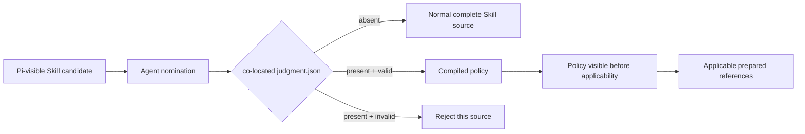
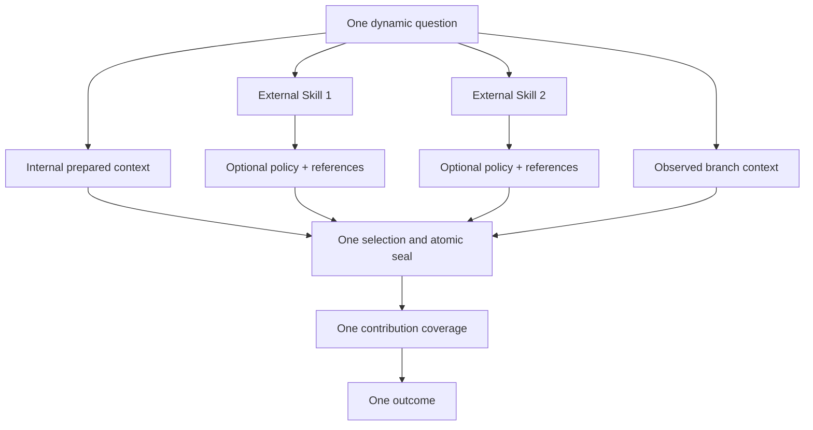
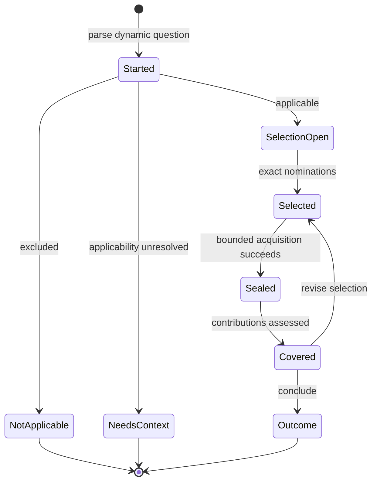
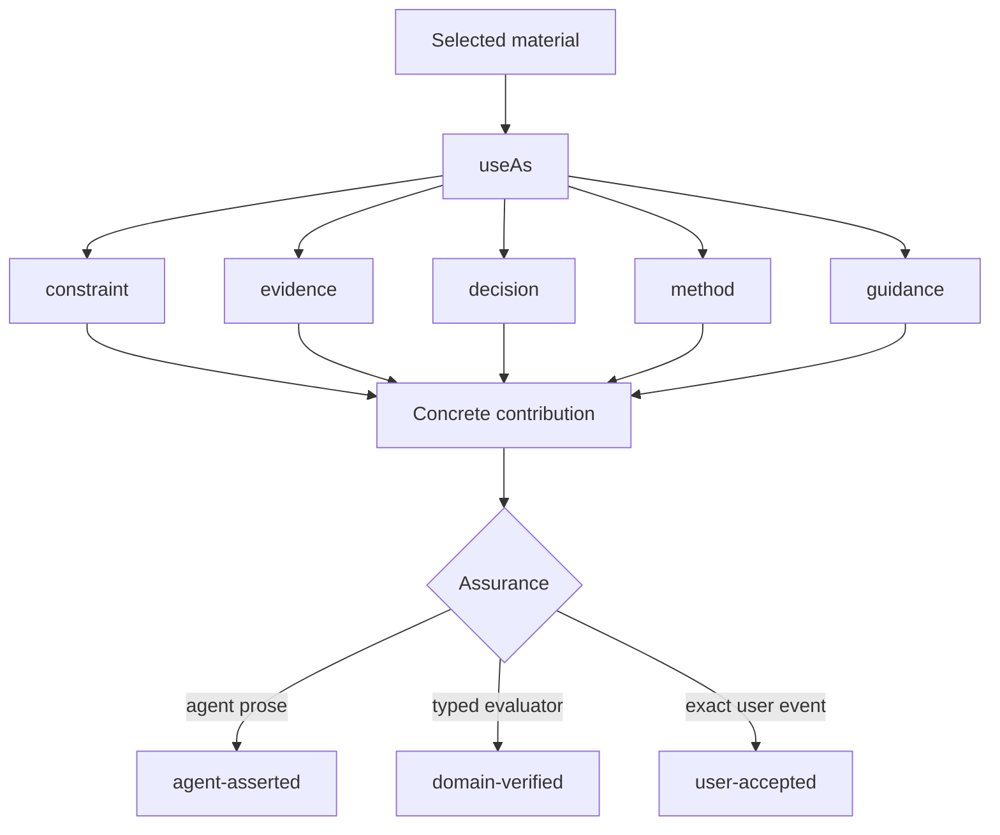

# Judgment Engine Flow

`@hobin/judgment` is a side-effect-free engine. An adapter owns discovery,
interaction, persistence, UI, and domain authority.

## Policy loading



Adapters inspect only exact nominated Skills. The engine does not crawl every
policy or read reference content at inventory time.

## One judgment, several context sources



A Skill may be a primary capability in one request and a context method,
constraint, evidence source, or guidance source in another. `judgment.json`
describes applicability and reference relevance; it does not start another
workflow.

## Engine lifecycle



Selection and sealing commit atomically. Failed acquisition leaves the attempt
at its prior immutable state.

## Material and authority



Every selected usable material needs a contribution. Generic prose cannot create
`domain-verified` or `user-accepted` assurance. The engine never grants mutation
authority; the owning adapter does.

## Identity

```text
owner + policy
→ question + branch
→ admitted source policies
→ selected descriptors + selected content
→ contributions + conflicts + limitations
→ outcome
```

Selected policy, question, descriptor, or content drift fails. Unrelated
inventory growth does not.
