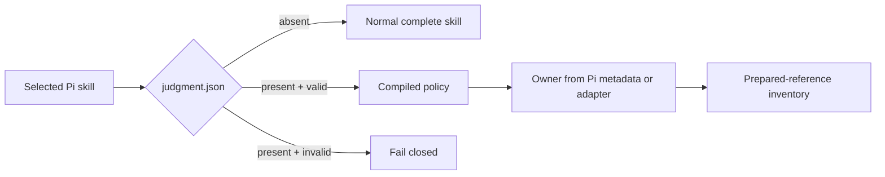
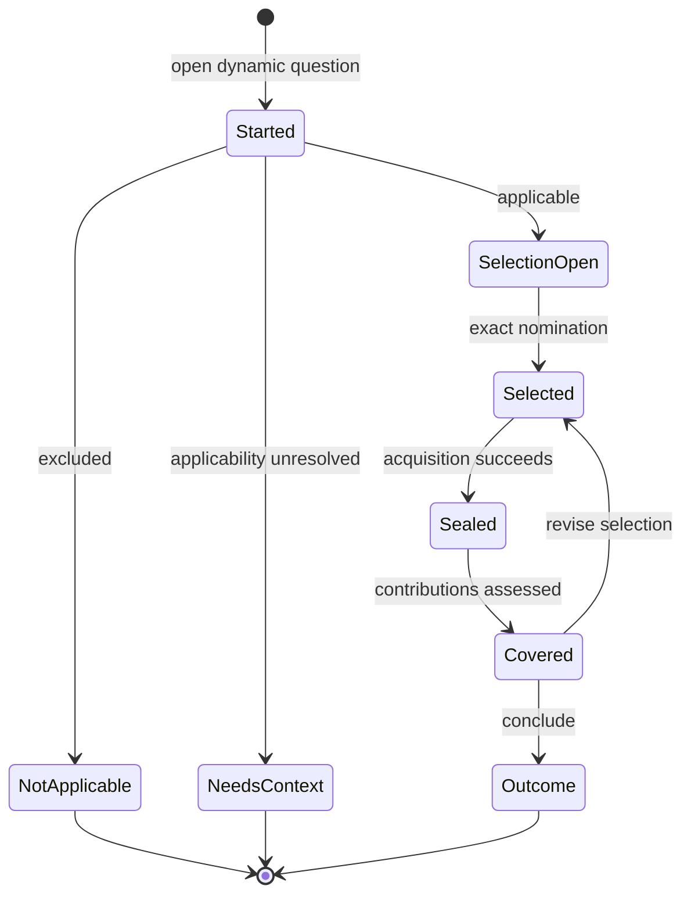
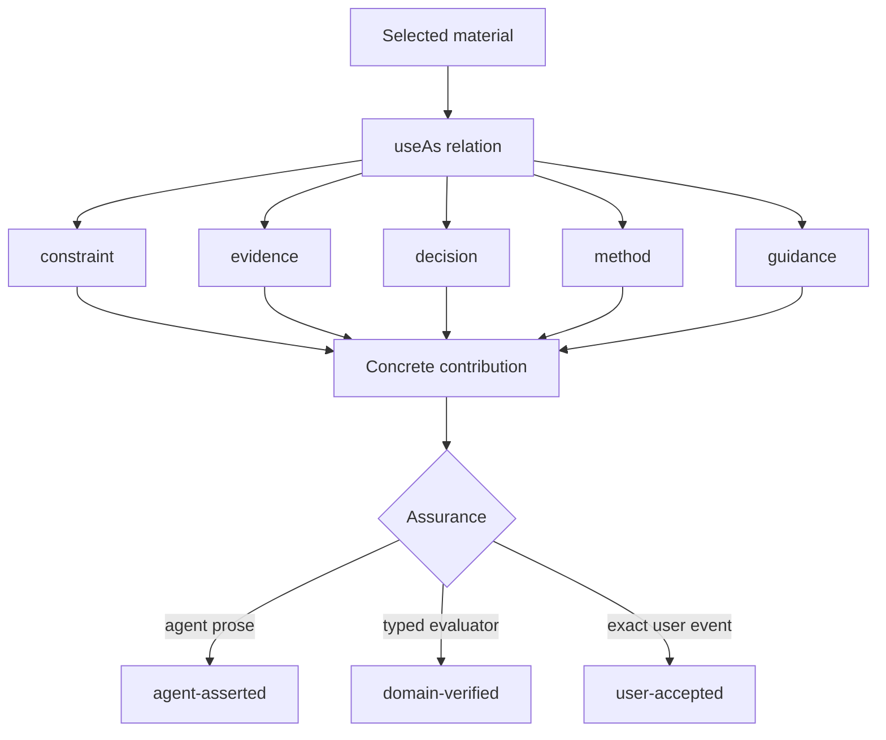

# Judgment Runtime Flow

This is the smallest package-level map of how authored policy becomes one exact,
replayable judgment. It describes runtime order and ownership; it does not imply
that a completed lifecycle makes the domain conclusion true.

## Policy loading



Only a selected capability's policy is loaded. Reference content is not read at
startup and catalog membership creates neither obligation nor authority.

## Judgment lifecycle



The generic Pi operation order is:

```text
judgment_open_context
→ judgment_assess_applicability
→ judgment_select_context
→ judgment_assess_coverage
→ judgment_conclude
```

`open` reveals the exact optional policy before applicability is assessed. Root
`unless` wins. Selection and sealing commit atomically; failed acquisition adds
neither event.

## Material and authority



Every selected usable material needs a contribution. Generic prose cannot create
`domain-verified` or `user-accepted` assurance. Policy and guidance cannot grant
mutation authority.

## Replay identity

```text
policy + owner
→ question + branch
→ selected descriptors + selected content
→ contributions + conflicts + limitations
→ outcome
```

Each arrow produces a canonical hash. Selected policy, question, descriptor, or
content drift invalidates replay. Unrelated inventory growth does not.
