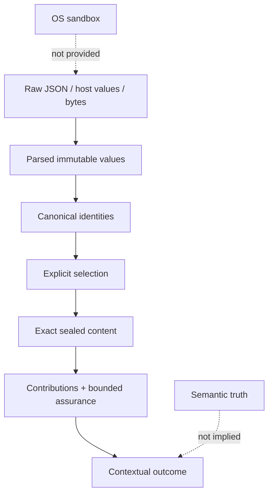
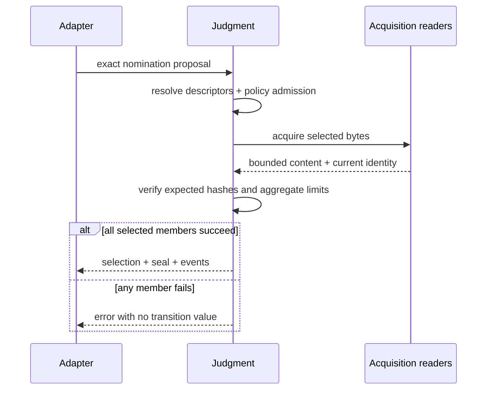
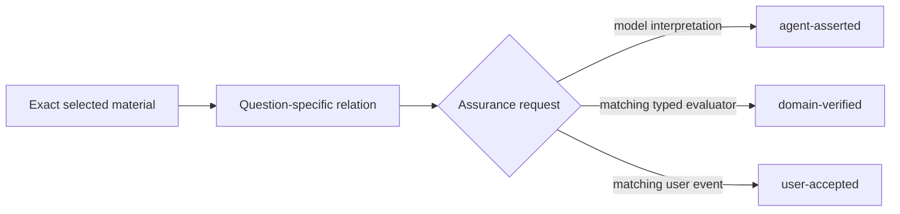

# Security and invariants

English | [한국어](./ko/security-and-invariants.md)

**Audience:** adapter authors, reviewers, and maintainers.

Judgment preserves evidence identity and workflow integrity. It is not a sandbox,
a source-trust service, or a proof that a conclusion is true.

## Trust layers



Each arrow adds a narrower guarantee. None should be interpreted as a guarantee
from a later layer.

## Parse, do not validate

A successful boundary returns the representation that encodes what was learned:

```text
unknown
→ JsonValue
→ exact data variant
→ immutable domain value
```

For compiled or persisted values, the parser reconstructs the semantic payload
and recomputes hashes. A separate `isValid` flag plus a cast would let callers
lose or bypass the invariant and is not an accepted boundary.

## Selection and sealing transaction



The adapter applies the returned transition only after the call succeeds.
Acquisition failure cannot leave a selected-but-unsealed state.

## File containment

Node readers enforce both lexical and physical containment:

```text
normalized relative path
→ join to source-specific root
→ realpath root and target
→ target remains under root
→ regular file
→ bounded bytes
→ fatal UTF-8 decode
```

Why both checks matter:

| Check | Prevents |
| --- | --- |
| Relative POSIX normalization | Absolute paths, traversal, ambiguous separators, dot segments |
| Root-specific join | Reading another provider through the wrong root |
| `realpath` containment | Symlink escape after lexical validation |
| Regular-file check | Directory/device surprises |
| Per-member and aggregate byte limits | Unbounded context acquisition |
| Fatal UTF-8 | Replacement-character ambiguity in content identity |

Every external policy root gets its own contained reader. A relative path from
provider A is never resolved under provider B.

## Drift model

| Change after selection | Effect |
| --- | --- |
| Unrelated inventory source added | Existing selection remains valid |
| Selected descriptor changes | Reject and select again |
| Selected policy or admitted policy set changes | Reject and reassess |
| Dynamic question text, owner, basis, or branch changes | New judgment identity required |
| Selected content bytes change | Reject seal/replay and reacquire |
| Tool result moves to another branch | Reject active-branch resolution |
| Persisted hash is edited without matching payload | Parser recomputation rejects it |

The engine binds only what the judgment used. This avoids both under-binding
(selected work drifting silently) and over-binding (unrelated catalog growth
invalidating useful work).

## Provenance and assurance



`domain-verified` is scoped to the evaluator's declared predicate. It does not
make every claim about the source domain-verified. `user-accepted` records a
specific user-owned decision or acceptance; it cannot make an observed fact
true or override a host constraint.

## Fail-closed cases

- unknown or extra data fields;
- unsupported `specVersion`;
- semantic duplicate statements or paths;
- malformed present policy;
- policy or reference path escape;
- duplicate source or nomination identities;
- source not explicitly admitted for the current policy set;
- error or truncated positive material;
- missing selected content;
- stale question, branch, policy, descriptor, or content;
- unusable selected member without a contribution;
- sufficient coverage with unresolved conflict;
- stronger assurance without matching provenance;
- outcome citations outside current coverage.

A provider failure is local to that provider or accepted batch. It must not erase
previously admitted, independently valid context.

## Threat boundary

Judgment does not protect against a malicious adapter with filesystem access. It
also does not evaluate whether a source lies, whether a Skill is safe to execute,
or whether a model interpretation is correct. Pi package code runs with the Pi
process's permissions. Use operating-system isolation for untrusted packages or
content.

## Review checklist

Before releasing an adapter integration, verify:

1. raw tool and persisted payloads cross exact parsers;
2. only nominated providers are opened;
3. policy is visible before applicability is accepted;
4. source-specific readers preserve lexical and physical containment;
5. admitted policy identities are passed into selection;
6. selection and sealing are applied atomically;
7. every usable member has a concrete contribution;
8. typed and user assurance cannot be synthesized from prose;
9. replay recomputes identities and checks branch/content drift; and
10. domain mutation authority remains outside contextual outcomes.
