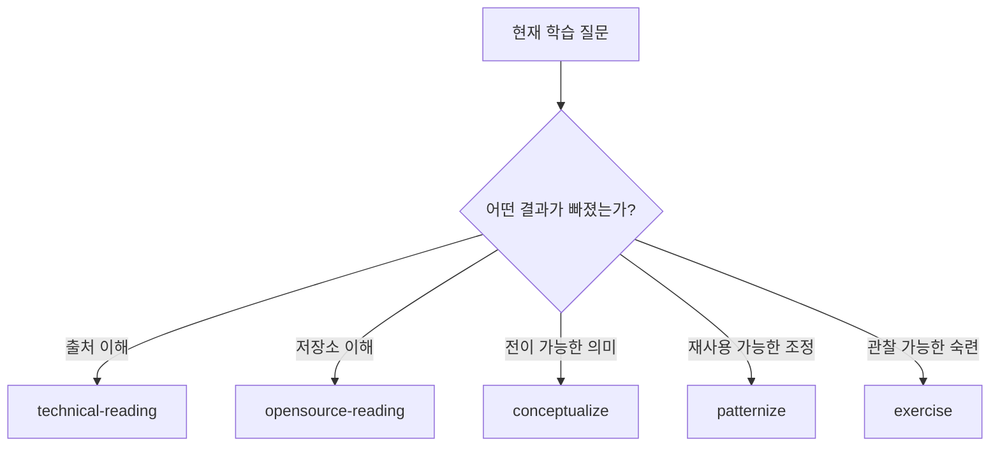
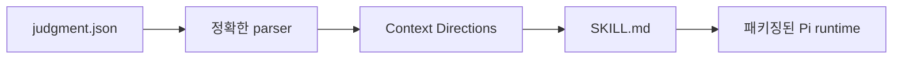

# @hobin/learning

[English](./README.md) | 한국어

기술 자료 읽기, 저장소 학습, 개념과 패턴 형성, 의도적 연습 설계를 위한 독립적인
다섯 Pi Skill입니다.

Learning은 출처에 근거하지만 단계 중심이 아닙니다. 각 Skill은 완전한 질문,
방법, 결과, 중지 조건을 소유하므로 더 큰 학습 워크플로에 들어가지 않고 하나만
사용할 수 있습니다.

## 설치

[Pi](https://pi.dev)와 Node.js 22.19 이상이 필요합니다.

```sh
pi install npm:@hobin/learning
```

한 번의 실행에서 시험하려면:

```sh
pi -e npm:@hobin/learning
```

## 먼저 해보기

자연스럽게 요청하세요.

```text
Read this specification with me. Preserve its examples and edge cases, then
explain the model it expects me to use.
```

또는 Skill을 직접 호출하세요.

```text
/skill:technical-reading Explain this article without flattening its boundaries.
/skill:opensource-reading Trace this public API through docs, tests, and implementation.
/skill:conceptualize Turn these source-bound insights into one transferable concept.
/skill:patternize Find the recurring decision path across these cases.
/skill:exercise Build prediction, diagnosis, repair, and transfer practice for this concept.
```

`/learning`은 일시적인 선택기를 엽니다. 편집 중인 내용을 보존하고 선택한
`/skill:...` 명령을 준비하지만 자동 전송하지 않습니다.

## Skill 선택

| 필요한 결과 | Skill | 결과 |
| --- | --- | --- |
| 책, 글, 명세, 튜토리얼, PDF, 웹페이지 이해 | `technical-reading` | 충실한 읽기와 출처에 묶인 설명 및 코칭 |
| 오픈 소스 저장소의 공개 API, 흐름, 불변식, tradeoff 학습 | `opensource-reading` | docs/tests/code provenance가 있는 근거 기반 저장소 slice |
| 출처를 넘어 유지되는 정신 모델에 이름 붙이기 | `conceptualize` | 원자적이고 transfer로 시험한 개념 또는 명시적 임시 경계 |
| 반복되는 개념이나 결정을 재사용 가능한 routine으로 조정 | `patternize` | context, forces, moves, checks, consequences를 담은 운영 패턴 |
| 이해를 관찰 가능한 수행으로 전환 | `exercise` | prediction, misconception, repair, transfer, mastery 과제 |



이 그림은 선택 지도이지 순서가 아닙니다. 다른 Skill의 질문이 중요해질 때만
handoff합니다.

## 실행 과정

1. Pi가 선택한 `SKILL.md`에서 완전한 방법을 불러옵니다.
2. Skill이 자신의 질문에 필요한 정확한 source 또는 repository slice를
   조사합니다.
3. 명시된 차이가 결과를 바꿀 수 있을 때만 선택적 패키지 reference를 읽습니다.
4. Skill은 완전한 대화 결과 또는 복사 가능한 Markdown을 반환합니다.
5. 사용자가 target을 명시적으로 요청할 때만 파일을 씁니다.

Learning은 notebook, graph database, metadata schema, Git workflow, sibling
package를 전제하지 않습니다. 보편적인 학습 단계나 완료율도 추적하지 않습니다.

## 선택적 Context Directions

각 Learning Skill에는 작은 `judgment.json` 작성 정책이 있습니다. 개발 시점에
결정적이고 모델에 보이는 `Context Directions` section으로 바뀝니다.



이것은 중첩된 Judgment 워크플로가 아닙니다. 정책은 Skill 적용 조건, 우선하는
제외 조건, 각 패키지 reference가 중요한 차이를 더할 수 있는 조건만 표현합니다.
Reference가 존재한다고 반드시 읽어야 하는 것은 아닙니다.

## 경계

- Technical reading은 일반화하기 전에 활성 source에 충실합니다.
- Repository study는 주장을 정확한 docs, tests, code에 결속합니다.
- Conceptualization은 출처 독립적인 의미와 출처 이력을 분리합니다.
- Patternization에는 주제 유사성이 아니라 반복과 조정이 필요합니다.
- Exercise에는 또 다른 요약이 아니라 관찰 가능한 근거가 필요합니다.
- 저장은 항상 사용자가 선택한 target에 대한 명시적 요청으로만 이루어집니다.

## 문서

| 문서 | 대상 |
| --- | --- |
| [Skill 선택](./docs/ko/choosing-a-skill.md) | 다섯 질문 구분과 handoff 시점 결정 |
| [아키텍처](./docs/ko/architecture.md) | 런타임 경계, 선택기 동작, stateless composition |
| [Context Directions](./docs/ko/context-directions.md) | 선택적 reference 정책과 생성된 Skill section 유지보수 |

## 개발

```sh
pnpm --filter @hobin/learning check
pnpm --filter @hobin/learning eval
pi -e ./packages/learning
```

정책을 바꾼 뒤 모델에 보이는 directions를 다시 생성합니다.

```sh
node packages/learning/scripts/write-context-directions.mjs
```

패키지 검사는 정책과 Skill 사이의 drift를 거부합니다.

## 라이선스

[MIT](./LICENSE)
