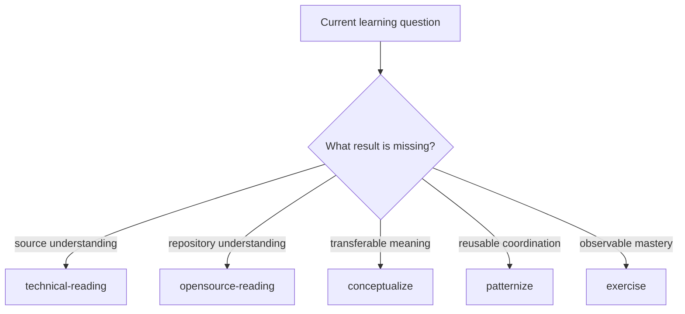
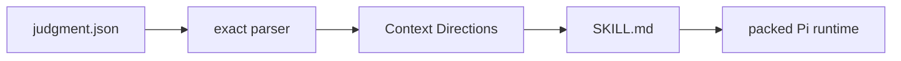

# @hobin/learning

Five independent Pi Skills for reading technical sources, studying repositories,
forming concepts and patterns, and designing deliberate practice.

Learning is source-grounded but not phase-driven. Each Skill owns a complete
question, method, result, and stop; use one Skill without committing to a larger
learning workflow.

## Install

Requires [Pi](https://pi.dev) and Node.js 22.19 or newer.

```sh
pi install npm:@hobin/learning
```

Try it for one run:

```sh
pi -e npm:@hobin/learning
```

## Try this first

Ask naturally:

```text
Read this specification with me. Preserve its examples and edge cases, then
explain the model it expects me to use.
```

Or invoke a Skill directly:

```text
/skill:technical-reading Explain this article without flattening its boundaries.
/skill:opensource-reading Trace this public API through docs, tests, and implementation.
/skill:conceptualize Turn these source-bound insights into one transferable concept.
/skill:patternize Find the recurring decision path across these cases.
/skill:exercise Build prediction, diagnosis, repair, and transfer practice for this concept.
```

Run `/learning` to open a transient chooser. It preserves your editor draft,
prepares the selected `/skill:...` command, and never sends it automatically.

## Choose a Skill

| You need to… | Skill | Result |
| --- | --- | --- |
| Understand a book, article, specification, tutorial, PDF, or webpage | `technical-reading` | Faithful reading plus source-bound explanation and coaching |
| Learn one public API, flow, invariant, or tradeoff from an open-source repository | `opensource-reading` | Evidence-backed repository slice with docs/tests/code provenance |
| Name a durable mental model that survives beyond its sources | `conceptualize` | Atomic, transfer-tested concept or explicit provisional boundary |
| Coordinate recurring concepts or decisions into a reusable routine | `patternize` | Operational pattern with context, forces, moves, checks, and consequences |
| Turn understanding into observable performance | `exercise` | Prediction, misconception, repair, transfer, and mastery tasks |



The diagram is a choice map, not a sequence. Handoffs occur only when another
Skill's question becomes consequential.

## What happens

1. Pi loads the complete method from the selected `SKILL.md`.
2. The Skill inspects the exact source or repository slice needed for its own
   question.
3. Optional packaged references are read only when their stated distinction can
   change the result.
4. The Skill returns a complete conversational result or copyable Markdown.
5. Files are written only when you explicitly ask for a target.

Learning assumes no notebook, graph database, metadata schema, Git workflow, or
sibling package. It does not track a universal learning phase or completion
percentage.

## Optional context directions

Every Learning Skill has a small `judgment.json` authoring policy. At development
time it becomes a deterministic, model-visible `Context Directions` section:



This is not a nested Judgment workflow. The policy only says when the Skill is
applicable, when an exclusion wins, and when each packaged reference may add a
material distinction. Reference availability never makes a read mandatory.

## Boundaries

- Technical reading stays faithful to the active source before generalizing.
- Repository study keeps claims tied to exact docs, tests, and code.
- Conceptualization separates source-independent meaning from source history.
- Patternization requires recurrence and coordination, not topical similarity.
- Exercise requires observable evidence, not another summary.
- Saving is always an explicit user request to a user-selected target.

## Documentation

| Document | For |
| --- | --- |
| [Choosing a Skill](./docs/choosing-a-skill.md) | Distinguishing the five questions and deciding when to hand off |
| [Architecture](./docs/architecture.md) | Runtime boundaries, chooser behavior, and stateless composition |
| [Context Directions](./docs/context-directions.md) | Maintaining optional reference policies and generated Skill sections |

## Development

```sh
pnpm --filter @hobin/learning check
pnpm --filter @hobin/learning eval
pi -e ./packages/learning
```

After changing a policy, regenerate its model-visible directions:

```sh
node packages/learning/scripts/write-context-directions.mjs
```

Package checks reject policy/Skill drift.

## License

[MIT](./LICENSE)
