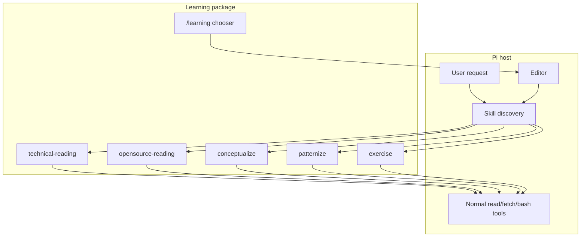
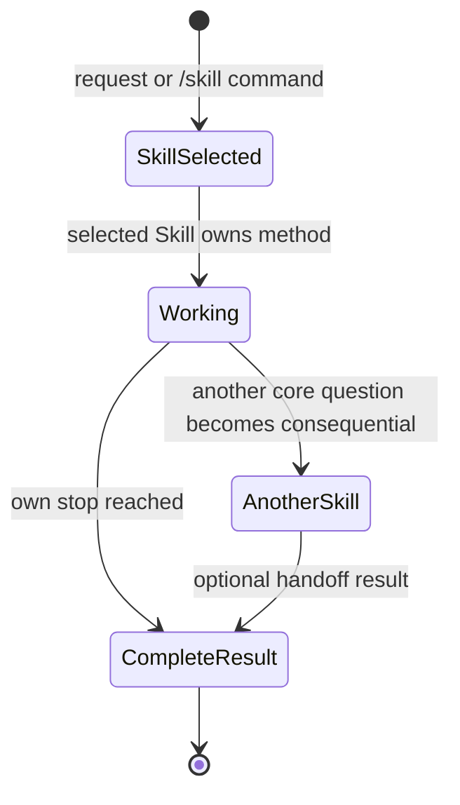
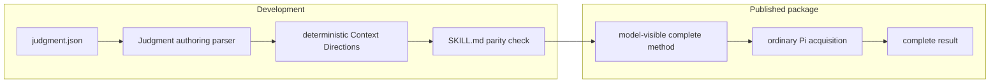
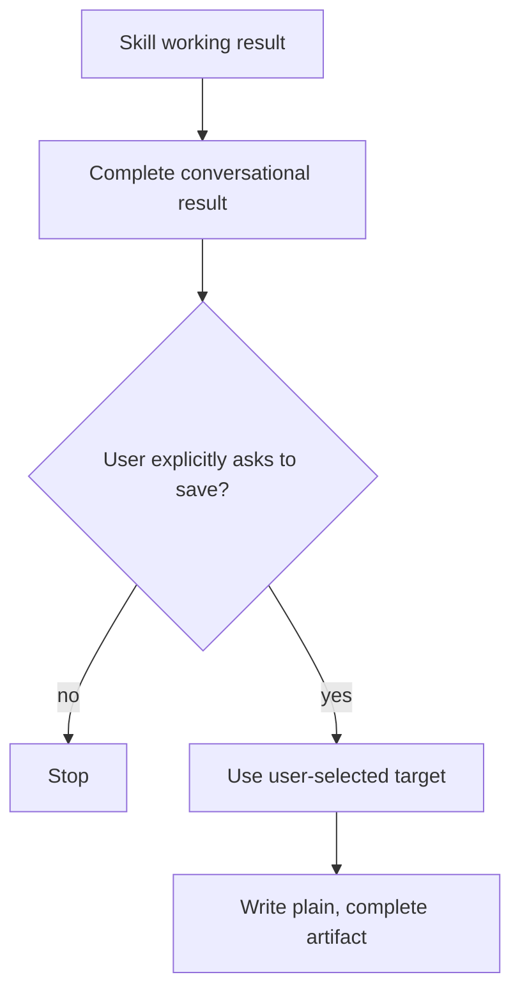

# Learning architecture

**Audience:** users who need the package boundary and maintainers changing the
chooser or Skill set.

Learning is a thin Pi package around five self-contained Skills. It has no shared
learning state machine.

## Runtime layers

The chooser only prepares an editor command. It does not invoke a model, append a
Learning event, choose a persistence destination, or establish a phase.

## Independent capabilities

The state diagram describes one Skill invocation, not package-wide persisted
state. Each invocation is complete even when it recommends a later handoff.

## Shared boundary, not shared workflow

The Skills share only package-level conventions:

- source-grounded claims;
- complete result and observable stop;
- explicit limitations;
- optional reference selection;
- user-selected persistence targets; and
- no hidden sibling-package dependency.

They do not share a required artifact schema, notebook, graph, progress counter,
or ordered route.

## Authoring and runtime split

`@hobin/judgment` is a development dependency for generating and checking
Context Directions. The packed runtime does not start a Judgment extension or
session lifecycle.

## Source ownership

| Skill | Evidence it owns | Evidence it must not flatten |
| --- | --- | --- |
| Technical reading | Active source text, structure, examples, visuals, caveats | Source wording/order when they carry the learning move |
| Open-source reading | Exact docs, tests, examples, implementation, commit/version context | Repository evidence into an unsupported architecture story |
| Conceptualize | Cross-source boundary tests and transfer cases | Source provenance into the concept's stable meaning |
| Patternize | Repeated cases, forces, moves, and consequences | Topical similarity into false recurrence |
| Exercise | Learner performance, misconceptions, repairs, and transfer | Explanation quality into mastery evidence |

## Artifact boundary

Learning does not infer a default notebook or repository. A target configured
earlier in the same conversation can be reused; otherwise the Skill asks the
minimum setup question before writing.

## Package map

| Path | Responsibility |
| --- | --- |
| `extensions/learning.ts` | Registers `/learning` |
| `extensions/tui.ts` | Chooser list and editor preparation |
| `skills/*/SKILL.md` | Complete user-visible methods |
| `skills/*/judgment.json` | Optional-reference authoring policies |
| `skills/*/references/` | Independently selectable supporting material |
| `references/skill-boundaries.md` | Shared ownership/handoff boundary |
| `scripts/context-directions.mjs` | Deterministic policy rendering |
| `scripts/check-package.mjs` | Package, Skill, reference, and parity checks |

## Adding a Skill

A new Skill is justified only when it owns a distinct core question, method,
result, and stop. Before adding one, verify that it is not:

- a phase inside an existing Skill;
- a named output format rather than a capability;
- a fixed source type that an existing Skill can already handle;
- a persistence mechanism; or
- a convenience route that forces otherwise independent work into one sequence.

Add the Skill directory, complete `SKILL.md`, optional references and policy,
chooser name, tests, and package-check expectation together.
