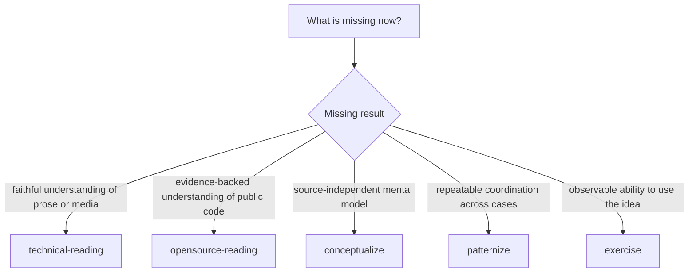
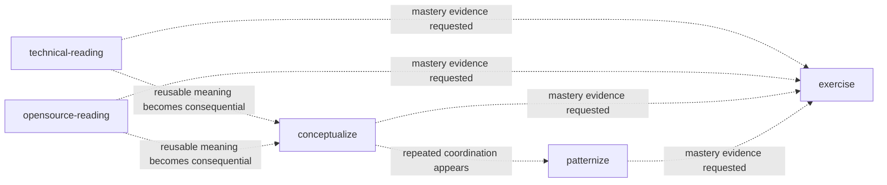

# Choosing a Learning Skill

The five Learning Skills are distinguished by the result you need, not by a
mandatory study sequence.

## Decision map



## Contrast table

| Skill | Starts from | Core question | Stops with |
| --- | --- | --- | --- |
| `technical-reading` | Book, article, docs, specification, tutorial, PDF, webpage | What is this source trying to make the reader understand, do, explain, or judge? | Faithful reading plus bounded explanation/coaching |
| `opensource-reading` | Public repository and one declared slice | How does this API, flow, invariant, or tradeoff actually work across docs, tests, and code? | Evidence-backed repository learning artifact |
| `conceptualize` | One or more learned insights or artifacts | What durable concept survives when source-specific wording is removed? | Atomic concept, boundary test, and graph update when requested |
| `patternize` | Repeated concepts, cases, or judgments | What recurring context/forces/moves/checks form one reusable operational routine? | Pattern or explicit rejection of false recurrence |
| `exercise` | A concept, pattern, reading result, or misconception | What performance would demonstrate understanding and transfer? | Deliberate practice and mastery rubric |

## Nearby cases

### Technical reading or conceptualize?

```text
“Explain what this chapter means and preserve its examples.”
→ technical-reading

“These three chapters suggest one model of information-preserving boundaries.
Name and test that model independently of the books.”
→ conceptualize
```

Technical reading remains accountable to source order, wording, examples, and
boundaries. Conceptualize deliberately asks what transfers beyond those sources.

### Open-source reading or ordinary code exploration?

Use `opensource-reading` when the learning result matters: a traceable API/flow,
contract, invariant, failure mode, or architecture boundary grounded in public
repository evidence. Ordinary repository work is enough when you only need to
locate a file or implement a change.

### Concept or pattern?

```text
Concept: a durable distinction or mental model.
Pattern: a recurring coordination of context, forces, moves, and checks.
```

Several related concepts do not automatically form a pattern. Patternize needs
recurrence and an operational axis.

### Explanation or exercise?

If the learner still lacks the model, read or conceptualize first. If the model
is available but performance is untested, use exercise. Rewriting another
summary is not practice.

## Handoffs are conditional



Dotted arrows mean “may hand off,” not “must proceed.” Every Skill returns a
complete result on its own.

## Example requests

### Technical reading

```text
Read this RFC section with me. Translate it faithfully, then explain the state
model and the exception that the example is demonstrating.
```

### Open-source reading

```text
Study how this repository's public retry API travels through documentation,
tests, and implementation. Identify the guarantee and one falsifier.
```

### Conceptualize

```text
Across these two reading notes, isolate the concept of evidence-preserving
boundaries. Test whether parsing, constructors, and protocol transitions are one
concept or several.
```

### Patternize

```text
These design reviews repeatedly separate discovery, admission, acquisition, and
commit. Decide whether that recurrence is a reusable pattern and write its
checks and failure modes.
```

### Exercise

```text
Turn this concept into a prediction task, one misconception diagnostic, a faded
worked example, a repair task, and a transfer problem with a mastery rubric.
```

## When not to use Learning

- You need Pi to implement or mutate a repository rather than teach from it.
- You need a persistent notebook or automated memory system.
- You want a generic summary with no source or mastery requirement.
- You have not identified a source, concept, recurrence, or performance target
  precise enough for one of the five questions.
