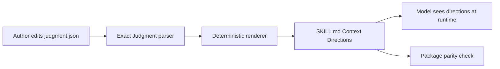
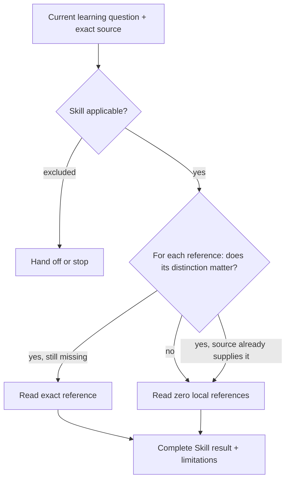

# Context Directions

**Audience:** maintainers of Learning Skills and their optional references.

Every Learning Skill has a complete method in `SKILL.md`. A small
`judgment.json` policy controls only capability applicability and conditional
packaged references. Its deterministic rendering is committed into the Skill as
`## Context Directions`.

## Why generate directions?

The packed Learning runtime should remain a normal, stateless Pi Skill package,
while policy authors still need one exact vocabulary and drift check.



No runtime parser call is required for the model to see the policy.

## Policy shape

```json
{
  "specVersion": "0.1",
  "when": [
    "A technical source must be understood faithfully before its lessons are generalized."
  ],
  "unless": [
    "The task asks only for a source-independent concept already supported by completed reading artifacts."
  ],
  "references": [
    {
      "path": "references/lens-library.md",
      "when": [
        "The source mixes conceptual argument, runtime semantics, examples, and boundary claims that need more than one reading lens."
      ]
    }
  ]
}
```

Root `unless` wins. Each reference is considered independently. Matching makes a
reference useful to consider, never mandatory or authoritative.

## Selection model



External source material is open-world. A book, repository, specification, or
user-provided artifact may already supply a local reference's distinction more
precisely.

## Generated section

The renderer produces a stable section containing:

- when the Skill is applicable;
- which exclusions win;
- every prepared reference path; and
- each reference's complete relevance statements.

It does not generate runtime question IDs, read order, source ranks, assurance,
or a checklist requiring every reference.

## Maintenance workflow

After changing a policy:

```sh
node packages/learning/scripts/write-context-directions.mjs
pnpm --filter @hobin/learning check
```

The package check verifies:

1. every Skill is discoverable by Pi;
2. every policy parses through the exact Judgment authoring parser;
3. every packaged reference appears exactly once in its policy;
4. every policy reference exists under that Skill;
5. the committed `Context Directions` section equals renderer output byte for
   byte;
6. legacy routes/read-order fields are absent; and
7. no nested Judgment extension or Skill is shipped.

## Reference authoring

A reference must be usable independently. Include the smallest complete material
needed for its promised distinction:

```text
triggering pressure
→ model, procedure, contrast, or diagnostic
→ worked example or counterexample where needed
→ observable boundary or stop
```

Do not split solely by source chapter or to reduce file length. Split when a
reference has independently meaningful applicability and can be selected without
requiring a hidden read order.

## Failure modes

| Failure | Why it is wrong |
| --- | --- |
| Every reference is always read | Catalog membership becomes ceremony |
| `SKILL.md` depends on an optional reference for its basic method | The Skill is incomplete without hidden acquisition |
| A policy lists external source URLs or tools | Runtime source availability drifts independently |
| A reference `when` is only topical | It does not explain what distinction can change the result |
| Generated directions are edited by hand | Policy and model-visible behavior drift |
| One Skill's reference is read as another Skill's private library | Capability ownership becomes ambiguous |

## Relationship to Judgment

Learning uses the authoring/compiler surface only. A stateful adapter may use the
same policy vocabulary for runtime inventory, selection, sealing, coverage, and
outcomes, but Learning deliberately does not. See
[`@hobin/judgment` policy authoring](../../judgment/docs/policy-authoring.md) for
the normative field and path rules.
