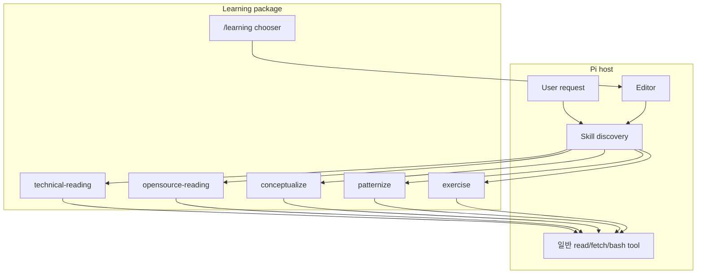
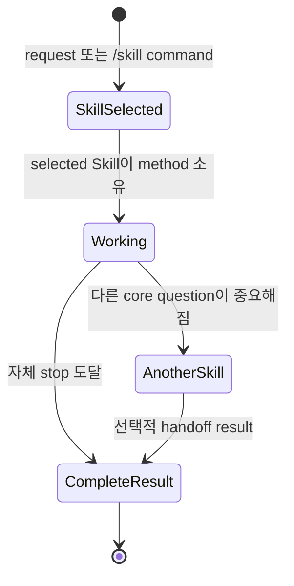
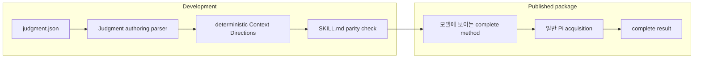
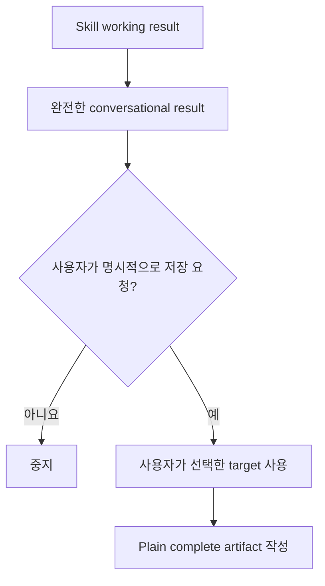

# Learning 아키텍처

[English](../architecture.md) | 한국어

**대상:** package boundary가 필요한 사용자와 chooser 또는 Skill set을 변경하는
maintainer

Learning은 다섯 self-contained Skill을 감싸는 얇은 Pi package입니다. 공유 learning
state machine이 없습니다.

## Runtime layer

Chooser는 editor command만 준비합니다. Model을 호출하거나, Learning event를
append하거나, persistence destination을 고르거나, phase를 만들지 않습니다.

## 독립적인 기능

이 state diagram은 하나의 Skill invocation을 설명하며 package-wide persisted
state를 뜻하지 않습니다. 이후 handoff를 권하더라도 각 invocation은 완전합니다.

## 공유 boundary, 공유 workflow 아님

Skill이 공유하는 것은 package-level convention뿐입니다.

- Source-grounded claim
- Complete result와 observable stop
- Explicit limitation
- Optional reference selection
- User-selected persistence target
- Hidden sibling-package dependency 없음

필수 artifact schema, notebook, graph, progress counter, ordered route는 공유하지
않습니다.

## Authoring/runtime 분리

`@hobin/judgment`는 Context Directions를 생성하고 검사하는 development
dependency입니다. Packed runtime은 Judgment extension 또는 session lifecycle을
시작하지 않습니다.

## Source 소유권

| Skill | 소유하는 evidence | 뭉개면 안 되는 evidence |
| --- | --- | --- |
| Technical reading | Active source text, structure, example, visual, caveat | Learning move를 담은 source wording/order |
| Open-source reading | Exact docs, tests, example, implementation, commit/version context | Repository evidence를 unsupported architecture story로 바꾸는 것 |
| Conceptualize | Cross-source boundary test와 transfer case | Source provenance를 concept의 stable meaning에 섞는 것 |
| Patternize | Repeated case, force, move, consequence | Topical similarity를 false recurrence로 바꾸는 것 |
| Exercise | Learner performance, misconception, repair, transfer | Explanation quality를 mastery evidence로 취급하는 것 |

## Artifact 경계

Learning은 default notebook 또는 repository를 추론하지 않습니다. 같은 대화에서
먼저 설정한 target은 재사용할 수 있고, 그 외에는 파일을 쓰기 전에 최소한의 설정
질문을 합니다.

## 패키지 지도

| 경로 | 책임 |
| --- | --- |
| `extensions/learning.ts` | `/learning` 등록 |
| `extensions/tui.ts` | Chooser list와 editor preparation |
| `skills/*/SKILL.md` | 완전한 user-visible method |
| `skills/*/judgment.json` | Optional-reference authoring policy |
| `skills/*/references/` | 독립적으로 선택 가능한 supporting material |
| `references/skill-boundaries.md` | 공유 ownership/handoff boundary |
| `scripts/context-directions.mjs` | Deterministic policy rendering |
| `scripts/check-package.mjs` | Package, Skill, reference, parity check |

## Skill 추가

새 Skill은 구별되는 core question, method, result, stop을 소유할 때만 정당합니다.
추가하기 전에 다음에 해당하지 않는지 확인하세요.

- 기존 Skill 내부의 phase
- Capability가 아니라 이름 붙인 output format
- 기존 Skill이 이미 다룰 수 있는 고정 source type
- Persistence mechanism
- 독립적인 작업을 하나의 sequence로 강제하는 convenience route

Skill directory, complete `SKILL.md`, optional reference와 policy, chooser name, test,
package-check expectation을 함께 추가합니다.
