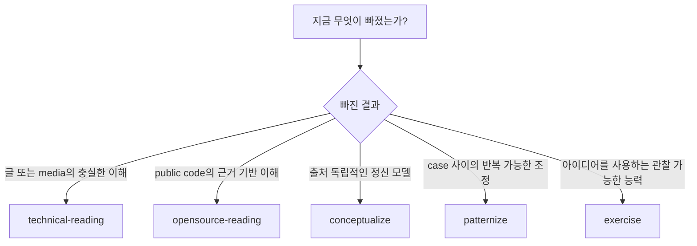
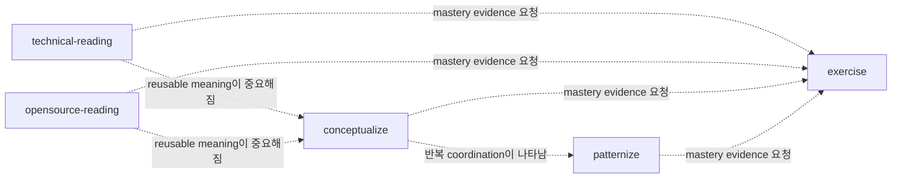

# Learning Skill 선택

[English](../choosing-a-skill.md) | 한국어

다섯 Learning Skill은 필수 학습 순서가 아니라 필요한 결과로 구분합니다.

## 선택 지도



## 비교표

| Skill | 출발점 | 핵심 질문 | 완료 결과 |
| --- | --- | --- | --- |
| `technical-reading` | 책, 글, docs, 명세, 튜토리얼, PDF, 웹페이지 | 이 source가 독자에게 무엇을 이해, 수행, 설명, 판단하게 하려는가? | 충실한 읽기와 한정된 설명/코칭 |
| `opensource-reading` | Public repository와 선언된 slice 하나 | 이 API, flow, invariant, tradeoff가 docs, tests, code에서 실제로 어떻게 동작하는가? | 근거 기반 repository learning artifact |
| `conceptualize` | 하나 이상의 학습된 insight 또는 artifact | Source-specific wording을 제거해도 어떤 durable concept가 남는가? | 요청 시 atomic concept, boundary test, graph update |
| `patternize` | 반복되는 concept, case, judgment | 어떤 반복 context/force/move/check가 하나의 재사용 가능한 운영 routine을 이루는가? | Pattern 또는 false recurrence의 명시적 거부 |
| `exercise` | Concept, pattern, reading result, misconception | 어떤 수행이 이해와 transfer를 보여주는가? | Deliberate practice와 mastery rubric |

## 가까운 case 구분

### Technical reading인가, conceptualize인가?

```text
“Explain what this chapter means and preserve its examples.”
→ technical-reading

“These three chapters suggest one model of information-preserving boundaries.
Name and test that model independently of the books.”
→ conceptualize
```

Technical reading은 source order, wording, example, boundary에 계속 책임을 집니다.
Conceptualize는 그 source를 넘어 transfer되는 것이 무엇인지 의도적으로 묻습니다.

### Open-source reading인가, 일반 code exploration인가?

학습 결과가 중요할 때 `opensource-reading`을 사용하세요. Public repository evidence에
근거한 traceable API/flow, contract, invariant, failure mode, architecture boundary가
그 결과입니다. 파일을 찾거나 변경을 구현하기만 하면 일반 repository 작업으로
충분합니다.

### Concept인가, pattern인가?

```text
Concept: durable distinction 또는 mental model
Pattern: context, force, move, check의 반복되는 coordination
```

관련 concept가 여러 개 있다고 자동으로 pattern이 되지는 않습니다. Patternize에는
recurrence와 operational axis가 필요합니다.

### Explanation인가, exercise인가?

학습자에게 아직 model이 없다면 먼저 읽거나 conceptualize합니다. Model은 있지만
수행을 검증하지 않았다면 exercise를 사용합니다. 또 다른 요약을 쓰는 것은 연습이
아닙니다.

## Handoff는 조건부



점선 화살표는 “넘길 수 있음”이지 “반드시 진행”이 아닙니다. 모든 Skill은 자체적으로
완전한 결과를 반환합니다.

## 요청 예시

### Technical reading

```text
Read this RFC section with me. Translate it faithfully, then explain the state
model and the exception that the example is demonstrating.
```

### Open-source reading

```text
Study how this repository's public retry API travels through documentation,
tests, and implementation. Identify the guarantee and one falsifier.
```

### Conceptualize

```text
Across these two reading notes, isolate the concept of evidence-preserving
boundaries. Test whether parsing, constructors, and protocol transitions are one
concept or several.
```

### Patternize

```text
These design reviews repeatedly separate discovery, admission, acquisition, and
commit. Decide whether that recurrence is a reusable pattern and write its
checks and failure modes.
```

### Exercise

```text
Turn this concept into a prediction task, one misconception diagnostic, a faded
worked example, a repair task, and a transfer problem with a mastery rubric.
```

## Learning을 사용하지 않을 때

- Repository를 학습하는 것이 아니라 Pi가 구현하거나 변경해야 할 때
- Persistent notebook 또는 automated memory system이 필요할 때
- Source 또는 mastery requirement 없는 일반 요약이 필요할 때
- 다섯 질문 중 하나가 다룰 만큼 정확한 source, concept, recurrence, performance
  target을 아직 식별하지 못했을 때
