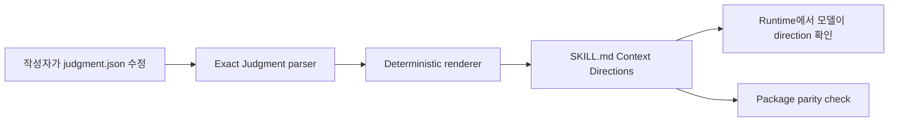
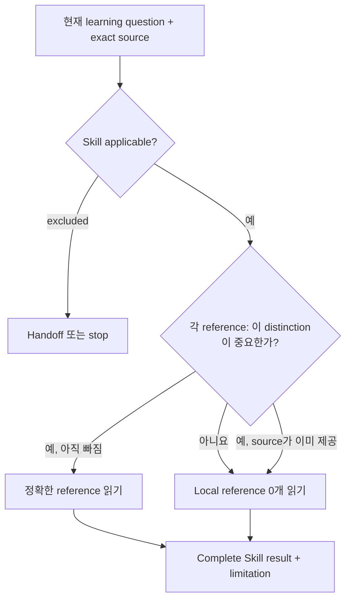

# Context Directions

[English](../context-directions.md) | 한국어

**대상:** Learning Skill과 선택적 reference의 maintainer

모든 Learning Skill은 `SKILL.md`에 완전한 method를 가집니다. 작은
`judgment.json` policy는 capability applicability와 conditional packaged
reference만 통제합니다. 결정적인 rendering은 Skill 안에 `## Context Directions`로
commit합니다.

## Directions를 생성하는 이유

Packed Learning runtime은 일반적인 stateless Pi Skill package로 유지하면서도
policy author에게는 하나의 정확한 vocabulary와 drift check가 필요합니다.



모델이 policy를 보기 위해 runtime parser를 호출할 필요가 없습니다.

## Policy 형태

```json
{
  "specVersion": "0.1",
  "when": [
    "A technical source must be understood faithfully before its lessons are generalized."
  ],
  "unless": [
    "The task asks only for a source-independent concept already supported by completed reading artifacts."
  ],
  "references": [
    {
      "path": "references/lens-library.md",
      "when": [
        "The source mixes conceptual argument, runtime semantics, examples, and boundary claims that need more than one reading lens."
      ]
    }
  ]
}
```

Root `unless`가 우선합니다. 각 reference는 독립적으로 고려합니다. Match는
reference가 검토할 가치가 있다는 뜻이지 필수 또는 authoritative하다는 뜻이
아닙니다.

## Selection model



외부 source material은 open-world입니다. 책, repository, specification,
user-provided artifact가 local reference의 distinction을 더 정확하게 이미 제공할 수
있습니다.

## 생성 section

Renderer는 다음을 포함하는 안정적인 section을 만듭니다.

- Skill 적용 조건
- 우선하는 제외 조건
- 모든 prepared reference path
- 각 reference의 완전한 relevance statement

Runtime question ID, read order, source rank, assurance, 모든 reference를 요구하는
checklist는 생성하지 않습니다.

## 유지보수 workflow

Policy 변경 후:

```sh
node packages/learning/scripts/write-context-directions.mjs
pnpm --filter @hobin/learning check
```

Package check가 확인하는 것:

1. 모든 Skill을 Pi가 discover할 수 있음
2. 모든 policy가 정확한 Judgment authoring parser를 통과
3. 모든 packaged reference가 policy에 정확히 한 번 등장
4. 모든 policy reference가 해당 Skill 아래 존재
5. Committed `Context Directions` section과 renderer output이 byte 단위로 일치
6. Legacy route/read-order field가 없음
7. Nested Judgment extension 또는 Skill을 package에 포함하지 않음

## Reference 작성

Reference는 독립적으로 사용할 수 있어야 합니다. 약속한 distinction에 필요한 가장
작고 완전한 material을 포함하세요.

```text
triggering pressure
→ model, procedure, contrast, 또는 diagnostic
→ 필요한 경우 worked example 또는 counterexample
→ observable boundary 또는 stop
```

Source chapter에 맞추거나 파일 길이를 줄이기 위해서만 나누지 마세요. 독립적으로
의미 있는 applicability가 있고 hidden read order 없이 선택할 수 있을 때
나눕니다.

## 실패 mode

| 실패 | 잘못된 이유 |
| --- | --- |
| 항상 모든 reference 읽기 | Catalog membership가 절차로 변함 |
| `SKILL.md`의 기본 method가 optional reference에 의존 | Hidden acquisition 없이는 Skill이 불완전 |
| Policy가 external source URL 또는 tool 나열 | Runtime source availability가 독립적으로 drift |
| Reference `when`이 topic만 표현 | 어떤 distinction이 결과를 바꿀 수 있는지 설명하지 못함 |
| Generated direction을 직접 수정 | Policy와 model-visible behavior가 drift |
| 한 Skill의 reference를 다른 Skill의 private library처럼 읽기 | Capability ownership이 모호해짐 |

## Judgment와의 관계

Learning은 authoring/compiler surface만 사용합니다. Stateful adapter는 같은 policy
vocabulary를 runtime inventory, selection, sealing, coverage, outcome에 사용할 수
있지만 Learning은 의도적으로 그렇게 하지 않습니다. 규범적인 field와 path rule은
[`@hobin/judgment` 정책 작성](../../../judgment/docs/ko/policy-authoring.md)을
참고하세요.
