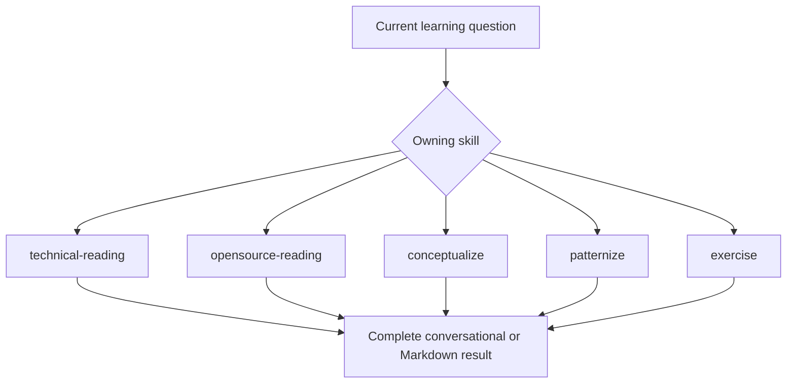
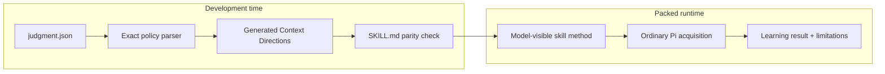
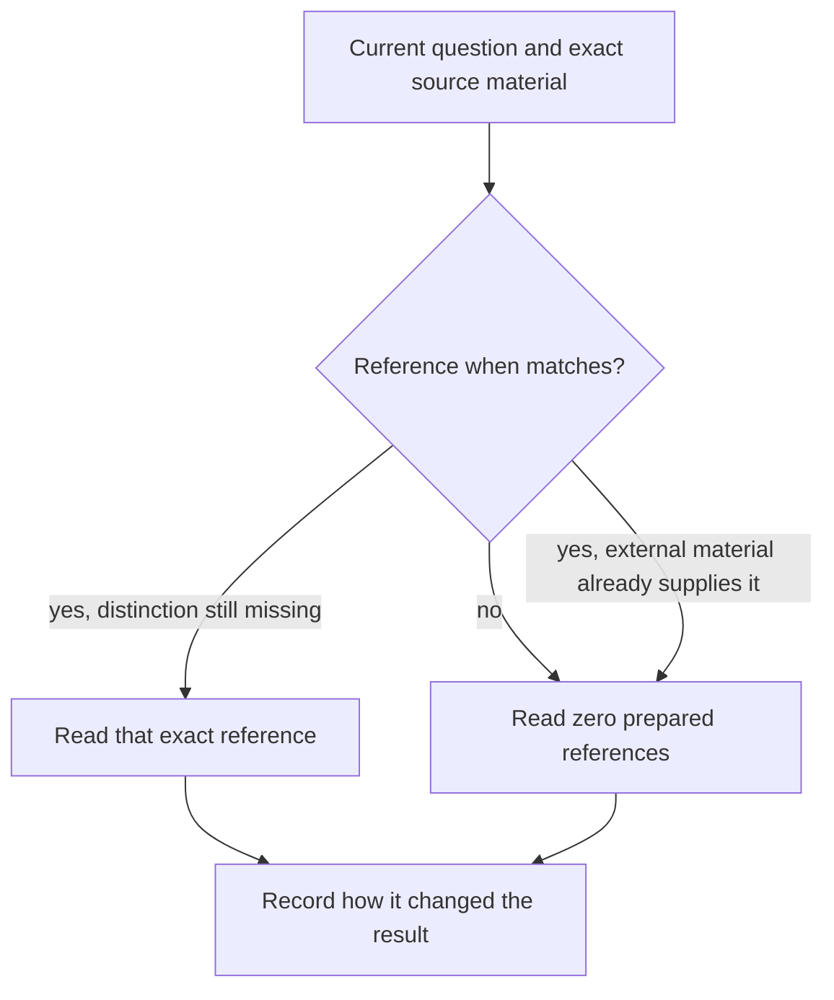

# Learning Runtime Flow

Learning exposes five independently complete skills. The map separates package
authoring from the model-visible runtime; it must not be read as a required
learning phase sequence.

## Independent capability selection

A handoff occurs only when another skill's core question becomes consequential.
No skill is a mandatory predecessor or successor of another.

## Authoring versus runtime

Learning does not ship the Judgment extension, session lifecycle, or nested
Judgment skill. It uses Judgment only to compile deterministic directions during
development.

## Reference selection

Prepared references are candidates, not requirements or authority. External
source material remains open-world and may make local guidance redundant.

## Persistence boundary

Every skill returns a complete result in conversation. Files are written only
when the user explicitly asks for a target. Learning assumes no notebook, graph,
Git workflow, or sibling-package persistence owner.
