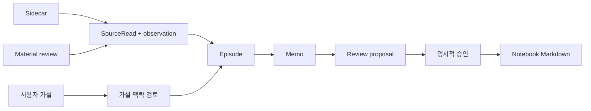
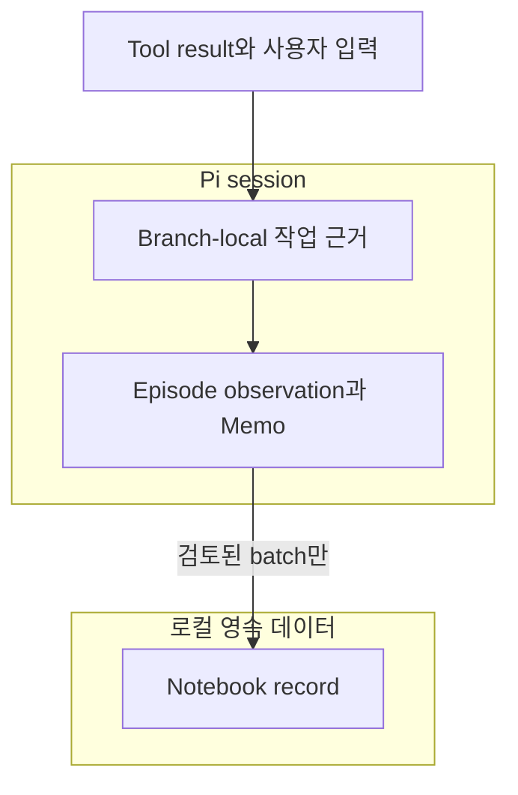
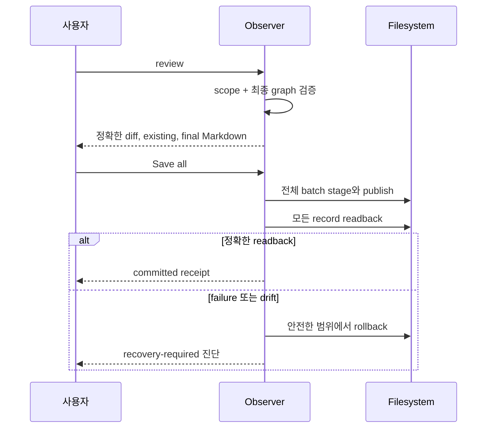

# @hobin/observer

[English](./README.md) | 한국어

여러 source material에 걸친 탐구를 따라가고 검토된 출처 연결 Markdown을 사용자가
고른 notebook에 발행하는 로컬 우선 Pi sidecar입니다.

Observer는 현재 Pi 세션에 작업 근거를 보관하고 Memo로 조정하도록 돕지만,
사용자가 정확한 Notebook batch를 검토하고 승인하기 전에는 영속적인 파일을 쓰지
않습니다.

## 설치

Pi 0.80.10–0.83.x와 Node.js 22.19 이상이 필요합니다.

```sh
pi install npm:@hobin/observer
```

한 번의 실행에서 시험하려면:

```sh
pi -e npm:@hobin/observer
```

## 먼저 해보기

워크벤치를 엽니다.

```text
/observer
```

**Settings**에서 Notebook 폴더를 고르고 Observer를 켠 뒤 Pi와 평소처럼
작업하세요. Observer는 현재 agent run의 의미 있는 source 결과를 지명하고,
standing inquiry에 연결하며, 작업 중인 해석을 현재 branch에 보존할 수 있습니다.

탐구가 준비되면:

```text
/observer memo
/observer review
```

Review는 검토 가능한 proposal을 준비하지만 파일을 쓰지 않습니다. **Proposal**을
열어 각 diff와 최종 Markdown을 살핀 뒤 **Save all**을 명시적으로 선택해야 검증된
전체 batch를 발행합니다.

## 탐구를 시작하는 세 가지 방법

| 진입 경로 | 사용 시점 | 명령 |
| --- | --- | --- |
| Sidecar | 다른 작업을 하는 동안 Observer가 의미 있는 근거를 포착하길 원할 때 | `/observer on` |
| 가설 추가 | 자신의 표현을 보존하고 그 관점에서 현재 맥락을 검토할 때 | `/observer add-hypothesis <text>` |
| 자료 관찰 | Sidecar mode를 바꾸지 않고 제공 또는 검색한 자료를 한정적으로 검토할 때 | `/observer material <request>` |

세 경로는 모두 같은 Episode, Memo, Review, Save 흐름에 합류합니다.



## Observer가 저장하는 것

Observer는 세 계층을 구분합니다.



| 계층 | 수명 | 목적 |
| --- | --- | --- |
| Candidate material | 현재 agent run 또는 정확한 material-review window | 아직 observation이 아닌 후보 근거 |
| Episode state | 현재 Pi branch | SourceRead, observation, hypothesis, Memo 작업, proposal state |
| Notebook Markdown | 로컬 파일시스템 | 영속적인 Source, Inquiry, Memo, Zettel record |

Pi session event가 작업을 조정하고 Notebook이 영속적인 source of truth가 됩니다.

## 워크벤치

`/observer`는 읽기 전용 keyboard-first view를 엽니다.

```text
Overview → Activity → Inquiries → Memos → Proposal → Notebook → Settings
```

화살표 또는 `j/k`로 이동하고, Enter로 열고, Escape로 돌아가며, Tab으로 focus를
옮깁니다. Page Up/Page Down 또는 Home/End로 스크롤하고, `y`로 선택한 semantic
record를 복사하며, `?`로 도움말을 봅니다. 열기, 스크롤, 복사는 파일을 쓰거나
Observer event를 추가하지 않습니다.

## 처리 모드

| 모드 | 동작 |
| --- | --- |
| `piggyback` | 기본값. 기존 foreground Pi turn을 사용하며 별도의 inference request를 추가하지 않음 |
| `local` | 명시적으로 선택한 loopback model에서 concurrency 1로 실행 |
| `off` | 로컬 staging은 유지하지만 모델 기반 해석은 수행하지 않음 |

Piggyback은 기존 turn에 context token을 더할 수 있습니다. “별도 request 없음”이
token 비용 0을 뜻하지 않습니다. Local mode는 loopback endpoint만 허용하며
영속 daemon이 아닙니다.

## 핵심 명령

| 명령 | 효과 |
| --- | --- |
| `/observer` | 워크벤치 열기 |
| `/observer setup <ko\|en> <path>` | Notebook 초기화 또는 선택 |
| `/observer on` / `/observer off` | 열린 Episode를 버리지 않고 Sidecar observation 전환 |
| `/observer add-hypothesis <text>` | 사용자 가설 보존 및 초기 맥락 검토 요청 |
| `/observer material <request>` | 한정된 material review 시작 |
| `/observer material retry` / `cancel` | 정확한 pending material request 재개 또는 취소 |
| `/observer memo` | Notebook 파일을 쓰지 않고 현재 working material 조정 |
| `/observer review` | 검증되고 검토 가능한 발행 proposal 준비 |
| `/observer save` | 명시적 승인 전에 이미 준비된 proposal 검사 |
| `/observer status` | Notebook, mode, Episode, processing, recovery 상태 표시 |

`ko`와 `en`은 새로 쓰는 record의 언어를 선택하며 워크벤치 UI 언어는 바꾸지
않습니다. 상대 Notebook 경로는 Pi working directory에서, `~/...`는 home
directory에서 해석합니다. Observer는 Notebook 경로를 대신 선택하지 않습니다.

## 안전한 발행 경계



기본 승인은 없고 일부 batch만 저장할 수도 없습니다. 현재 target drift, 잘못된
Markdown, graph error, stale proposal identity, readback 실패는 settlement를
중단합니다.

## 경계

Observer는 로컬 Source, Inquiry, Memo, Zettel 발행을 소유합니다. Git, GitHub,
원격 동기화, 백업, vector database, model truth, crash-proof durability,
multi-process coordination은 소유하지 않습니다. Zettel은 적어도 하나의 직접
Source reference를 유지해야 합니다.

Pi 패키지는 Pi 프로세스 권한으로 실행됩니다. 설치 전에 소스를 검토하고 신뢰하지
않는 material에는 운영체제 샌드박스를 사용하세요.

## 문서

| 문서 | 대상 |
| --- | --- |
| [사용자 가이드](./docs/ko/user-guide.md) | Notebook 설정, 워크플로, 명령, 워크벤치, 복구 |
| [아키텍처](./docs/ko/architecture.md) | Episode state, session/durable 경계, component 소유권 |
| [근거와 처리](./docs/ko/evidence-and-processing.md) | nomination, SourceRead, typed context, Piggyback, atomic commit |
| [Notebook 발행](./docs/ko/notebook-publication.md) | record graph, Review/Save transaction, readback, rollback, 한계 |

## 개발

```sh
pnpm --filter @hobin/observer check
pnpm --filter @hobin/observer eval
pi -e ./packages/observer
```

Maintainer는 발행을 결정하기 전 clean worktree에서
`pnpm --filter @hobin/observer release:check`를 사용합니다.

## 라이선스

[MIT](./LICENSE)
