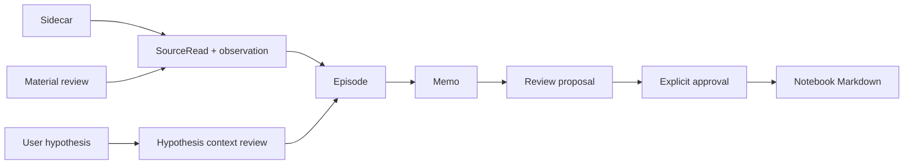
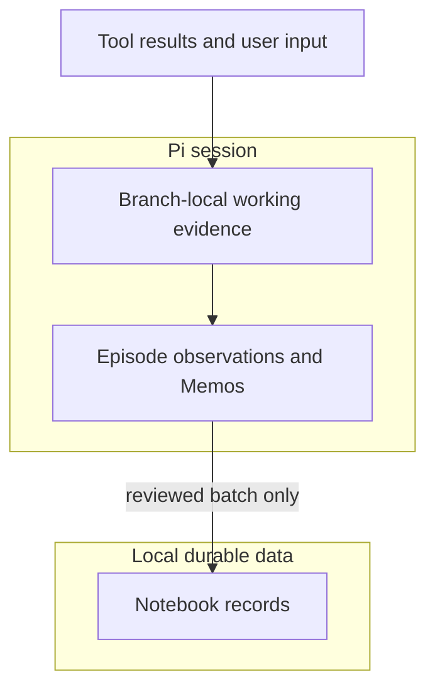
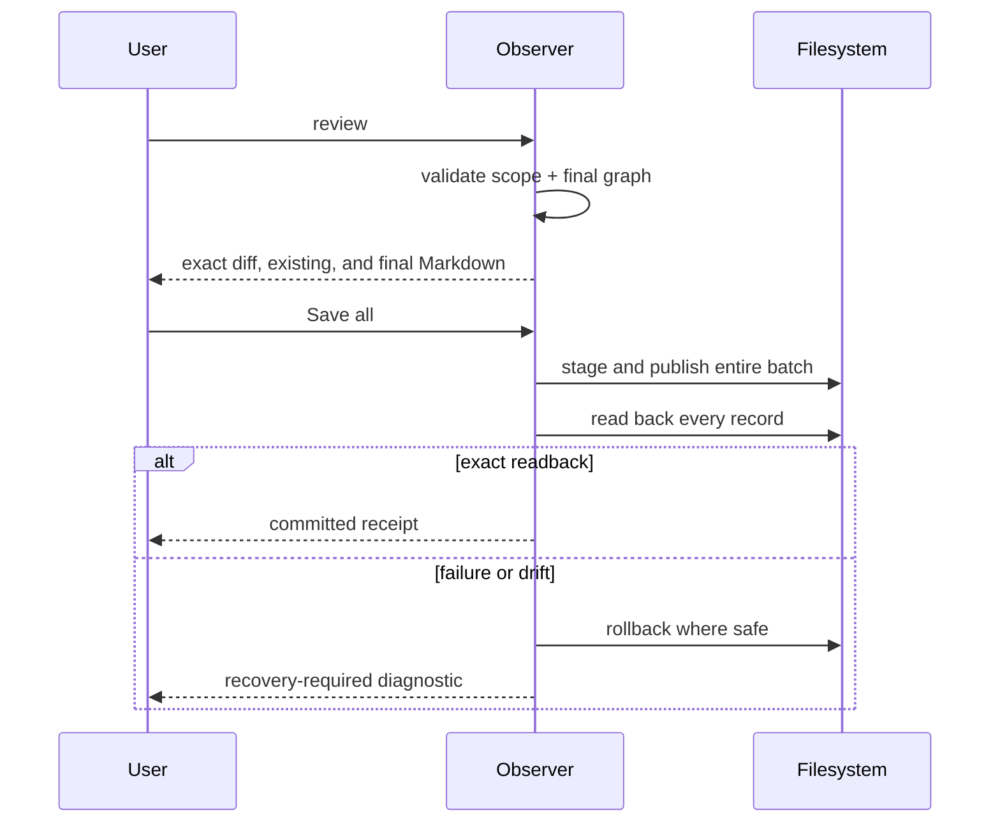

# @hobin/observer

A local-first Pi sidecar for following an inquiry across source material and
publishing reviewed, source-linked Markdown to a notebook you choose.

Observer keeps working evidence in the current Pi session, helps reconcile it
into Memos, and writes nothing durable until you inspect and approve the exact
Notebook batch.

## Install

Requires Pi 0.80.10–0.83.x and Node.js 22.19 or newer.

```sh
pi install npm:@hobin/observer
```

Try it for one run:

```sh
pi -e npm:@hobin/observer
```

## Try this first

Open the workbench:

```text
/observer
```

In **Settings**, choose a Notebook folder and turn Observer on. Then continue
working with Pi normally. Observer can nominate meaningful source results from
the current agent run, connect them to a standing inquiry, and keep the working
interpretation on the current branch.

When the inquiry is ready:

```text
/observer memo
/observer review
```

Review prepares an inspectable proposal. It does not write files. Open
**Proposal**, inspect each diff and final Markdown, then explicitly choose
**Save all** to publish the whole validated batch.

## Three ways to start inquiry work

| Entry path | Use it when… | Command |
| --- | --- | --- |
| Sidecar | You want Observer to notice meaningful evidence while you do other work | `/observer on` |
| Add a hypothesis | You want to preserve your wording and review current context through that lens | `/observer add-hypothesis <text>` |
| Observe material | You want one bounded review of supplied or retrieved material without changing Sidecar mode | `/observer material <request>` |

All three paths join the same Episode, Memo, Review, and Save flow.



## What Observer stores

Observer separates three layers:



| Layer | Lifetime | Purpose |
| --- | --- | --- |
| Candidate material | Current agent run or exact material-review window | Eligible evidence, not yet an observation |
| Episode state | Current Pi branch | SourceReads, observations, hypotheses, Memo work, and proposal state |
| Notebook Markdown | Local filesystem | Durable Source, Inquiry, Memo, and Zettel records |

Pi session events coordinate work; the Notebook is the durable source of truth.

## Workbench

`/observer` opens a read-only, keyboard-first view:

```text
Overview → Activity → Inquiries → Memos → Proposal → Notebook → Settings
```

Use arrows or `j/k` to move, Enter to inspect, Escape to go back, Tab to change
focus, Page Up/Page Down or Home/End to scroll, `y` to copy the focused semantic
record, and `?` for help. Opening, scrolling, and copying do not write files or
append Observer events.

## Processing modes

| Mode | Behavior |
| --- | --- |
| `piggyback` | Default. Uses an existing foreground Pi turn and adds no separate inference request |
| `local` | Runs at concurrency one on an explicitly selected loopback model |
| `off` | Keeps local staging but performs no model-backed interpretation |

Piggyback can add context tokens to an existing turn; “no separate request” does
not mean zero token cost. Local mode accepts only loopback endpoints and is not a
durable daemon.

## Essential commands

| Command | Effect |
| --- | --- |
| `/observer` | Open the workbench |
| `/observer setup <ko\|en> <path>` | Initialize or select a Notebook |
| `/observer on` / `/observer off` | Toggle Sidecar observation without discarding an open Episode |
| `/observer add-hypothesis <text>` | Preserve a user hypothesis and request an initial context review |
| `/observer material <request>` | Start a bounded material review |
| `/observer material retry` / `cancel` | Resume or cancel the exact pending material request |
| `/observer memo` | Reconcile current working material without writing Notebook files |
| `/observer review` | Prepare a validated, inspectable publication proposal |
| `/observer save` | Inspect an already prepared proposal before explicit approval |
| `/observer status` | Show Notebook, mode, Episode, processing, and recovery state |

`ko` and `en` select the language of newly written records, not the workbench UI.
Relative Notebook paths resolve from Pi's working directory; `~/...` resolves
from your home directory. Observer never chooses a Notebook path for you.

## Safe publication boundary



There is no default approval and no partial-batch save. Current target drift,
invalid Markdown, graph errors, stale proposal identity, or failed readback stop
settlement.

## Boundaries

Observer owns local Source, Inquiry, Memo, and Zettel publication. It does not
own Git, GitHub, remote sync, backup, vector databases, model truth, crash-proof
durability, or multi-process coordination. A Zettel must retain at least one
direct Source reference.

Pi packages execute with Pi's process permissions. Review source before
installation and use an operating-system sandbox for untrusted material.

## Documentation

| Document | For |
| --- | --- |
| [User guide](./docs/user-guide.md) | Notebook setup, workflows, commands, workbench, and recovery |
| [Architecture](./docs/architecture.md) | Episode state, session/durable boundaries, and component ownership |
| [Evidence and processing](./docs/evidence-and-processing.md) | Nomination, SourceReads, typed context, Piggyback, and atomic commit |
| [Notebook publication](./docs/notebook-publication.md) | Record graph, Review/Save transaction, readback, rollback, and limits |

## Development

```sh
pnpm --filter @hobin/observer check
pnpm --filter @hobin/observer eval
pi -e ./packages/observer
```

Maintainers use `pnpm --filter @hobin/observer release:check` from a clean
worktree before any publication decision.

## License

[MIT](./LICENSE)
