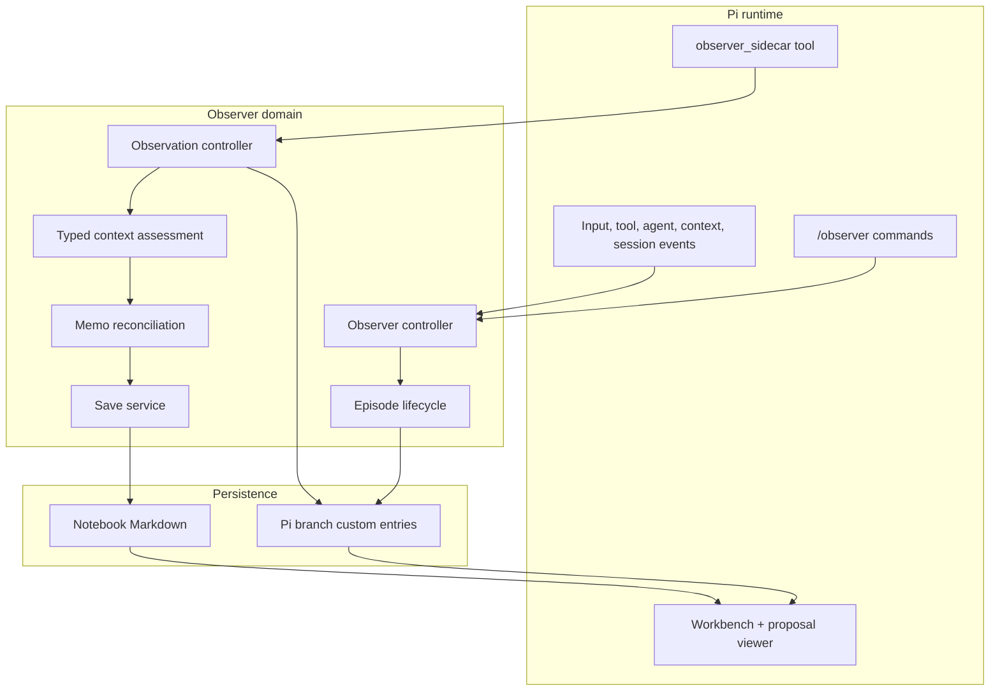
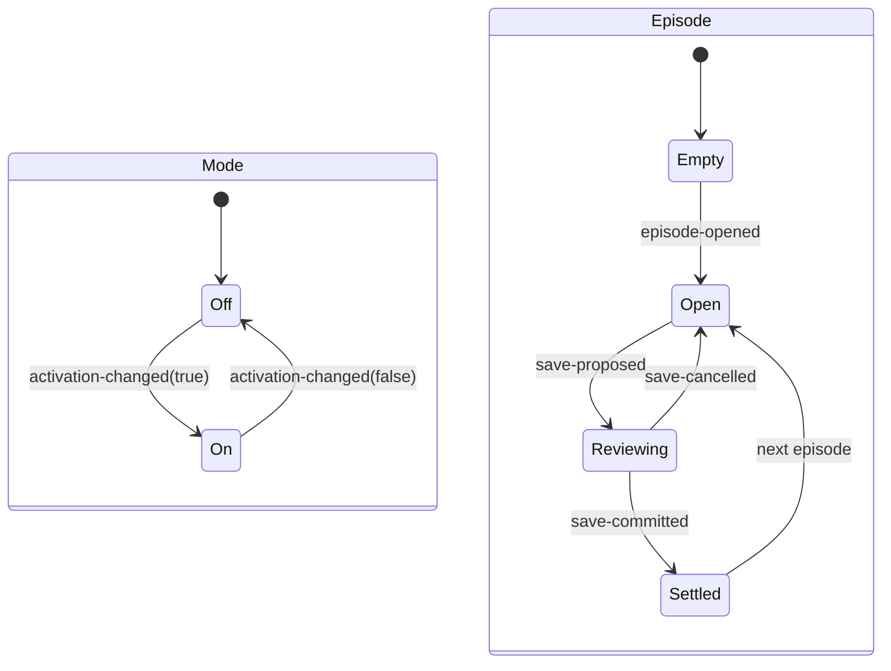
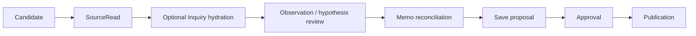
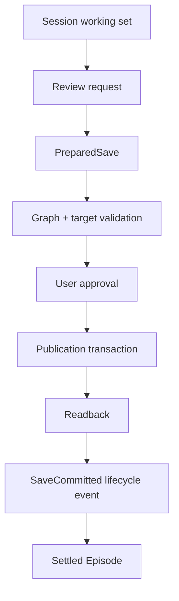

# Observer architecture

English | [한국어](./ko/architecture.md)

**Audience:** maintainers and reviewers.

Observer has two different forms of state:

1. branch-local Pi session state for active inquiry work; and
2. user-approved Notebook Markdown for durable records.

The publication boundary between them is explicit and transactional.

## Layer map



The extension is an adapter. Domain parsers/controllers do not render TUI and the
Notebook publisher does not interpret model output.

## Mode and Episode are orthogonal



Turning Mode Off does not discard an Open Episode. Material review and explicit
hypothesis workflows can operate while Mode is Off.

## Inquiry pipeline



Each transition uses exact IDs and current-branch replay. Candidate capture alone
is not a SourceRead; a SourceRead alone is not a semantic observation; an
observation alone is not durable publication.

## Session protocols

Observer separates several typed streams rather than one permissive event shape:

| Stream | Purpose |
| --- | --- |
| Lifecycle events | Episode, activation, language, selection, Memo receipt, proposal, cancellation, commit |
| Observation events | Candidates, SourceReads, hydration, semantic observations, user hypotheses, material review |
| Memo session | Prepared and applied reconciliation instructions |
| Save session | Review request, prepared handoff, approval, commit acknowledgment |
| Processing policy | Piggyback/local/off and selected local model |

Each decoder uses exact variants and rejects unknown fields. Replay applies only
entries on the supplied Pi branch ancestry.

## Durable boundary



`SaveCommitted` is appended only after exact filesystem readback succeeds. A
prepared proposal is not durable Notebook state.

## Context and assurance boundary

Observer uses Judgment primitives inside typed domain assessments; it does not
expose a generic Judgment workflow.

```text
SourceReading + optional InquiryContext
→ observation context assessment
→ observer-context-basis/v1

working hypotheses/Memos + explicit related records
→ Memo context assessment
→ observer-context-basis/v1
```

Named evaluators establish source/inquiry/memo identity relations only. Semantic
stance, movement, supporting clues, and interpretation remain agent-asserted.
An explicit user event preserves user-owned hypothesis wording.

## Component map

| Area | Main files | Responsibility |
| --- | --- | --- |
| Pi adapter | `extensions/observer.ts` | Commands, events, sidecar tool, prompt/context integration |
| Workbench | `extensions/observer-workbench-tui.ts`, `src/observer-workbench.ts` | Read-only inquiry projection |
| Proposal UI | `extensions/save-proposal-tui.ts` | Diff/final/existing inspection and explicit approval |
| Lifecycle | `src/lifecycle.ts`, `src/lifecycle-machine.ts` | Episode/Mode events, pure transition, XState projection |
| Observation | `src/observation-*.ts`, `src/observation-controller.ts` | Candidate/read/hydrate/observe/request protocols |
| Context | `src/observer-context.ts` | Exact basis, typed evaluator relations, coverage |
| Memo | `src/memo-*.ts` | Scope, reconciliation, instructions, session replay |
| Notebook | `src/notebook*.ts`, `src/markdown-profile.ts` | Selection, Markdown decoding, inventory, graph validation |
| Save | `src/save-*.ts`, `src/notebook-publication-*.ts` | Preflight, approval, transaction, readback, rollback |
| Processing | `src/observer-processing-policy.ts`, `src/observer-background-queue.ts` | Piggyback/local/off and bounded scheduling |

## Atomic commit boundaries

There are three important all-or-nothing boundaries:

1. **Observer commit:** staged source reads, observations, Memo work, and optional
   proposal work are parsed and branch-revalidated before serialized append.
2. **Memo apply:** one prepared reconciliation pass applies as a complete domain
   transition or not at all.
3. **Notebook publish:** all approved records stage, publish, read back, and
   settle together; partial batch success is not exposed as committed state.

These boundaries are separate because they protect different state owners.

## Non-goals

Observer does not provide:

- Git, GitHub, synchronization, backup, or sharing;
- a vector database or general knowledge graph service;
- a persistent background daemon or cross-process lock service;
- model truth, automated publication approval, or source trust;
- crash/power-loss guarantees beyond its explicit atomic-file and rollback
  boundaries; or
- concurrent multi-instance Notebook coordination.
