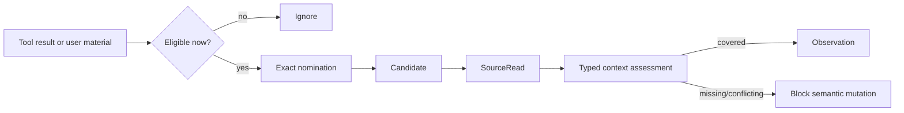
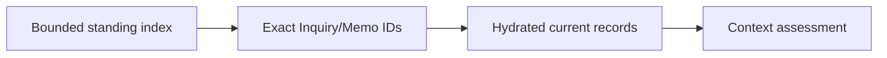
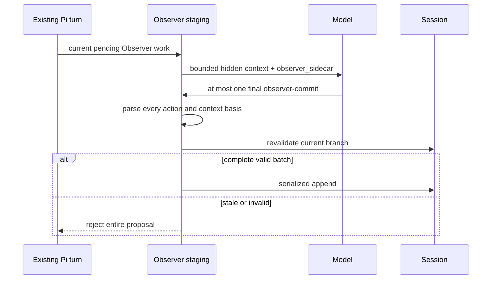

# Evidence and processing

**Audience:** users who need to understand what Observer captures and maintainers
changing nomination, interpretation, or processing behavior.

Observer never treats every Pi tool result as durable evidence. It uses an
explicit pipeline from eligibility to exact source reading to semantic record.

## Evidence pipeline



A tool call's presence in the session is not a nomination. The model must provide
the exact current-run call ID and a material reason such as evidence,
counterexample, boundary, or Inquiry/Memo relevance.

## Candidate windows

| Path | Eligible window |
| --- | --- |
| Sidecar On | Meaning-bearing results from the current agent run |
| Inline material review | Exact user message supplied for that request |
| Retrieved material review | Successful tool results from the run that starts or retries that request |
| Add hypothesis | Exact user hypothesis input and the subsequent bounded context review |

When an agent run settles or unrelated user input begins, unselected candidates
expire. A suspended material request keeps its identity but not an open-ended
capture window.

## What is normally ignored

Routine navigation, directory listings, write acknowledgments, repeated content,
diagnostic boilerplate, and self-generated Observer tool results do not become
candidates by default. This keeps “the tool ran” separate from “this exact output
changed the inquiry.”

Oversized nominated content is split into ordered bounded segments. Segmenting
preserves all selected text and order; it does not silently drop a middle chunk.
Repeated nomination of the same call and content resumes existing candidates
rather than duplicating them.

## SourceRead

A `SourceReading` binds:

```text
source identity and kind
+ exact content/claim locators
+ retrieval or observation provenance
+ faithful summary
+ branch and Episode identity
```

External material and direct observation stay distinct. A user's instruction to
retrieve a URL is not the URL's source content.

## Inquiry hydration

Observer does not load every saved Inquiry or Memo into every observation. The
model may nominate exact standing record IDs after seeing a bounded index.
Hydration then returns only those selected records and binds their current
content identity.



Missing, stale, unrelated, or copied-across-branch hydration fails closed.

## Typed context basis

Observation context asks whether the proposed semantic action has the source and
Inquiry relations it claims:

```text
SourceReading
+ optional hydrated InquiryContext
+ relatedInquiryIds
→ typed evaluator relations
→ selected context + coverage
→ observer-context-basis/v1
```

Memo context similarly binds current working sources, observations, hypotheses,
Memos, explicitly related durable records, and proposed outcomes.

| Relation | Maximum assurance |
| --- | --- |
| Exact source/inquiry/memo identity established by named evaluator | `domain-verified` for that relation |
| Semantic stance, movement, interpretation, summary | `agent-asserted` |
| Original user hypothesis or explicit user policy choice | Exact user-event provenance |

A named evaluator does not make the semantic interpretation domain-verified.

## Semantic records

An observation records a bounded relation to one or more standing inquiries:

| Stance | Meaning |
| --- | --- |
| `supports` | Current source supports the inquiry within its stated boundary |
| `challenges` | It supplies contradictory evidence or a counterexample |
| `refines` | It narrows or changes the inquiry without overturning it |
| `boundary` | It changes where the inquiry applies |
| `uncertain` | The association is plausible but unresolved |

Movement records how consequential the observation is for the inquiry, but it
remains an agent interpretation. Minor observations stay quiet; major movements
may produce a visible alert.

A new Observer hypothesis is distinct from an observation about an existing
Inquiry. User hypotheses preserve original wording and origin even when later
revised.

## Piggyback processing



Piggyback creates no separate model request. It may increase the existing turn's
context. The final tool call terminates without a follow-up model turn.

One commit may contain nominations, SourceReads, hydration, observations,
hypothesis reviews, and one scoped Memo or proposal-preparation result. The
staged batch is accepted only after all parts parse and the branch still matches.

## Local processing

Local mode uses one explicitly selected Pi model whose endpoint is loopback:

```text
localhost | 127.0.0.0/8 | ::1
```

The queue:

- runs at concurrency one;
- deduplicates job identities;
- yields to foreground input;
- aborts and requeues active work when foreground processing begins;
- defers provider failures instead of retrying repeatedly in one run; and
- loses in-memory queued work when the process exits.

Cost metadata is never evidence that an endpoint is local.

## Processing Off

Off keeps local candidate and request coordination but performs no model-backed
interpretation. It does not clear the open Episode or silently settle requests.

## Failure and recovery

| Failure | Result |
| --- | --- |
| Missing nomination call/result | No candidate |
| Result from prior run or sibling branch | Reject |
| Mixed material-review and Sidecar ancestry | Reject |
| Missing SourceRead or observation coverage | Request remains pending |
| Stale context basis | Reject semantic append |
| Conflicting duplicate prepared action | Reject replay/application |
| Provider failure in local mode | Defer once; no same-run retry loop |
| Agent run ends mid material review | Suspend exact request; expose retry/cancel |
| New Memo needed before Review proposal | Save preparation waits for a later ordinary turn when required |

## Interpretation boundary

A successful Observer receipt proves that one exact proposal crossed the typed
and branch checks and was recorded. It does not prove that the model's summary,
stance, hypothesis, or pattern is true. Users should preserve uncertainty and
counterevidence in the records themselves.
