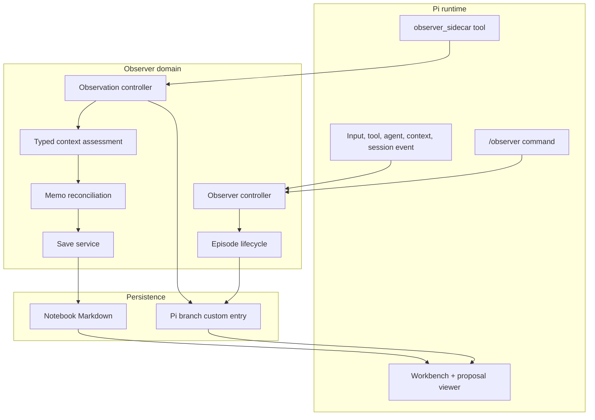
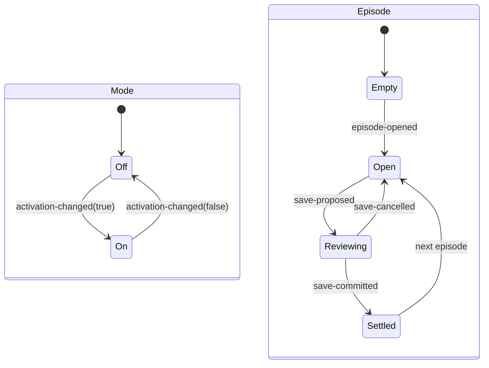
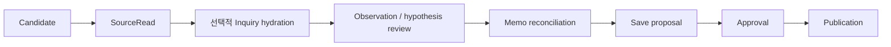
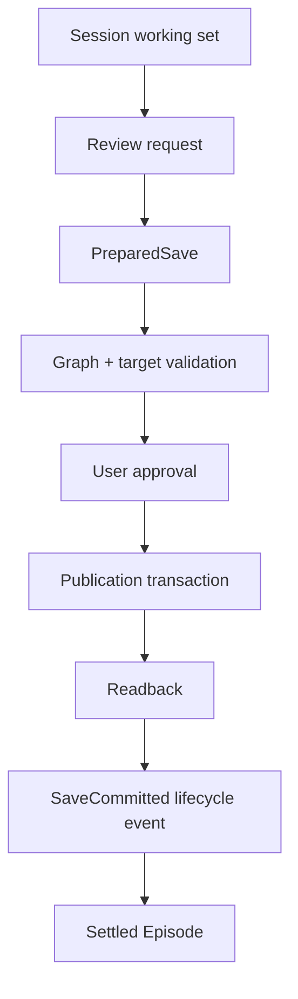

# Observer 아키텍처

[English](../architecture.md) | 한국어

**대상:** maintainer와 reviewer

Observer에는 서로 다른 두 형태의 state가 있습니다.

1. 활성 inquiry work를 위한 branch-local Pi session state
2. Durable record를 위한 user-approved Notebook Markdown

두 state 사이의 publication boundary는 명시적이며 transactional합니다.

## Layer 지도



Extension은 adapter입니다. Domain parser/controller는 TUI를 render하지 않고,
Notebook publisher는 model output을 interpret하지 않습니다.

## Mode와 Episode는 직교



Mode를 Off로 바꿔도 Open Episode를 버리지 않습니다. Material review와 explicit
hypothesis workflow는 Mode가 Off여도 동작할 수 있습니다.

## Inquiry pipeline



각 transition은 exact ID와 current-branch replay를 사용합니다. Candidate capture만으로
SourceRead가 되지 않고, SourceRead만으로 semantic observation이 되지 않으며,
observation만으로 durable publication이 되지 않습니다.

## Session protocol

Observer는 하나의 permissive event shape 대신 여러 typed stream을 분리합니다.

| Stream | 목적 |
| --- | --- |
| Lifecycle event | Episode, activation, language, selection, Memo receipt, proposal, cancellation, commit |
| Observation event | Candidate, SourceRead, hydration, semantic observation, user hypothesis, material review |
| Memo session | Prepared/applied reconciliation instruction |
| Save session | Review request, prepared handoff, approval, commit acknowledgment |
| Processing policy | Piggyback/local/off와 selected local model |

각 decoder는 exact variant를 사용하고 unknown field를 거부합니다. Replay는 제공된 Pi
branch ancestry의 entry에만 적용합니다.

## Durable boundary



`SaveCommitted`는 정확한 filesystem readback이 성공한 뒤에만 append합니다.
Prepared proposal은 durable Notebook state가 아닙니다.

## Context와 assurance 경계

Observer는 typed domain assessment 안에서 Judgment primitive를 사용하며 generic
Judgment workflow를 노출하지 않습니다.

```text
SourceReading + optional InquiryContext
→ observation context assessment
→ observer-context-basis/v1

working hypotheses/Memos + explicit related records
→ Memo context assessment
→ observer-context-basis/v1
```

Named evaluator는 source/inquiry/memo identity relation만 확립합니다. Semantic
stance, movement, supporting clue, interpretation은 계속 agent-asserted입니다. Explicit
user event는 user-owned hypothesis wording을 보존합니다.

## Component 지도

| 영역 | 주요 파일 | 책임 |
| --- | --- | --- |
| Pi adapter | `extensions/observer.ts` | Command, event, sidecar tool, prompt/context integration |
| Workbench | `extensions/observer-workbench-tui.ts`, `src/observer-workbench.ts` | Read-only inquiry projection |
| Proposal UI | `extensions/save-proposal-tui.ts` | Diff/final/existing inspection과 explicit approval |
| Lifecycle | `src/lifecycle.ts`, `src/lifecycle-machine.ts` | Episode/Mode event, pure transition, XState projection |
| Observation | `src/observation-*.ts`, `src/observation-controller.ts` | Candidate/read/hydrate/observe/request protocol |
| Context | `src/observer-context.ts` | Exact basis, typed evaluator relation, coverage |
| Memo | `src/memo-*.ts` | Scope, reconciliation, instruction, session replay |
| Notebook | `src/notebook*.ts`, `src/markdown-profile.ts` | Selection, Markdown decoding, inventory, graph validation |
| Save | `src/save-*.ts`, `src/notebook-publication-*.ts` | Preflight, approval, transaction, readback, rollback |
| Processing | `src/observer-processing-policy.ts`, `src/observer-background-queue.ts` | Piggyback/local/off와 bounded scheduling |

## Atomic commit boundary

세 가지 중요한 all-or-nothing boundary가 있습니다.

1. **Observer commit:** staged source read, observation, Memo work, optional proposal
   work를 parse하고 branch를 재검증한 뒤 serialized append합니다.
2. **Memo apply:** prepared reconciliation pass 하나를 complete domain transition으로
   적용하거나 전혀 적용하지 않습니다.
3. **Notebook publish:** 승인된 모든 record를 함께 stage, publish, read back,
   settle합니다. Partial batch success는 committed state로 노출하지 않습니다.

이 경계들은 서로 다른 state owner를 보호하므로 분리되어 있습니다.

## 하지 않는 일

Observer는 다음을 제공하지 않습니다.

- Git, GitHub, synchronization, backup, sharing
- Vector database 또는 general knowledge graph service
- Persistent background daemon 또는 cross-process lock service
- Model truth, automated publication approval, source trust
- 명시적인 atomic-file/rollback boundary를 넘어서는 crash/power-loss guarantee
- Concurrent multi-instance Notebook coordination
