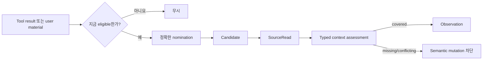
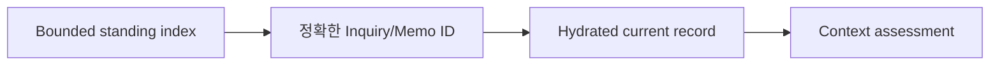
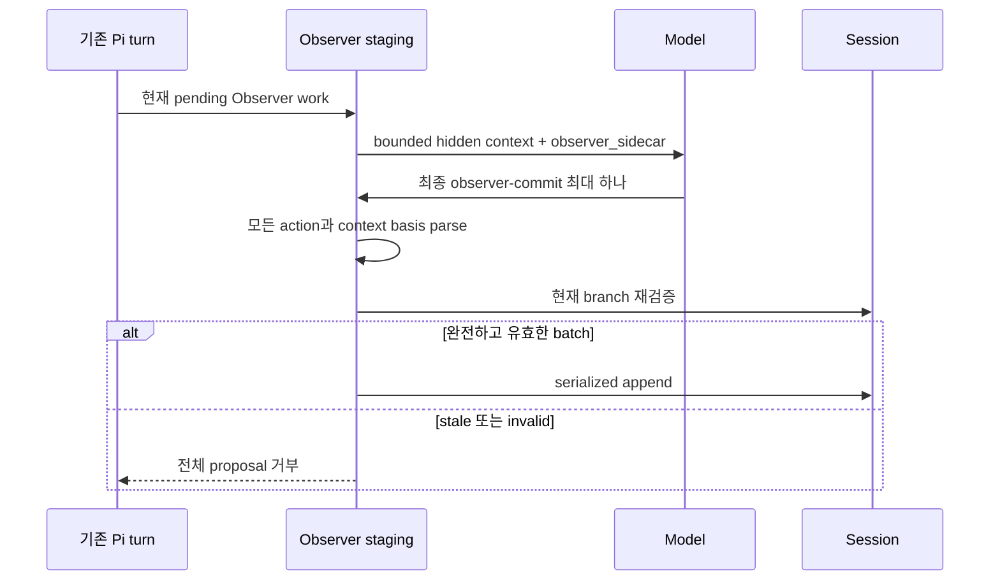

# 근거와 처리

[English](../evidence-and-processing.md) | 한국어

**대상:** Observer가 무엇을 capture하는지 알아야 하는 사용자와 nomination,
interpretation, processing behavior를 변경하는 maintainer

Observer는 모든 Pi tool result를 durable evidence로 취급하지 않습니다. Eligibility,
exact source reading, semantic record를 잇는 명시적 pipeline을 사용합니다.

## Evidence pipeline



Session에 tool call이 존재하는 것은 nomination이 아닙니다. Model은 정확한
current-run call ID와 evidence, counterexample, boundary, Inquiry/Memo relevance
같은 material reason을 제공해야 합니다.

## Candidate window

| 경로 | Eligible window |
| --- | --- |
| Sidecar On | 현재 agent run의 meaning-bearing result |
| Inline material review | 해당 request에 제공된 exact user message |
| Retrieved material review | Request를 start 또는 retry한 run의 successful tool result |
| Add hypothesis | Exact user hypothesis input과 뒤따르는 bounded context review |

Agent run이 settle하거나 관련 없는 user input이 시작되면 unselected candidate는
expire합니다. Suspended material request는 identity를 유지하지만 open-ended capture
window는 유지하지 않습니다.

## 일반적으로 무시하는 것

Routine navigation, directory listing, write acknowledgment, repeated content,
diagnostic boilerplate, self-generated Observer tool result는 기본적으로 candidate가
되지 않습니다. 이렇게 “tool이 실행됨”과 “이 exact output이 inquiry를 바꿈”을
구분합니다.

Oversized nominated content는 순서를 보존하는 bounded segment로 나눕니다. Segment는
선택된 text와 order를 모두 보존하며 중간 chunk를 조용히 버리지 않습니다. 같은
call/content의 반복 nomination은 duplicate를 만들지 않고 기존 candidate를
resume합니다.

## SourceRead

`SourceReading`이 결속하는 것:

```text
source identity와 kind
+ exact content/claim locator
+ retrieval 또는 observation provenance
+ faithful summary
+ branch와 Episode identity
```

External material과 direct observation은 구별된 상태로 남습니다. URL을 가져오라는
사용자 instruction은 URL의 source content가 아닙니다.

## Inquiry hydration

Observer는 저장된 모든 Inquiry 또는 Memo를 모든 observation에 load하지 않습니다.
Model이 bounded index를 본 뒤 exact standing record ID를 지명할 수 있습니다.
Hydration은 selected record만 반환하고 current content identity를 결속합니다.



Missing, stale, unrelated, copied-across-branch hydration은 fail closed합니다.

## Typed context basis

Observation context는 제안된 semantic action이 주장하는 source/Inquiry relation을
실제로 가지는지 묻습니다.

```text
SourceReading
+ optional hydrated InquiryContext
+ relatedInquiryIds
→ typed evaluator relations
→ selected context + coverage
→ observer-context-basis/v1
```

Memo context도 current working source, observation, hypothesis, Memo, explicitly
related durable record, proposed outcome을 결속합니다.

| Relation | 최대 assurance |
| --- | --- |
| Named evaluator가 exact source/inquiry/memo identity를 확립 | 해당 relation에 `domain-verified` |
| Semantic stance, movement, interpretation, summary | `agent-asserted` |
| Original user hypothesis 또는 explicit user policy choice | Exact user-event provenance |

Named evaluator가 semantic interpretation을 domain-verified로 만들지는 않습니다.

## Semantic record

Observation은 하나 이상의 standing inquiry와 한정된 relation을 기록합니다.

| Stance | 의미 |
| --- | --- |
| `supports` | 현재 source가 명시된 boundary 안에서 inquiry를 지지 |
| `challenges` | 모순 근거 또는 counterexample 제공 |
| `refines` | Inquiry를 뒤집지 않고 좁히거나 변경 |
| `boundary` | Inquiry가 적용되는 범위 변경 |
| `uncertain` | 연관 가능성은 있지만 미해결 |

Movement는 observation이 inquiry에 얼마나 중요한지 기록하지만 계속 agent
interpretation입니다. Minor observation은 조용히 유지하고 major movement만 visible
alert를 만들 수 있습니다.

새 Observer hypothesis는 기존 Inquiry에 대한 observation과 다릅니다. User
hypothesis는 나중에 revise해도 original wording과 origin을 보존합니다.

## Piggyback processing



Piggyback은 별도 model request를 만들지 않지만 기존 turn의 context를 늘릴 수
있습니다. 최종 tool call은 follow-up model turn 없이 terminate합니다.

Commit 하나는 nomination, SourceRead, hydration, observation, hypothesis review,
scoped Memo 또는 proposal-preparation result 하나를 포함할 수 있습니다. 모든 부분이
parse되고 branch가 계속 일치할 때만 staged batch를 accept합니다.

## Local processing

Local mode는 endpoint가 loopback인 명시적으로 선택된 Pi model 하나를 사용합니다.

```text
localhost | 127.0.0.0/8 | ::1
```

Queue는 다음과 같이 동작합니다.

- Concurrency 1
- Job identity deduplicate
- Foreground input에 양보
- Foreground processing 시작 시 active work abort/requeue
- Provider failure를 한 run에서 반복 retry하지 않고 defer
- Process 종료 시 in-memory queued work 소실

Cost metadata는 endpoint가 local이라는 근거가 아닙니다.

## Processing Off

Off는 local candidate와 request coordination을 유지하지만 model-backed
interpretation을 수행하지 않습니다. Open Episode를 지우거나 request를 조용히
settle하지 않습니다.

## 실패와 복구

| 실패 | 결과 |
| --- | --- |
| Nomination call/result 누락 | Candidate 없음 |
| 이전 run 또는 sibling branch result | 거부 |
| Material-review와 Sidecar ancestry 혼합 | 거부 |
| SourceRead 또는 observation coverage 누락 | Request pending 유지 |
| Stale context basis | Semantic append 거부 |
| Conflicting duplicate prepared action | Replay/application 거부 |
| Local mode provider failure | 한 번 defer, same-run retry loop 없음 |
| Material review 중 agent run 종료 | Exact request suspend, retry/cancel 노출 |
| Review proposal 전에 새 Memo 필요 | 필요하면 이후 ordinary turn까지 Save preparation 대기 |

## 해석 경계

성공한 Observer receipt는 정확한 proposal 하나가 typed/branch check를 통과해
기록됐음을 입증합니다. Model의 summary, stance, hypothesis, pattern이 참임을 입증하지
않습니다. Record 자체에 uncertainty와 counterevidence를 보존해야 합니다.
