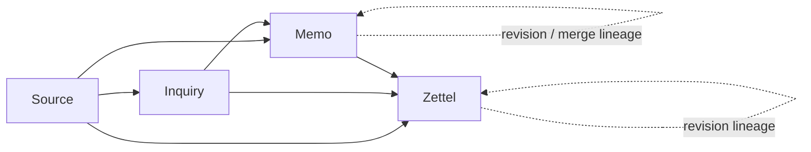
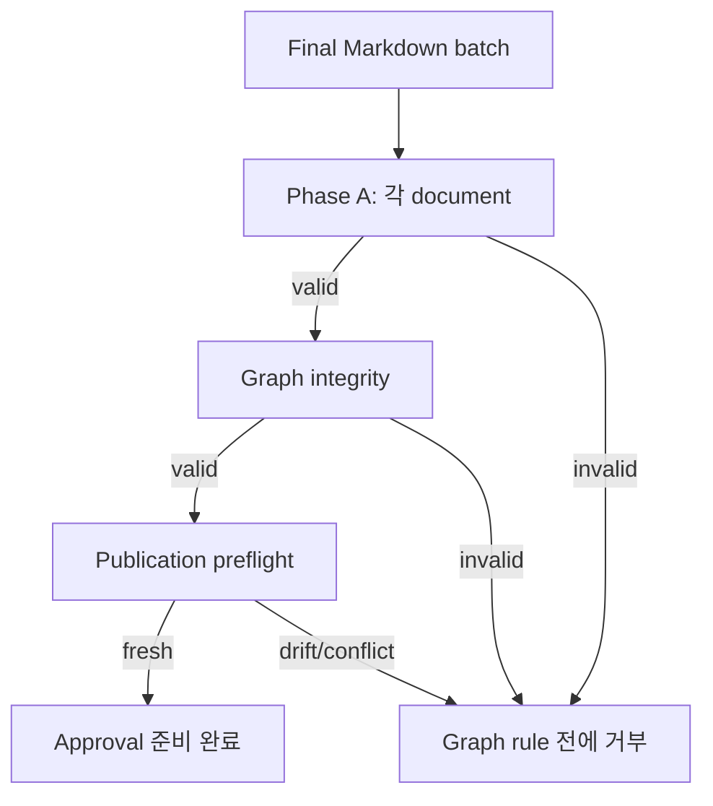
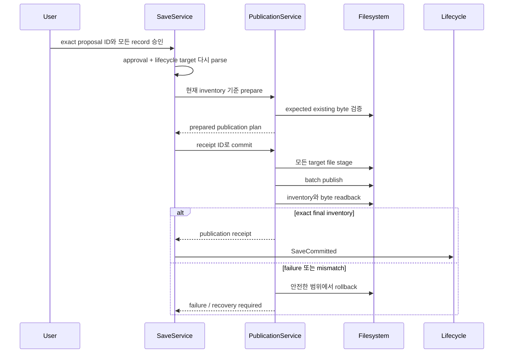

# Notebook 발행

[English](../notebook-publication.md) | 한국어

**대상:** durable record를 조사하는 사용자와 Markdown, graph, Review, Save behavior를
변경하는 maintainer

Observer Notebook Markdown은 durable source of truth입니다. Publication은
session-local inquiry work 이후 사용자가 명시적으로 승인하는 별도 transaction입니다.

## Record graph



화살표는 가능한 typed reference를 뜻하며 모든 record의 필수 edge는 아닙니다.
Zettel에는 더 강한 규칙이 하나 있습니다. 적어도 하나의 direct Source reference를
유지해야 합니다.

## Record type

| Type | 목적 | 중요한 identity |
| --- | --- | --- |
| Source | External material 또는 direct observation | Source kind, provenance, claim/condition, content identity |
| Inquiry | Standing question 또는 hypothesis | Original wording, current wording, origin, revision reason, evidence |
| Memo | 하나 이상의 Inquiry에 묶인 working synthesis | Inquiry relation, optional primary hypothesis, evidence, status |
| Zettel | Promoted durable note | Direct Source reference, semantic relation, lineage |

모든 record는 `observer-record/v1`을 사용합니다. 정확한 machine schema는
[`../../schemas/observer-record.v1.schema.json`](../../schemas/observer-record.v1.schema.json)에
있습니다.

## Markdown envelope

유효한 record의 구성:

```text
YAML frontmatter
→ 정확히 하나의 document H1
→ non-empty Markdown body
```

Observer는 인식하지 못하는 non-Observer frontmatter field를 보존하지만 자체
schema가 통제하는 structure의 unknown field는 거부합니다. Language tag는 BCP 47
value입니다. Record ID는 record type prefix와 일치해야 합니다.

## Validation phase



### Document validation

- Frontmatter가 존재하고 YAML로 parse됨
- Schema version과 record type 지원
- Record ID prefix와 timestamp 유효
- H1이 정확히 하나
- Body가 non-empty
- Type별 field와 status rule 충족

### Graph validation

- Record ID가 unique
- 모든 source, lineage, semantic, inquiry, evidence target이 존재
- Self-edge와 duplicate edge 없음
- Lineage target type 일치
- Memo가 inquiry scope에 연결
- Promotion status와 target type 일치
- 모든 Zettel에 direct Source reference 존재

Input order는 graph diagnostic을 바꾸지 않습니다.

## Review scope

Prepared proposal이 결속하는 값:

```text
Notebook canonical path + identity
+ Episode와 request identity
+ output language
+ exact create/update operation
+ expected existing content hash
+ exact final Markdown
+ proposal hash
```

Review는 현재 Notebook을 다시 열고 batch를 이미 적용한 것처럼 complete final
graph를 검증합니다. 파일은 쓰지 않습니다.

## Approval boundary



Approval은 정확한 전체 batch를 대상으로 합니다. 다른 proposal ID, record set,
Notebook, target state는 거부합니다.

## Transaction 동작

Publication transaction은 다음을 분리합니다.

1. **plan** — create/update operation과 expected byte 계산
2. **stage** — final record로 노출하지 않고 temporary file 작성
3. **publish** — planned order로 target 교체
4. **read back** — exact final content decode와 inventory
5. **settle** — readback 후에만 committed lifecycle event append
6. **rollback** — 안전한 settlement 이전 failure에서 known prior byte 복원

Rollback이 unknown actor가 바꾼 byte를 덮어쓸 수 있다면 Observer는 추측하지 않고
recovery-required state를 보고합니다.

## Target drift

| Drift | 동작 |
| --- | --- |
| Approval 전 기존 update target content 변경 | 거부하고 Review로 복귀 |
| Publication 전 새 record path 출현 | Collision 거부 |
| Notebook path 또는 manifest identity 변경 | Live target 거부 |
| Non-target Notebook record 변경으로 final graph invalid | Preflight 거부 |
| Readback이 planned final byte와 다름 | Settle하지 않고 rollback/recovery |
| Duplicate settled commit replay | Exact protocol이 허용할 때만 거부 또는 stutter |

## Atomicity 경계

Observer는 자체 process 관점에서 하나의 logical batch를 보장합니다. Distributed
transaction, filesystem snapshot, power-loss durability, concurrent Observer process
사이의 coordination은 주장하지 않습니다.

```text
no approval         → write 없음
partial failure     → 안전한 범위에서 known write rollback
unknown target drift→ 중지 후 recovery 요구
exact readback      → committed receipt 하나 + settled Episode
```

## Notebook 소유권

Observer가 소유하는 것:

- 하나의 명시적 local root 선택
- Record decoding과 graph validation
- Review proposal과 approval identity
- Atomic-file planning, publication, readback, rollback
- Verified publication 이후 settlement event

Observer가 소유하지 않는 것:

- Git history 또는 remote synchronization
- Backup 또는 disaster recovery
- Shared multi-writer coordination
- External Markdown editor locking
- Vector search 또는 graph database
- Model-authored record의 semantic truth

이 속성이 중요하다면 Notebook에 자체 backup 또는 version-control policy를
적용하세요.

## Maintainer 검증

Publication 변경 시 다음 test를 유지하세요.

- Create, update, mixed batch
- Approved empty batch
- Preparation 시점에 결속된 language
- Approval/proposal/target mismatch
- Dangling, duplicate, self, lineage, orphan, promotion graph error
- Stage, publish, readback fault injection
- 첫 publication 전 non-target drift
- Unknown byte로 차단된 rollback
- Active transaction overlap
- Republish 없는 post-save pre-ack recovery
