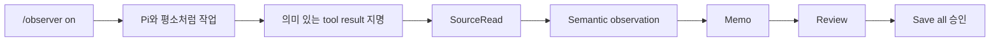
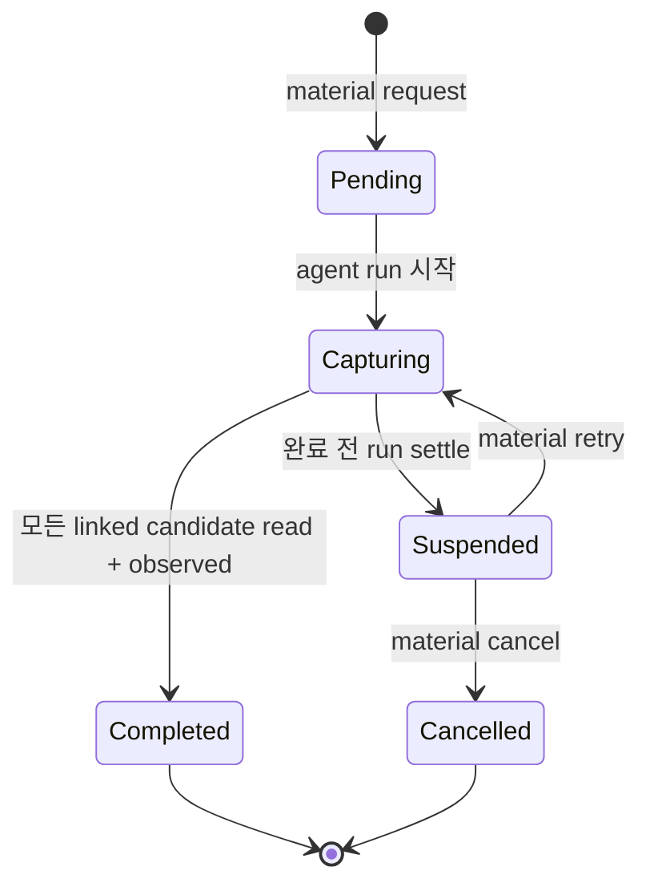

# Observer 사용자 가이드

[English](../user-guide.md) | 한국어

Observer는 여러 source material에 걸친 하나의 로컬 탐구를 따라가며 검토된
Notebook batch만 발행합니다.

## Notebook 설정

Workbench를 열고 **Settings**를 선택합니다.

```text
/observer
```

또는 명령을 사용합니다.

```text
/observer setup en ~/notes/observer
/observer setup ko ./notes/observer
```

경로 해석은 명시적입니다.

| 입력 | 해석 |
| --- | --- |
| `/absolute/path` | 입력 그대로 사용 |
| `./relative/path` 또는 `notes/observer` | Pi의 현재 working directory 기준 |
| `~` 또는 `~/notes` | 현재 사용자의 home directory 기준 |
| `~other-user/notes` | 추측하지 않고 거부 |

Observer는 새 폴더를 초기화하거나 기존 폴더를 채택하기 전에 resolve된 absolute
path를 보여줍니다. 채택한 폴더의 관련 없는 파일은 다시 쓰지 않습니다.

`en`과 `ko`는 새로 쓰는 Memo와 Zettel record의 언어를 고릅니다. Workbench UI는
바꾸지 않으며 기존 record는 자체 언어를 유지합니다.

## Workbench

```text
Overview
├── Notebook health, mode, Episode, processing, next action
Activity
├── SourceRead, observation, material review, hypothesis review
Inquiries
├── original/current hypothesis와 evidence
Memos
├── 완전한 working Memo content와 relation
Proposal
├── preparation status 또는 정확한 diff/existing/final Markdown
Notebook
├── durable record와 정확한 Markdown
Settings
└── Notebook, Sidecar mode, language, processing policy
```

| 키 | 동작 |
| --- | --- |
| `↑` / `↓`, `j` / `k` | 선택 이동 |
| Enter | 조사 또는 contextual action 실행 |
| Escape | 한 단계 돌아가기 |
| Tab | Section/content 사이 이동 |
| Page Up / Page Down | Viewport 스크롤 |
| Home / End | Viewport 안에서 이동 |
| `y` | 선택한 전체 semantic record 복사 |
| `?` | 맥락 도움말 |

Workbench는 명시적인 contextual action 외에는 읽기 전용입니다. Record를 열고,
스크롤하고, 복사해도 event를 추가하거나 Notebook 파일을 쓰지 않습니다.

## Sidecar workflow



일반 tool result는 후보 근거일 뿐입니다. 같은 agent run 동안 model이 정확한
tool-call ID와 이유를 지명해야 합니다. 일반적인 navigation, listing, write
acknowledgment, repeated read, diagnostic은 선택하지 않습니다.

열린 Episode를 버리지 않고 Sidecar observation을 끕니다.

```text
/observer off
```

Mode와 Episode는 별개입니다. Off는 model-backed continuous observation을 멈추지만
현재 inquiry work를 보존합니다.

## 가설 추가

```text
/observer add-hypothesis The order of capture changes interpretation bias.
Context: The last two examples diverged only after delayed note-taking.
```

선택적 context line은 Observer interpretation과 구별되는 user context로 남습니다.
Observer는 original wording을 보존하고 다음을 포함한 초기 review를 요청합니다.

- Supporting clue
- Challenging clue
- Missing information
- 가능한 경우 exact Source ID
- Interpretation boundary

Insufficient context도 유효한 결과이며 original hypothesis를 다시 쓰지 않습니다.

## Material 관찰

Sidecar mode가 On 또는 Off일 때 bounded material review를 사용합니다.

```text
/observer material <inline text, file path, URL, or retrieval request>
```

File 또는 URL은 Pi가 먼저 material을 가져옵니다. Command text 자체는 source
evidence가 아닙니다. Retrieved result는 material request를 시작하거나 retry한 정확한
agent run 동안에만 후보가 됩니다.



중단된 request 복구:

```text
/observer material retry
/observer material cancel
```

`retry`는 같은 request에 한 번 더 bounded capture window를 엽니다. `cancel`은
Sidecar mode를 바꾸거나 Episode를 닫지 않고 cancellation을 기록합니다. Request가
pending인 동안 Review는 사용할 수 없습니다.

## Memo 조정

```text
/observer memo
```

Memo reconciliation은 현재 SourceRead, observation, hypothesis, 기존 working Memo,
명시적으로 관련된 standing Notebook record를 비교합니다. Exact evidence ID를
유지하면서 Memo를 create, revise, merge, retain, mark할 수 있습니다. Notebook
Markdown은 쓰지 않습니다.

같은 exact basis의 반복 preparation은 stable합니다. Stale 또는 incomplete
coverage는 거부합니다.

## Review와 Save

```text
/observer review
```

Review는 pending Memo work를 먼저 닫고 publication proposal을 준비합니다. Proposal
view에 나타나는 내용:

- 모든 target path와 operation
- Update의 existing Markdown
- 정확한 final Markdown
- Line diff
- 결속된 Notebook, language, record scope
- Validation 또는 recovery diagnostic

Preparation은 아무것도 쓰지 않습니다.

Ready proposal에서 `s`를 누르거나 `/observer save`를 사용해 별도의 approval
viewer를 엽니다. 선택지는 다음과 같습니다.

- **Back** — 검증된 proposal 유지
- **Return to Review** — proposal만 버리고 working state 보존
- **Save all N records** — 전체 batch 승인

Default “Yes”와 partial-batch save는 없습니다.

## Processing policy

```text
/observer processing piggyback
/observer processing local
/observer processing off
```

| Policy | 동작 |
| --- | --- |
| Piggyback | 기존 foreground model turn 사용. Run당 최종 `observer-commit` 최대 하나 |
| Local | 사용 가능한 loopback Pi model 선택. In-memory queue, concurrency 1, foreground work에 양보 |
| Off | Local candidate/request state 유지, model-backed interpretation은 수행하지 않음 |

Model price metadata가 “free” 또는 “local”이라고 해도 non-loopback endpoint는 Local
mode에서 거부합니다. Queue는 daemon 또는 durable scheduler가 아닙니다.

## 상태와 복구

```text
/observer status
```

Status는 Notebook identity/health, Sidecar mode, Episode, pending material 또는
Memo/Save request, processing policy, proposal state, recovery action을 보고합니다.

일반 복구 case:

| 상태 | 동작 |
| --- | --- |
| Material request suspended | `material retry` 또는 `material cancel` |
| Proposal ready | Proposal 검토 후 approve 또는 Review로 복귀 |
| Target drift로 proposal invalidated | Review로 돌아가 다시 준비 |
| Episode 중 Notebook 이동/교체 | 정확한 Notebook identity를 복구하거나 다른 것을 선택하기 전에 work settle/cancel |
| Background processing paused | 일반 Pi work 재개 또는 processing policy 전환 |
| Malformed branch history | Diagnostic을 보존하고 semantic mutation을 강제하지 않음 |

## 명령

| 명령 | 효과 |
| --- | --- |
| `/observer` | Workbench |
| `/observer settings` | Settings 바로 열기 |
| `/observer setup` | 대화형 setup |
| `/observer setup <ko\|en> <path>` | 정확한 Notebook setup/selection |
| `/observer status` | 현재 state와 recovery |
| `/observer on` / `off` | Sidecar observation 전환 |
| `/observer add-hypothesis <text>` | User hypothesis 보존과 review |
| `/observer material <request>` | Bounded material review |
| `/observer material retry` / `cancel` | Pending material review 복구 |
| `/observer processing off\|piggyback\|local` | Interpretation policy 설정 |
| `/observer memo` | Working Memo 조정 |
| `/observer review` | Publication proposal 준비 |
| `/observer save` | Prepared proposal 검사와 명시적 승인 |

## 업데이트와 제거

```sh
pi update npm:@hobin/observer
pi remove npm:@hobin/observer
```

Project-local package declaration에는 `pi install -l npm:@hobin/observer`를
사용합니다.
