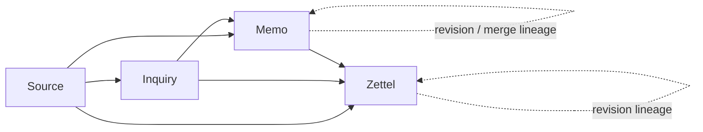
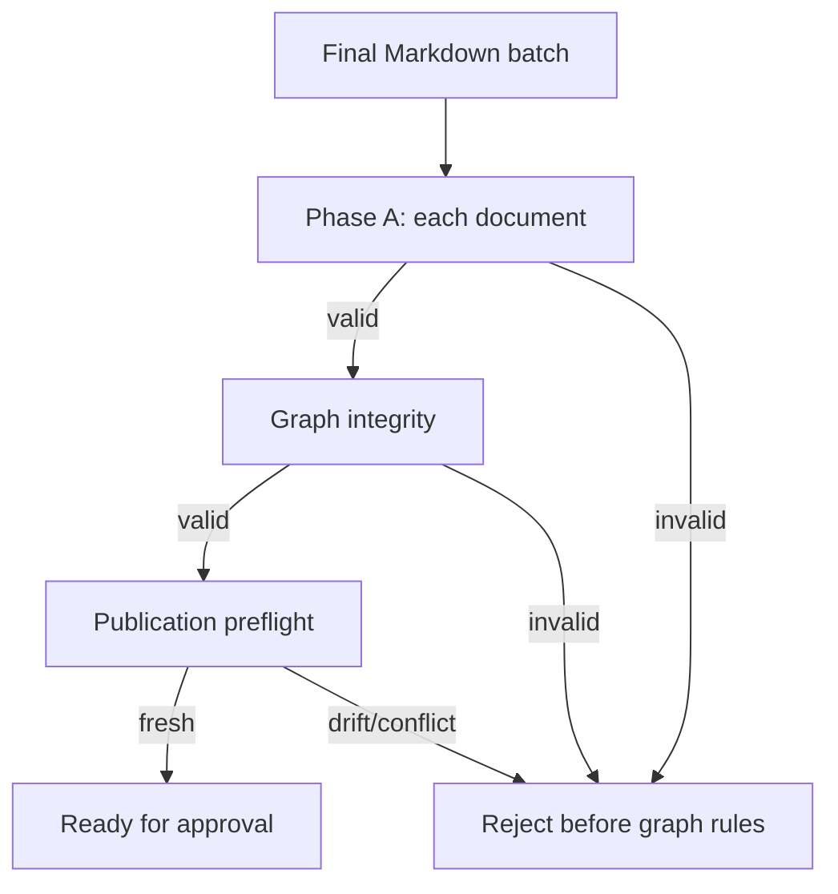
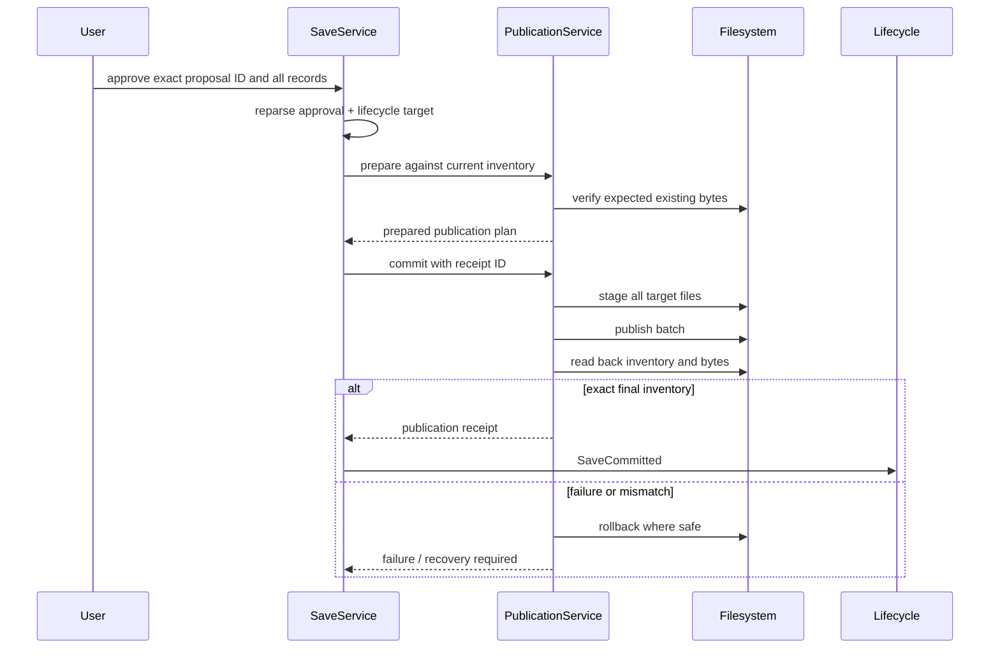

# Notebook publication

**Audience:** users inspecting durable records and maintainers changing Markdown,
graph, Review, or Save behavior.

Observer Notebook Markdown is the durable source of truth. Publication is a
separate, explicitly approved transaction after session-local inquiry work.

## Record graph



The arrows show possible typed references, not required edges for every record.
A Zettel has one stronger rule: it must retain at least one direct Source
reference.

## Record types

| Type | Purpose | Important identity |
| --- | --- | --- |
| Source | External material or direct observation | Source kind, provenance, claims/conditions, content identity |
| Inquiry | Standing question or hypothesis | Original wording, current wording, origin, revision reason, evidence |
| Memo | Working synthesis tied to one or more Inquiries | Inquiry relations, optional primary hypothesis, evidence, status |
| Zettel | Promoted durable note | Direct Source reference, semantic relations, lineage |

All records use `observer-record/v1`. The exact machine schema is
[`../schemas/observer-record.v1.schema.json`](../schemas/observer-record.v1.schema.json).

## Markdown envelope

A valid record contains:

```text
YAML frontmatter
→ exactly one document H1
→ non-empty Markdown body
```

Observer preserves unrecognized non-Observer frontmatter fields, but rejects
unknown fields inside its own schema-controlled structures. Language tags are
BCP 47 values. Record IDs must match their record type prefix.

## Validation phases



### Document validation

- frontmatter exists and parses as YAML;
- schema version and record type are supported;
- record ID prefix and timestamps are valid;
- exactly one H1 exists;
- body is non-empty;
- type-specific fields and status rules hold.

### Graph validation

- record IDs are unique;
- every source, lineage, semantic, inquiry, and evidence target exists;
- no self-edge or duplicate edge exists;
- lineage target types match;
- Memos are connected to their inquiry scope;
- promotion status and target types agree; and
- every Zettel has a direct Source reference.

Input order does not change graph diagnostics.

## Review scope

A prepared proposal locks:

```text
Notebook canonical path + identity
+ Episode and request identity
+ output language
+ exact create/update operations
+ expected existing content hashes
+ exact final Markdown
+ proposal hash
```

Review reopens the current Notebook and validates the complete final graph as if
the batch were already applied. It does not write files.

## Approval boundary



Approval is for the entire exact batch. A different proposal ID, record set,
Notebook, or target state is rejected.

## Transaction behavior

The publication transaction separates:

1. **plan** — compute create/update operations and expected bytes;
2. **stage** — write temporary files without exposing them as final records;
3. **publish** — replace targets in the planned order;
4. **read back** — decode and inventory exact final content;
5. **settle** — append the committed lifecycle event only after readback;
6. **rollback** — restore known prior bytes when an injected or real failure
   occurs before safe settlement.

If rollback would overwrite bytes changed by an unknown actor, Observer reports
recovery-required state instead of guessing.

## Target drift

| Drift | Behavior |
| --- | --- |
| Existing update target content changes before approval | Reject and return to Review |
| New record path appears before publication | Reject collision |
| Notebook path or manifest identity changes | Reject live target |
| Non-target Notebook record changes and invalidates final graph | Reject preflight |
| Readback differs from planned final bytes | Do not settle; rollback/recovery |
| Duplicate settled commit is replayed | Reject or stutter only where exact protocol permits |

## Atomicity boundary

Observer guarantees one logical batch from its own process perspective. It does
not claim distributed transactions, filesystem snapshots, power-loss durability,
or coordination between concurrent Observer processes.

```text
no approval        → no writes
partial failure    → rollback known writes where safe
unknown target drift→ stop and require recovery
exact readback     → one committed receipt + settled Episode
```

## Notebook ownership

Observer owns:

- selection of one explicit local root;
- record decoding and graph validation;
- Review proposal and approval identity;
- atomic-file planning, publication, readback, and rollback; and
- settlement events after verified publication.

Observer does not own:

- Git history or remote synchronization;
- backups or disaster recovery;
- shared multi-writer coordination;
- external Markdown editor locking;
- vector search or a graph database; or
- the semantic truth of model-authored records.

Keep the Notebook under your own backup or version-control policy if those
properties matter.

## Maintainer verification

Changes to publication should retain tests for:

- create, update, and mixed batches;
- approved empty batches;
- language locked at preparation time;
- approval/proposal/target mismatches;
- dangling, duplicate, self, lineage, orphan, and promotion graph errors;
- stage, publish, and readback fault injection;
- non-target drift before first publication;
- rollback blocked by unknown bytes;
- active transaction overlap; and
- post-save pre-ack recovery without republishing.
