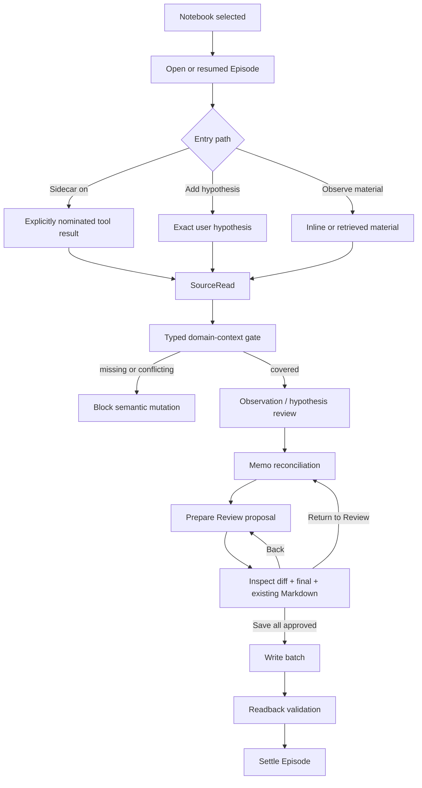
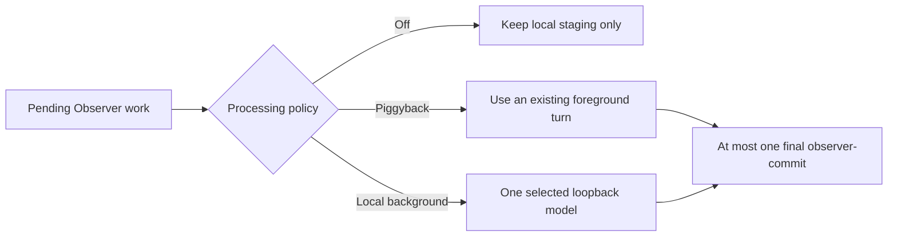
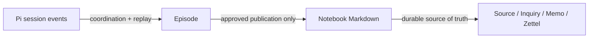

# Observer Runtime Flow

Observer coordinates one branch-local inquiry Episode and publishes only an
explicitly approved Notebook batch. The diagram shows ordering and write
boundaries; it does not imply that model interpretation is true.

## Episode flow



Only the `Save all` path writes Notebook Markdown. Preparation, workbench
inspection, Memo reconciliation, and proposal review are read-only with respect
to the Notebook.

## Processing policy



Piggyback means no separate inference request, not zero token overhead. Local
background accepts only a loopback endpoint and runs with concurrency one.

## Evidence and assurance

```text
exact SourceReading / InquiryContext / Memo scope
→ adapter-owned evaluator relation
→ compact observer-context-basis/v1
→ semantic action proposal
→ immediate branch revalidation
→ serialized append
```

Named evaluators establish only declared source, inquiry, or memo relations.
Semantic stance and movement remain agent-asserted. User-owned decisions require
an explicit user event. Missing context, stale basis, cross-branch evidence, or
conflicting relations block mutation.

## Durable boundary



Pi events do not replace the Notebook. Observer does not own Git, remote sync,
backup, graph databases, or model semantic truth.
