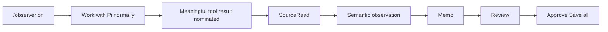
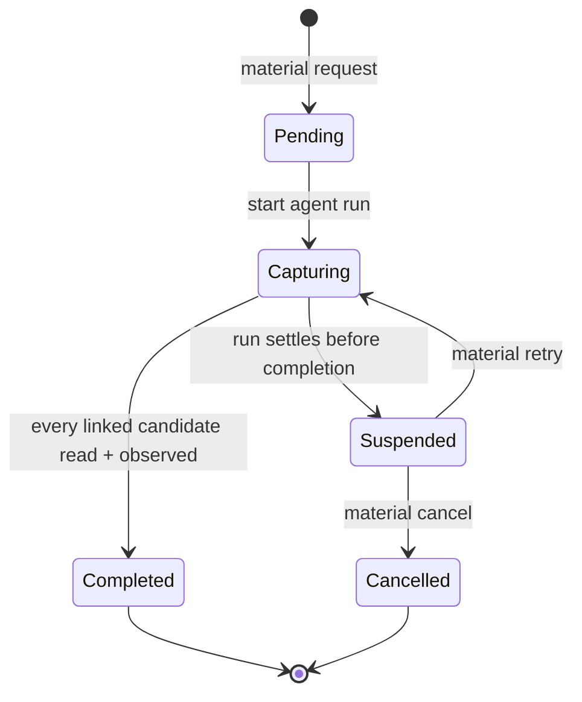

# Observer user guide

English | [한국어](./ko/user-guide.md)

Observer follows one local inquiry across source material and publishes only a
reviewed Notebook batch.

## Set up a Notebook

Open the Workbench and choose **Settings**:

```text
/observer
```

Or use a command:

```text
/observer setup en ~/notes/observer
/observer setup ko ./notes/observer
```

Path interpretation is explicit:

| Input | Resolution |
| --- | --- |
| `/absolute/path` | Used as written |
| `./relative/path` or `notes/observer` | Resolved from Pi's current working directory |
| `~` or `~/notes` | Resolved from the current user's home directory |
| `~other-user/notes` | Rejected rather than guessed |

Observer shows the resolved absolute path before initializing a new folder or
adopting an existing one. It does not rewrite unrelated files in an adopted
folder.

`en` and `ko` select the language of newly written Memo and Zettel records. They
do not change the Workbench UI, and existing records keep their own language.

## Workbench

```text
Overview
├── Notebook health, mode, Episode, processing, next action
Activity
├── SourceReads, observations, material reviews, hypothesis reviews
Inquiries
├── original/current hypotheses and evidence
Memos
├── complete working Memo content and relations
Proposal
├── preparation status or exact diff/existing/final Markdown
Notebook
├── durable records and exact Markdown
Settings
└── Notebook, Sidecar mode, language, processing policy
```

| Key | Action |
| --- | --- |
| `↑` / `↓`, `j` / `k` | Move selection |
| Enter | Inspect or activate contextual action |
| Escape | Return one level |
| Tab | Move between sections/content |
| Page Up / Page Down | Scroll viewport |
| Home / End | Jump within viewport |
| `y` | Copy complete focused semantic record |
| `?` | Contextual help |

The Workbench is read-only except for explicit contextual actions. Opening,
scrolling, or copying records does not append events or write Notebook files.

## Sidecar workflow



A normal tool result is only eligible evidence. During the same agent run the
model must nominate its exact tool-call ID with a reason. Routine navigation,
listings, write acknowledgments, repeated reads, and diagnostics remain
unselected.

Turn Sidecar observation off without discarding the open Episode:

```text
/observer off
```

Mode and Episode are separate: Off stops model-backed continuous observation but
preserves current inquiry work.

## Add a hypothesis

```text
/observer add-hypothesis The order of capture changes interpretation bias.
Context: The last two examples diverged only after delayed note-taking.
```

The optional context line remains user context, distinct from Observer's
interpretation. Observer preserves the original wording and requests an initial
review containing:

- supporting clues;
- challenging clues;
- missing information;
- exact Source IDs when available; and
- an interpretation boundary.

Insufficient context is a valid result and never rewrites the original
hypothesis.

## Observe material

Use a bounded material review while Sidecar mode is either On or Off:

```text
/observer material <inline text, file path, URL, or retrieval request>
```

For a file or URL, Pi first retrieves the material. The command text is not
source evidence. Retrieved results are eligible only during the exact agent run
that starts or retries the material request.



Recover an interrupted request with:

```text
/observer material retry
/observer material cancel
```

`retry` opens one more bounded capture window for the same request. `cancel`
records cancellation without changing Sidecar mode or closing the Episode.
Review remains unavailable while the request is pending.

## Reconcile a Memo

```text
/observer memo
```

Memo reconciliation compares current SourceReads, observations, hypotheses,
existing working Memos, and explicitly related standing Notebook records. It can
create, revise, merge, retain, or mark Memos while keeping exact evidence IDs.
It does not write Notebook Markdown.

Repeated preparation for the same exact basis is stable; stale or incomplete
coverage is rejected.

## Review and Save

```text
/observer review
```

Review first closes pending Memo work, then prepares a publication proposal. The
Proposal view shows:

- every target path and operation;
- existing Markdown for updates;
- exact final Markdown;
- a line diff;
- the locked Notebook, language, and record scope; and
- validation or recovery diagnostics.

Preparation writes nothing.

From a ready proposal, press `s` or use `/observer save` to open the separate
approval viewer. The choices are:

- **Back** — keep the validated proposal;
- **Return to Review** — discard only the proposal and preserve working state;
- **Save all N records** — approve the complete batch.

There is no default “Yes” and no partial-batch save.

## Processing policy

```text
/observer processing piggyback
/observer processing local
/observer processing off
```

| Policy | Behavior |
| --- | --- |
| Piggyback | Uses an existing foreground model turn; at most one final `observer-commit` per run |
| Local | Selects an available loopback Pi model; in-memory queue, concurrency one, yields to foreground work |
| Off | Keeps local candidate/request state but performs no model-backed interpretation |

Local mode rejects non-loopback endpoints even when model price metadata says
“free” or “local.” The queue is not a daemon or durable scheduler.

## Status and recovery

```text
/observer status
```

Status reports Notebook identity/health, Sidecar mode, Episode, pending material
or Memo/Save request, processing policy, proposal state, and recovery action.

Common recovery cases:

| Status | Action |
| --- | --- |
| Material request suspended | `material retry` or `material cancel` |
| Proposal ready | Inspect Proposal, then approve or return to Review |
| Proposal invalidated by target drift | Return to Review and prepare again |
| Notebook moved/replaced during Episode | Restore exact Notebook identity or settle/cancel work before selecting another |
| Background processing paused | Resume ordinary Pi work or switch processing policy |
| Malformed branch history | Preserve diagnostics; do not force semantic mutation |

## Commands

| Command | Effect |
| --- | --- |
| `/observer` | Workbench |
| `/observer settings` | Open Settings directly |
| `/observer setup` | Interactive setup |
| `/observer setup <ko\|en> <path>` | Exact Notebook setup/selection |
| `/observer status` | Current state and recovery |
| `/observer on` / `off` | Toggle Sidecar observation |
| `/observer add-hypothesis <text>` | Preserve and review a user hypothesis |
| `/observer material <request>` | Bounded material review |
| `/observer material retry` / `cancel` | Recover pending material review |
| `/observer processing off\|piggyback\|local` | Set interpretation policy |
| `/observer memo` | Reconcile working Memos |
| `/observer review` | Prepare publication proposal |
| `/observer save` | Inspect prepared proposal and approve explicitly |

## Update and remove

```sh
pi update npm:@hobin/observer
pi remove npm:@hobin/observer
```

Use `pi install -l npm:@hobin/observer` for a project-local package declaration.
